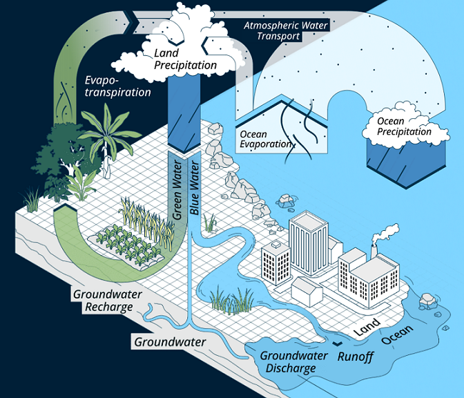
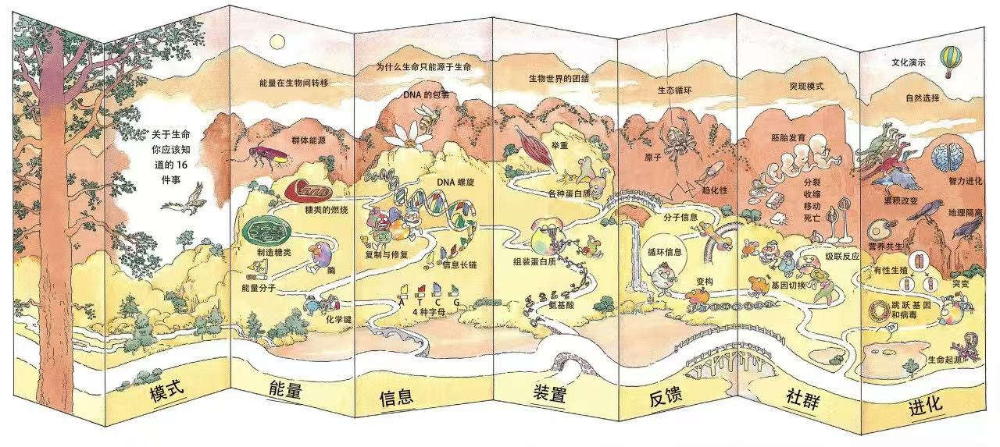
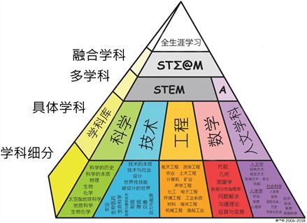
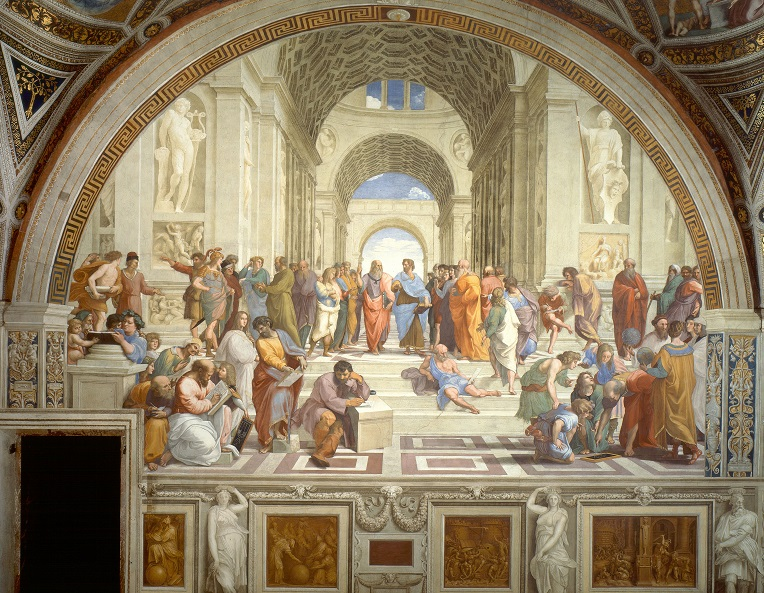

<!--  -->

<h3>遇见孩子，遇见更好的自己 🚀</h3>
<h3>欢迎来到一个新手爸爸的育儿宝库 💎</h3>

# 📇 目录

- 🚣 [儿童发展阶段](#-儿童发展阶段)
  - 💡 [发育评估标准](#-发育评估标准)
  - 🤰🏼 [胚胎发育阶段](#-胚胎发育阶段)
  - 🚼 [新生儿发展阶段](#-新生儿发展阶段)
  - 👶 [1-2岁发展阶段](#-1-2岁发展阶段)
  - 👼 [3-5岁发展阶段](#-3-5岁发展阶段)
  - 🧒 [6-11岁发展阶段](#-6-11岁发展阶段)
  - 👦 [12-14岁发展阶段](#-12-14岁发展阶段)
  - 🧑 [15-17岁发展阶段](#-15-17岁发展阶段)
- 👨‍👩‍👧‍👦 [家庭教育](#-家庭教育)
  - 📓 [教育理论](#-教育理论)
  - ➡️ [养育指南](#-养育指南)
  - 👨‍👦 [亲子时间](#-亲子时间)
  - 🎃 [家庭活动](#-家庭活动)
  - 🧧 [写给孩子的信](#-写给孩子的信)
- 🎓 [学校教育](#-学校教育)
  - 🗃️ [教学资源](#-教学资源)
  - ✨ [教学标准](#-教学标准)
  - 🧭 [教学评估](#-教学评估)
- 🏫 [社会教育](#-社会教育)
  - 📢 [创新教育](#-创新教育)
  - 👩🏼‍🏫 [在线教育](#-在线教育)
  - 🎒 [慕课资源](#-慕课资源)
  - 🌐 [公益组织](#-公益组织)
  - 🙆🏼 [儿童网站](#-儿童网站)
  - ☑️ [机构报告](#-机构报告)
- 👨‍💻 [STEAM](#-STEAM)
  - 🔬 [科学（Science）](#-Science)
  - 📡 [技术（Technology）](#-Technology)
  - 🩺 [工程（Engineering）](#-Engineering)
  - 🎨 [艺术（Arts）](#-Arts)
  - 📐 [数学（Mathematics）](#-Mathematics)
  - 👑 [实践](#-实践)

 

# 🚣 儿童发展阶段

🧑 儿童的定义：根据联合国《[儿童权利公约](https://zh.wikipedia.org/wiki/%E5%85%92%E7%AB%A5%E6%AC%8A%E5%88%A9%E5%85%AC%E7%B4%84)》的定义，儿童是指18岁以下人口，即0~17周岁的人口。

- 👉 [Early_Brain_Development](https://www.researchgate.net/publication/12089227_Developmental_Science_and_the_Media_Early_Brain_Development) - 生命早期是大脑快速发育阶段。
- 👉 [Early Childhood in Focus: Developing Brains](https://vanleerfoundation.org/publications-reports/developing-brains/) 《聚焦儿童早期7：大脑发育》系伯纳德·范里尔基金会的出版物，它包含有关大脑构造和发育的信息和研究，以及环境因素如何影响大脑发育。
- 👉 [培育更好的大脑：儿童早期发展新前沿](https://www.unicef.cn/reports/building-better-brains) - 联合国儿童基金会推出培育更好的大脑。
- 🕮 [《孩子的大脑：智商与情商的真相》](https://weread.qq.com/web/reader/264323d071cc8b05264da11) - 这本书旨在帮助我们理解孩子的大脑，告诉我们如何影响孩子的智商和情商发展，并在为人父母这个巨大的挑战上对我们进行指导。
- 👉 [天生学习家系列丛书](https://book.douban.com/series/48929) 
  - 🕮 [《园丁与木匠》](https://weread.qq.com/web/reader/42432e707190d338424666e) - 带你看懂孩子行为背后的学习规律，用大量经典而富有创造性的实验，向你描述了孩子在看的时候，在听的时候，在玩的时候，在做的时候，都是怎么学习的，以及在幼儿期、学龄期、青春期不同阶段的学习特性。
  - 🕮 [《孩子如何学习》](https://weread.qq.com/web/reader/6ab32330718a05d86abd48b) - 对于普通大众来说，这本书能启发你对人脑学习机制的深度思考，让你在孩子身上看到梦寐以求的学习之道。
  - 🕮 [《孩子如何思考》](https://weread.qq.com/web/reader/9d032c107193a9449d00d16) - 揭示孩子意识与思维之谜，剖析童年对人生的重大意义，给你“我为什么是我”的终极答案。
- 👉 [脑科学领域的大神级专家斯坦尼斯拉斯·迪昂关于脑系列丛书](https://book.douban.com/subject_search?search_text=斯坦尼斯拉斯·迪昂)
  - 🕮 [《脑与意识: 破解人类思维之迷》](https://weread.qq.com/web/reader/93b327007171e2f993bb1d5) - 意识的神奇在于其无形，让我们跟随迪昂一同踏上旅程，探索人类思想、情感与意志背后那复杂而令人兴奋的真相。
  - 🕮 [《脑与阅读: 破解人类阅读之谜》](https://weread.qq.com/web/reader/534328e0717dd535534a74e) - 为读者展现了人脑神奇的阅读能力，像拆解钟表的精密结构一样，揭示了阅读在脑中的认知齿轮，回答了“我们是如何阅读的？”这一问题。
  - 🕮 [《脑与数学: 我们的数学能力是如何精进的》](https://weread.qq.com/web/reader/1d0329107296a4031d07c25) - 让我们读懂孩子的数学认知方式，以科学的方法帮助他们更好地发展思维能力。
  - 🕮 [《精准学习》](https://weread.qq.com/web/reader/30c32ee0813ab7b70g0180ce) - 为我们揭示了人脑的自然学习法则，阐释了人脑的学习能力相较现行人工智能的优势，提出了高效学习的4大核心支柱。

## 💡 发育评估标准

- 🗐 [0~6岁儿童发育行为评估量表](http://www.nhc.gov.cn/ewebeditor/uploadfile/2017/10/20171026154358287.pdf) - 国家卫健委2018年推出的0～6岁儿童发育行为评估量表。
- 🗐 [0~6岁儿童发展的里程碑](https://www.unicef.cn/reports/developmental-milestone-children-0-6-years) - 教育部和联合国儿童基金会推出的0～6岁儿童发展的里程碑。
- 🗐 [0~6岁儿童发育监测与评估](https://www.unicef.cn/media/7396/file/%E5%84%BF%E7%AB%A5%E5%8F%91%E8%82%B2%E7%9B%91%E6%B5%8B%E4%B8%8E%E8%AF%84%E4%BC%B0%EF%BC%880-6%E5%B2%81%EF%BC%89.pdf) - 联合国儿童基金会推出的0～6岁儿童发育监测与评估。

## 🤰🏼 胚胎发育阶段

- 🕮 [《海蒂怀孕大百科》](https://book.douban.com/subject/24529161/) - 本书就像是经验丰富而充满热情的私人产科医生，无微不至地解答你怀孕过程中可能遇到的所有问题，帮助准父母打消顾虑、摆脱压力，轻松享 受孕期生活。 
- 🕮 [《西尔斯怀孕百科》](https://book.douban.com/subject/3655433/) - 《西尔斯怀孕百科》是一本出色而全面的怀孕指南，是准父母的绝佳选择。
- 🕮 [《宝宝出生的奥秘》](https://weread.qq.com/web/reader/826325807188965f826737a) - 讲述妈妈怀孕到生产的整个过程。让爸爸们也能感同身受妈妈们生命来临时的那种悸动！

## 🚼 新生儿发展阶段

- 👉 [婴幼儿喂养咨询培训包](https://www.unicef.cn/iycf) - 本书以联合国儿童基金会和世界卫生组织2010年发布的婴幼儿喂养咨询包为基础。
- 🕮 [《卡普新生儿安抚法（0~1岁）》](https://weread.qq.com/web/reader/dfe325405b7384dfe7c605a) - 学习理解孩子的需求，学会安抚孩子的方法。

## 👶 1-2岁发展阶段

- 👉 [为什么0~3岁重要](https://www.zerotothree.org/why-0-3/) - ZERO TO THREE 非营利组织以科学的视角来分析0~3岁的重要性。
- 👉 [儿童早期发展](https://www.unicef.cn/reports/early-childhood-development-ecd) - 联合国儿童基金会资料。
- 👉 [儿童早期发展科学培训资源包](https://www.unicef.cn/reports/secd-resource-kit) - 联合国儿童基金会和多所大学提供的资源。
- 👉 [0~3岁儿童成长发育监测图-男孩](./images/0~3岁男孩生长发育监测图.jpg) - 👉 [0~3岁儿童成长发育监测图-女孩](./images/0~3岁女孩生长发育监测图.jpg)
- 🕮 [《卡普儿童行为手册（1~4岁）》](https://weread.qq.com/web/reader/708323605b7385708bdb9c4) - 学习孩子行为发展规律，帮助孩子确立行为规范。
- 🕮 [《从出生到3岁：婴幼儿能力发展与早期教育权威指南》](https://weread.qq.com/web/reader/bb132bb0813ab7854g014459) - 这本详细的指导手册中描述0-3岁婴幼儿在每个月的心理、生理、社会能力和情感发展。

## 👼 3-5岁发展阶段

- 👉 [3~6岁儿童学习与发展指南](https://www.unicef.cn/reports/3-6-children-learn-and-development-guide) - 教育部和联合国儿童基金会推出的3~6岁儿童学习与发展指南。
- 🕮 [《魔法岁月：0~6岁孩子的精神世界》](https://book.douban.com/subject/26352480/) - 本书可以帮你了解0~6岁孩子的生理与心理变化，放下对孩子的过度保护，帮助孩子解决焦虑、排便、自律等问题，详细分析了对孩子进行管教的必要性。
- 🕮 [《0~6岁，抓住孩子的语言关键期》](https://weread.qq.com/web/reader/2cb326b0813ab6f99g018786) - 作者还认为，0~6岁是孩子学习言语的关键期，错过这个时期，语言装置系统将完全卸载。因此，父母应该牢牢抓住这个阶段，适时引导，帮助孩子发现自己的语言天赋。
- 🕮 [《理解孩子的语言》](https://weread.qq.com/web/reader/d673255071cc8a24d677d2c) - 只要我们稍微懂得倾听孩子，并理解他们的语言，他们会在自己发展的每个阶段，都把他们的任何需要都告诉我们。

## 🧒 6-11岁发展阶段

- 🕮 [《儿童心理学：0~8岁儿童的成长》](https://book.douban.com/subject/35328412/) - 展示了婴儿期、1~3岁、4~5岁、6~8岁四个阶段，儿童在知觉、动作、生理、情绪、语言和阅读等方面的发展规律。
- 🕮 [《我最想要的记忆魔法书》](https://weread.qq.com/web/reader/dcc32ad0813ab6fd1g0123a4) - 人的记忆潜能实际上是没有极限的； 记忆力与学习能力直接相关，一旦记忆力提高，一个人的学习能力自然水涨船高： 大脑本身不会随着年龄增加而衰退，人的记忆力之所以衰退，主要是因为缺乏动力。

## 👦 12-14岁发展阶段

- 🕮 [《儿童发展心理学：费尔德曼带你开启孩子的成长之旅》](https://book.douban.com/subject/26605896/) - 全面综合介绍儿童、青少年发展的指南，世界著名发展心理学大师费尔德曼代表作，哈佛大学等200多所美国高校采用的经典教材。

## 🧑 15-17岁发展阶段

- 🕮 [《伯克毕生发展心理学：从0岁到青少年》](https://book.douban.com/subject/25773343/) - 对个体的生命早期、婴儿期和学步期、幼儿期、小学期、青少年期的各领域的发展娓娓道来。现在已经出到[第七版](https://book.douban.com/subject/35623788/)了。
- 🕮 [《儿童发展心理学》](https://weread.qq.com/web/reader/24d32e0071cce5c524d88e5) - 记录了个体从产前发育开始到青春期的发展进程，包括胎儿期、婴儿及学步儿期、童年早期、童年中期和青春期等阶段的发展特征，系统阐述了个体在每一个发展阶段的生理、认知、智力、情绪、语言、行为、社会性以及人格等方面的发展状态，以及家庭及社会等因素对儿童心理发展的影响。
- 🕮 [《发展心理学：儿童与青少年》](https://book.douban.com/subject/26838522/) - 介绍了从产前发育一直到青少年时期的发展进程，系统阐述了关于生理、认知、智力、语言、情绪、人格、性别角色意识以及社会性等重要发展领域的各种理论观点和重要研究。

 

# 👨‍👩‍👧‍👦 家庭教育

中国关心下一代工作委员会修订的[《全国家庭教育指导大纲》](http://zgggw.gov.cn/zhengcefagui/gzzd/zgggw/13792.html)，适用于各级各类家庭教育指导机构、相关职能部门、社会团体、宣传媒体和家庭教育指导者，对新婚夫妇、孕妇、18 岁以下儿童家长（父母或其他监护人）开展的家庭教育指导服务行为。

## 📓 教育理论

### 🤱🏼 父母说教育

- 🕮 [《斯宾塞的快乐教育》](https://weread.qq.com/web/bookDetail/8b332640813ab83cbg017c89) - 一本运用教育学知识讲述如何让孩子爱上学习的书。
- 🕮 [《卡尔•威特的教育》](https://weread.qq.com/web/reader/be9328c0718ea4fbbe96fa8) - 200年前的教育方法如何与今天的家庭教育结合起来？今天中国的父母如何体会200年前老卡尔的教育理念的精髓？
- 🕮 [《海蒂育儿大百科（0-1岁）》](https://weread.qq.com/web/reader/89b32250813ab805cg0189a5) - 0~1岁丰富实用的育儿知识。
- 🕮 [《海蒂育儿大百科（1-3岁）》](https://book.douban.com/subject/25859575/) - 1~3岁丰富实用的育儿知识。

### 👨‍⚕️ 医生说教育

- 🕮 [《斯波克育儿经》](https://weread.qq.com/web/reader/9ed32860813ab7377g010983) - 被公认为20世纪最可信的育儿手册，凝结了“育儿之父”斯波克医生经60年考验行之有效的育儿经验。
- 🕮 [《西尔斯亲密育儿百科》](https://weread.qq.com/web/reader/660320e071629618660cafc) - 西尔斯博士根据近40年的儿科临床实践，以及与妻子玛莎共同养育8个子女的经验，结合发展心理学的“亲密理论”，总结出了一套亲密育儿法。
- 🕮 [《定本育儿百科》](https://weread.qq.com/web/reader/0ee3262071c5f3560eed165) - 从婴儿诞生前一直写到孩子上小学，全面周到的育儿知识。

### 👩🏼‍🔬 心理学家说教育

- 🕮 [《教出乐观的孩子：让孩子受用一生的幸福经典》](https://weread.qq.com/web/reader/611325805ae2c561133540c) - 积极心理学之父马丁•塞利格曼集30年、千百个成人及儿童研究之精华著成的教育经典。书中重墨提及积极心理教育在学校实践中的成功应用，富有借鉴意义。
- 🕮 [《儿童教育心理学：阿德勒关于儿童心理发展、性格与人格养成的秘密》](https://weread.qq.com/web/reader/46532be0718247e74656296) - 本书以个体心理学理论为基础，以经过实践检验的教育方法为指导，从人格统一性、自卑感、卓越感、社会情感、学校教育、家庭氛围等几个贯穿始终的关键词出发，旨在破解儿童的心理行为密码。

### 👩‍🏫 教育学家说教育

- 🕮 [《给父母的建议》](https://weread.qq.com/web/reader/83d32910727ca06983debb0) - 《给父母的建议》是苏联当代教育家苏霍姆林斯基专门为家长和从事教育工作的人员阅读所写的经典著作，他认为没有什么比父母教育孩子更加需要智慧的了，我一生都在努力探求这种智慧。
- 🕮 [《教养的迷思》](https://weread.qq.com/web/reader/bf032ad0719230adbf0f346) - 在《教养的迷思》一书中，作者用众多的证据证明，在孩童的成长过程中，父母的影响力并没有大家想象中的大，真正具有影响力的是孩童在家庭之外的同辈群体。
- 🕮 [《童年的秘密》](https://weread.qq.com/web/reader/1be32e50719523e31bef162) - 全面介绍蒙台梭利教育理念和方法。蒙氏教育法是当今世界公认的最优秀的教育方法。
- 🕮 [《爱和自由》](https://weread.qq.com/web/reader/86c32cc0813ab7e7ag013b5a) - 全面讲述了孙瑞雪教育机构“爱和自由”的教育理念和方法。

## ➡️ 养育指南

### 👪 成为父母

- 🕮 [《遇见孩子，遇见更好的自己》](https://weread.qq.com/web/reader/cb232f605b6b31cb2804ff2) - 三位美国教育专家写给天下父母的心灵成长课。
- 🕮 [《不吼不叫：如何平静地让孩子与父母合作》](https://weread.qq.com/web/reader/22f325e071a3f6e822f45cb) - 本书基于气质研究和正念理论，为你提供强有力的技巧，以减少家庭冲突，促进合作、尊重和相互理解。你还会学到一些策略，帮助你在沮丧达到峰值时管理好自己的压力；掌握实用的解决方法，帮助你恢复冷静，能够以让大人和孩子都受益的方式带着同情心与孩子有效沟通。
- 🕮 [《你就是孩子最好的玩具》](https://weread.qq.com/web/reader/e3532d6071bba368e35b841) - 孩子们并不需要智力玩具或者电视节目，他们需要的是你！他们真正看重的是和你在一起的快乐时光，他们需要被重视，需要和父母单独相处而不被打扰的时间，需要和父母建立一生的亲密关系！

### 👨‍🏫 正面管教

- 👉 [积极养育指南](https://www.unicef.cn/documents/positive-parenting-guide) - 联合国儿童基金会推出的儿童积极养育指南。
- 🕮 [《正面管教》](https://weread.qq.com/web/reader/bbc32a50813ab7953g01522a) - 《正面管教》已经成为管教孩子的”黄金法则“。
- 🕮 [《看见孩子：洞察、共情与联结》](https://weread.qq.com/web/reader/55932970813ab8237g0121c3) - 一本培养情绪健康、有心理韧性的孩子的实用指南。
- 🕮 [《如何培养孩子的社会能力》](https://weread.qq.com/web/reader/68e327a0813ab7854g0153bb) - 培养孩子的良好的社会能力，让还成长为一个充满自信的人。

### 👨🏻‍❤‍👨🏼 情感教育

情感教育让孩子获得一种内心的智慧，或用更优美的表述为内心塑造！

- 👉 [社会情感学习资源](https://www.unicef.cn/documents/sel-resources) - 联合国儿童基金会与教育部于2011年引入的社会情感学习项目。
- 🕮 [《理解孩子的语言：孩子的笑、哭泣和害怕》](https://weread.qq.com/web/reader/d673255071cc8a24d677d2c) - 书中分析了恐惧、愤怒、喜悦和悲伤几种情绪，通过这些分析来帮助家长和孩子相互了解，坚定父母的信心，提高孩子的情商。
- 🕮 [《我什么办法都试过了！：理解一至五岁孩子》](https://book.douban.com/subject/27154263/) - 如何理解一至五岁的孩子？运用神经科学和实验心理学的科学发现来理解。
- 🕮 [《他怎么总找我麻烦？：理解六至十一岁孩子》](https://book.douban.com/subject/27054213/) - 如何理解六至十一岁的孩子？运用神经科学和实验心理学的科学发现来理解。
- 🕮 [《心理学与生活》](https://weread.qq.com/web/reader/a6c32000813ab6c04g013ced) - 是一部心理学经典教科书，心理学导论类教材的典范之作。
- 🕮 [《津巴多普通心理学》](https://weread.qq.com/web/reader/631324c0813ab735bg01382c) - 普通心理学的经典教材。

### 🚑️ 健康安全

- 👉 [婴幼儿喂养咨询培训包](https://www.unicef.cn/iycf) - 本书以联合国儿童基金会和世界卫生组织2010年发布的婴幼儿喂养咨询包为基础。
- 👉 [3岁以下婴幼儿健康养育照护指南](http://www.nhc.gov.cn/fys/s3585/202211/22e3f33c47f54f2c81c28db4e8ee7723.shtml) - 国家卫生健康委办公厅关于印发3岁以下婴幼儿健康养育照护指南。
- 👉 [0-6岁儿童监护人健康教育小册子](https://www.unicef.cn/reports/0-6-children-guardian-health-education-booklet) - 联合国儿童基金会和中国健康教育中心推出的。
- 👉 [儿童安全教育方法](https://www.xueshu.com/haowen/173030.html) - 学术之家上整理的12篇儿童安全教育方法。
- 🕮 [《薄世宁医学通识讲义：一生需要上一次医学院》](https://book.douban.com/subject/34842793/) - 人在一生中，难免要面对疾病的来临与生命的诘问，以医学的思维面对自我，以科学的方式关爱家人，才是对自己与家人真正的爱。

## 👨‍👦 亲子时间

### 🎶 童谣儿歌

- 🕮 [《鹅妈妈童谣》](https://book.douban.com/subject/35175546/) - 流传英国数百年的枕边教材，孩子读书识字前的启蒙绘本，叫醒宝宝的小耳朵，培养语感、乐感与认知能力。👉 [B站鹅妈妈儿歌童谣（全113集）](https://www.bilibili.com/video/BV1oM4m1R7YM)
- 👉 [25首经典儿歌童谣大全](https://www.wukongsch.com/blog/zh/best-kids-songs-collection-post-36383/) - 25首经典儿歌童谣大全，含中英文歌词。⏬ [Download the PDF](./docs/中文经典儿歌大全.pdf)

### 🧟 睡前故事

#### 🦄 奇幻故事

- 🕮 [《一千零一夜》](https://book.douban.com/subject/30355859/) - 本书精选《一千零一夜》中最脍炙人口也最为有趣的十个故事。
- 🕮 [《纳尼亚传奇》](https://weread.qq.com/web/reader/2de32c307192f4302de525e) - 《纳尼亚传奇》是一个通往魔法世界的大衣橱，带给孩子受益终生的爱、希望与勇气。
- 🕮 [《霍比特人》](https://weread.qq.com/web/reader/ebf326c0813ab8e6cg0126da) - 《霍比特人》是托尔金为自己孩子写的炉边故事，但从此开始你便踏入他构造的中洲这一奇幻世界。
- 🕮 [《魔戒》](https://weread.qq.com/web/reader/1e5323c058a8531e55ae435) - 《魔戒》是一部关于中洲伟大的想象力和动人的故事集，蕴含对世间万物最本真的好奇心与最深刻的洞察力。

#### 🏛︎ 历史故事

- 🕮 [《荷马史诗》](https://weread.qq.com/web/reader/58f32590718b66a158fc59f) - 《伊利亚特》为古希腊不朽英雄史诗，西方古典文化基石。
- 🕮 [《希腊人的故事》](https://weread.qq.com/web/reader/6bc32a60716aed026bcc085) - 日本女作家盐野七生，将我们带回那个人与神共处同一片天地的传奇时代，冷静透彻地将视角集中于多元文明如何共存，场景再现般地讲述在一次次改变世界格局的决策中，性格迥异的英雄们如何引领国家走向巅峰。
- 🕮 [《罗马人的故事》](https://weread.qq.com/web/reader/9c03231072051fc49c0e3b3) - 日本女作家盐野七生，15年写就15册巨著《罗马人的故事》，还原一个意大利半岛的小国成为世界帝国，持续1300年的辉煌历程，再现一个英雄辈出的时代。作者真是大爱罗马！至今定居罗马。

#### 🔮 冒险故事

- 🕮 [《鲁滨逊漂流记》](https://book.douban.com/subject/30284020/) - 面对困难，我永不妥协，因为我有一颗敢于冒险的心！
- 🕮 [《绿野仙踪》](https://weread.qq.com/web/reader/173328a0526dd91736ad263) - 奇幻冒险童书《绿野仙踪》，带给孩子爱与勇气，永葆梦想与善良！
- 🕮 [《彼得·潘》](https://weread.qq.com/web/reader/08f325d05c668d08f419bb1) - 讲述了小女孩温蒂和两个弟弟约翰、迈克尔跟随小飞侠彼得·潘来到神奇之境梦幻岛并在那里生活的故事。

#### ♥️ 暖心故事

- 🕮 [《草房子》](https://weread.qq.com/web/reader/e9a32d80813ab8540g012d73) - 感动百万中国人的儿童文学经典，被无数老师、家长和孩子爱若珍宝、贴心收藏的男孩桑桑的童年记忆。
- 🕮 [《秘密花园》](https://weread.qq.com/web/reader/e4e3288071e8eefee4e4bcf) - 讲述了一个关于友谊、决心和毅力的故事。被盛赞为20世纪最具创造性和最卓越的童书。

#### 🎍 自然之美

- 🕮 [《德雷尔一家》](https://weread.qq.com/web/reader/1d032280813ab8c2ag01770d) - 书中讲述的人与大自然的故事让人神往，是中小学生学习自然文学写作不可多得的范本。更有百余种动植物生活习性的精彩描述，为我们提供了一场自然观察和科普的知识盛宴。
- 🕮 [《八堂自然课：大自然教给我们的生存之道》](https://weread.qq.com/web/reader/2e832730728aa8bc2e84144) - 这本书就像一只手，牵着我们走进大自然。接着它又教我们如何用眼、用耳、用心去体会。
- 🕮 [《夏日走过山间》](https://weread.qq.com/web/reader/1c132bc0715379441c15d42) - 以其优美、细腻的文风而被称为“感动一个国家的文字”，开启了20世纪自然文学创作的新方式。
- 🕮 [《人间草木》](https://weread.qq.com/web/reader/236321107156f80e23656b5) - 用极简的笔，极淡的墨写出了草木山川、花鸟虫鱼的人味，写出了乡情民俗、凡人小事温润的乡土味；以一颗从容豁达的心写出了世间的美好与灵动。
- 🕮 [《萝西与苹果酒》](https://weread.qq.com/web/reader/36032fd071705838360669c) - 一本宛如田园诗般优美的天才自传体小说，向童年与故乡致敬。如诗如画的语言，充沛真挚的情感，仿若穿越岁月的烟云，深情回望往昔时光。
- 🕮 [《边城》](https://weread.qq.com/web/reader/64232900722e9c376424aff) - 小溪，白塔，墨竹，渡口，独户的人家……故事在静美中拉开帷幕。
- 🕮 [《冯骥才散文精选集：灵魂需要独处》](https://weread.qq.com/web/reader/b633232072182affb63c528) - 冯骥才的文字细腻灵动，平缓舒畅，往往将生活细节放大、重组，在点滴中发现生命的美好，让心灵重获自由的同时，感受灵魂的坚韧与顽强。

#### 🎉 知识之妙

- 🕮 [《文心》](https://weread.qq.com/web/reader/bfd326205e195cbfd4e4e69) - 知识是枯燥的，故事是有趣的。把知识巧妙地融进有趣的故事，读故事时习得许多知识，无疑是最理想的学习方法。《文心》就是这一成功方法的典范。
- 🕮 [《中国少年儿童百科全书》](https://book.douban.com/subject/1028409/) - 林崇德主编的《中国少年儿童百科全书》，共四册。
- 🕮 [《十万个为什么》](https://book.douban.com/subject/2160556/) - 这是《十万个为什么》的经典版本。
- 🕮 [《DK博物大百科：自然界的视觉盛宴》](https://book.douban.com/subject/30384279/) - 本书的出版是史密森博物院国家自然历史博物馆的一个里程碑，本书展示了对地球自然历史的无与伦比的视觉盛宴。
- 🕮 [《极简宇宙史》](https://book.douban.com/subject/26697350/) - 夏夜，你躺在沙滩上，仰望夜空。一颗小小的流星安静滑过，还来不及许愿，不可思议的事情发生了：你一下子穿越五十亿年，走进时光的旅行。 

### 🖼️ 绘本图册

- 👉 [豆瓣热门儿童绘本TOP20](https://m.douban.com/subject_collection/EC644XZ7I)
- 🕮 [《好绘本如何好》](https://book.douban.com/subject/26797923/) - 让每一个对绘本好奇的人，都能建立正确完整的绘本观，共同寻找新的可能性，发挥潜在的创意思考和无限想象。
- 🕮 [《给0岁宝宝的第一本书》](https://book.douban.com/subject/35188948/) - 描摹了婴儿富有个性的动作和表情，描画吃饭、睡觉、玩耍这些小婴儿最熟悉的日常生活场景，展现小宝宝和爸爸妈妈极温馨的日常生活片段。
- 🕮 [《变变看》](https://book.douban.com/subject/30289694/) - 形状、色彩、数字和语言，竟能构成这么多的可能。其展现形式，又是孩子们最喜欢的猜谜游戏。
- 🕮 [《亲爱的动物园》](https://book.douban.com/subject/10763603/) - 栩栩如生的动物、浅显易懂的文字、诙谐有趣的内容，翻开书就彷佛置身可爱的动物王国。
- 🕮 [《动物肖像大书》](https://book.douban.com/subject/35726004/) - 《动物肖像大书》是一本很特别的图集，创作灵感来自世界各大博物馆、美术馆的肖像画，汇集了从文艺复兴时期到19世纪的传世名作。
- 🕮 [《奇幻精品店》](https://book.douban.com/subject/26935627/) - 这是一本诗一样的书，正如书中的奇幻精品店，专为生日和节日提供礼物。
- 🕮 [《如何做出一本书》](https://book.douban.com/subject/36291018/) - 独特的场景对话形式更具带入感和参与感，带你见证一本书从无到有的整个过程！
- 🕮 [《地图》](https://book.douban.com/subject/25960141/) - 介绍了7大洲、4大洋、北极和42个国家，是一本不同于一般的地图，绘本式地呈现了边界、城市、河流、险峰，呈现了有代表性的动物、植物、历史、人文名胜、文化事件和很多与当地有关的奇妙趣闻。
- 🕮 [《我的小小自然书》](https://book.douban.com/subject/26849263/) - 从小动物自己的日常生活出发，为小读者介绍各种典型自然环境的方方面面。
- 🕮 [《我的收藏：寻找大自然的宝藏](https://book.douban.com/subject/26776895/) - 一堂美不胜收的自然课，一段自然寻宝的旅程，让每个孩子爱上自然观察，寻找生命之美。
- 🕮 [《森林图书馆》](https://book.douban.com/subject/34953990/) - 森林深处有一幢杉树房子，那是猫头鹰的家。
- 🕮 [《阿狸和会飞的湖》英文版绘本](https://www.unicef.cn/documents/english-book-ali-and-flying-lake) - 一本关于水、环境和气候变化的儿童书。
- 🕮 [《我们的食物从哪里来》](https://book.douban.com/subject/36209328/) - 本书精选7类餐桌上的常见食物，对比展现14个生产场景，从生产源头了解这些生活中我们最常见的食物！
- 🕮 [《24个菜市场的环球之旅》](https://book.douban.com/subject/36209327/) - 本书带领我们开启了一场历时12个月的旅行，每个月会到访1个国家的2个菜市场。
- 🕮 [《调皮的建筑师》](https://book.douban.com/subject/36092608/) - 建筑不仅是遮风挡雨的地方，也是激发无限想象与可能的造梦之地。
- 🕮 [《房子：世界插画大师英诺森提作品》](https://book.douban.com/subject/19974155/) - 来自世界插画大师英诺森提的作品。🕮 [《世界插画大师英诺森提作品（套装共7册）》](https://book.douban.com/series/14381)
- 👉 [世界最美的书得主BLEXBOLEX图像诗三部曲](https://book.douban.com/series/63429) - 共三册：🕮 [《歌谣》](https://book.douban.com/subject/35799865/)、🕮 [《四季》](https://book.douban.com/subject/35542802/)和 🕮 [《人们》](https://book.douban.com/subject/36062733/)
- 👉 [英文绘本集合](https://bit.ly/kidsbooklib) - 开源的上千本英文绘本，可以使用[Readtogether](https://readtogether.ai/)数字化实体书工具实现多媒体形式阅读。

### 🏬 走进生活

#### 🍛 食物

- 🕮 [《食物信息图》](https://book.douban.com/subject/26992853/) - 带上这本书，向枯燥的一日三餐说再见，开启幸福感爆棚的寻味之旅！
- 🕮 [《餐桌植物简史》](https://book.douban.com/subject/34661979/) - 一本关于餐桌植物的“冷知识大全”。讲述粮食、蔬菜与水果的传奇身世、吃货的好奇心词典。、
- 🕮 [《神奇的葱蒜》](https://book.douban.com/subject/27140604/) - 大蒜和它的亲戚（葱属植物）有着非凡、丰富而奇异的故事。
- 🕮 [《菜市场蔬菜图鉴》](https://book.douban.com/subject/26446742/) - 菜市场可以很小，也可以很大。小到可以装在一个菜篮之内，大到可以容纳整个世界。当我们用博物学家的鼻子、探险者的眼睛、美食家的舌头来重新品味菜市场的时候，整个世界都变得有趣了。
- 🕮 [《菜市场水果图鉴》](https://book.douban.com/subject/26446737/) - 同《菜市场蔬菜图鉴》
- 🕮 [《菜市场鱼图鉴》](https://book.douban.com/subject/34841109/) - 鱼鲜不仅仅作为食物，更是海洋生态系统的重要一员，而生活中对鱼鲜的认识，更有助于拉近我们与海洋之间的浩瀚距离。

#### 🎍 种植

- 🕮 [《园丁手册：花园里的奇趣问答》](https://book.douban.com/subject/35307158/) - 英国皇家园艺学会（RHS）首席顾问盖伊·巴特（Guy Barter）在其数十年园艺实践中收集和归纳的129个典型问题及其既简单明了又出乎意料的解答。
- 🕮 [《鲜花帝国：鲜花育种、栽培与售卖的秘密》](https://book.douban.com/subject/25876757/) - 花卉贸易已经形成规模庞大的产业，鲜花都是实验室制造、试管育种、工厂种植、机器收割，接着被打包装箱、拍卖出售，然后搭乘飞机漂洋过海走进大型超市或当地花店。

#### 💰️ 金钱

人类金钱世界宛如一个巨大的水厂，管道纵横交错，里面流淌着金钱。这幅作品把整个体系隐喻成一个水厂系统，旨在通过简单易懂的画面让金钱世界变得触手可及。揭示：**金钱如水，金钱即权力！**

<!--  -->

- 👉 [The Waterworks of Money](https://www.waterworksofmoney.com/) - 金钱世界形容为一个水厂的原作。👉 [老钱日日谈的翻译](https://baijiahao.baidu.com/s?id=1782543561288119950)，📺️ [YouTobe视频](https://www.youtube.com/watch?v=IszXpzIo_ZQ)，📺️ [B站搬运视频](https://www.bilibili.com/video/BV1nm421g723)
- 👉 [经济机器是如何运转的](https://www.economicprinciples.org/zh-hans/index.html) - 瑞·达利欧的《经济机器是怎样运行的》。📺️ [B站搬运视频](https://www.bilibili.com/video/BV1Ab4y1p7nd)
- 🕮 [《金钱心理学：财富、人性和幸福的永恒真相》](https://book.douban.com/subject/36415996/) - 给孩子一个正确看待金钱的起点！
- 🕮 [《经济学的思维方式》](https://weread.qq.com/web/reader/8c332830813ab7ebdg013f1c) - 经济学通识教育的经典之作。它所传达的思维方式，有助于每个人过上更好的生活。

#### 🔯 文化

- 🕮 [《中国古代文化常识》](https://weread.qq.com/web/reader/36832c507164851a368ca1b) - 行文平易简洁，雅俗共赏，一直以来，都是学习中国古代文化知识的入门经典。👉 [24年全新补订版](https://weread.qq.com/web/reader/650324e0813ab8febg011aed)

### 🏕️ 观察自然

[《笔记大自然：找寻一种探索周围世界的新途径》](https://book.douban.com/subject/3131814/)是一本指导如何给大自然书写日记的入门书。他们用两种指尖艺术——书写与绘画，来传递大自然的色彩与神奇。现在作者更新了新的笔记了[《新笔记大自然》](https://book.douban.com/subject/21357312/)

#### 🧩 合集

- 👉 [自然文库](https://book.douban.com/series/23677) - 商务印书馆出版的自然文库丛书。共58册，精品很多！
- 👉 [普林斯顿大学·生物图鉴](https://book.douban.com/series/69330) - 普林斯顿大学·生物图鉴(共4册)。打开一个“新”物种的大门，探寻人迹罕至的生物秘境。
  - 🕮 [《真菌：地球分解者》](https://book.douban.com/subject/36663889/)
  - 🕮 [《病毒：斗争与平衡》](https://book.douban.com/subject/36678513/)
  - 🕮 [《甲虫：鞘翅目征服地球》](https://book.douban.com/subject/37005098/)
  - 🕮 [《飞蛾：被低估的鳞翅目》](https://book.douban.com/subject/37058852/)
- 👉 [盛口满的手绘自然图鉴](https://book.douban.com/series/47042) - 著名博物学家盛口满的手绘自然图鉴(共7册)。在日常生活中培养孩子的观察思考能力。
  - 🕮 [《蔬菜的植物学》](https://book.douban.com/subject/33385442/)
  - 🕮 [《水果的秘密》](https://book.douban.com/subject/32583253/)
  - 🕮 [《餐桌上的生物进化》](https://book.douban.com/subject/34842095/)
  - 🕮 [《谷物的智慧》](https://book.douban.com/subject/33385545/)
  - 🕮 [《餐后骨头大考察》](https://book.douban.com/subject/33385523/)
  - 🕮 [《落叶的大千世界》](https://book.douban.com/subject/36698014/)
  - 🕮 [《石头的生命故事》](https://book.douban.com/subject/36698063/)

#### 🌲 植物

- 🕮 [《植物Q&A》](https://book.douban.com/subject/26901213/) - 植物专家郑元春老师打开了植物教室的门，提200多个问题给你，也帮你解答了200多个问题。现在就开始吧！
- 🕮 [《传粉的力量》](https://book.douban.com/subject/35085866/) - 传粉总是静悄悄地发生，这一看似毫不起眼的过程却堪称自然界的奇迹。
- 🕮 [《种子的故事》](https://book.douban.com/subject/25876107/) - 作者从种子的起源谈起，向读者描述了，在万物并茂的地球上，种子所具有的不可磨灭的重要地位。
- 🕮 [《怎样观察一粒种子》](https://book.douban.com/subject/33372572/) - 《怎样观察一粒种子》一次进入种穗、种荚和果实世界的旅程。👉 [配图摄影集合](https://www.robertllewellyn.com/PHOTOGRAPHS/SEED/1/caption)
- 🕮 [《怎样观察一朵花》](https://book.douban.com/subject/26924202/) - 通过作者的出色文字，我们进入了一个绝妙无比的领域——那里花瓣变成了色彩艳丽的山洞的岩壁，柱头和雄蕊则成了奇异华丽的雕塑。👉 [配图摄影集合](https://www.robertllewellyn.com/PHOTOGRAPHS/FLOWERS-ONE/1/caption)
- 🕮 [《怎样观察一棵树》](https://book.douban.com/subject/26901529/) - 《怎样观察一棵树》邀你将细致敏锐的目光投向身边常见的树木，并关注一些罕见却易于观察的树木特征。👉 [配图摄影集合](https://www.robertllewellyn.com/PHOTOGRAPHS/TREE/1/caption)
- 🕮 [《看不见的森林》](https://book.douban.com/subject/25876750/) - 这是一本森林观测笔记。 在这本书里，一位生物学家以一年的时间为主线，在每次的观测中，为我们揭开藏森林一平方米地域里的秘密。
- 🕮 [《蕨类植物的秘密生活》](https://book.douban.com/subject/35479478/) - 蕨类植物是一类特殊类型的植物，它们和种子植物不同，不依靠种子而是靠孢子繁殖。正因如此，它们的成长周期中存在两个世代，有着两种形态。
- 🕮 [《苔藓森林》](https://book.douban.com/subject/36392391/) - 苔藓不会开花结果，甚至没有根系，却在地球上兴旺繁盛了四亿年：岩崖表面、倒木裂缝、砖瓦沟隙皆为领地；失水高达98%也能“死而复生”；就算在嘈杂城市也能活得很好，甚至懂得利用人类脚步传播后代。
- 🕮 [《百合圣经：世界最伟大的图谱丛书》](https://book.douban.com/subject/1000284/) - 尽现了20余科193种被当时的西方人统统视为百合的所有美丽花卉。

#### 🐶 动物

- 🕮 [《所罗门王的指环》](https://book.douban.com/subject/1024846/) - 大自然的真实面貌，比起诗人所能描摹的境界，更要美上千百倍。
- 🕮 [《地球上最孤单的动物：43种濒危动物插画集》](https://book.douban.com/subject/34897038/) - 本书介绍了来自世界八大栖息地的43 种野生濒危动物，讲述了它们的生存状态、生活习性，以及面临的威胁和困境。
- 🕮 [《动物的秘密语言》](https://book.douban.com/subject/36915334/) - 在本书中，动物的这些基本行为被一一讲述。作者用风趣、生动的语言，精准、有趣的插图把动物心理与其行为之间的微妙关系展现得淋漓尽致。
- 🕮 [《地球上的性：动物繁殖那些事》](https://book.douban.com/subject/30312164/) - 研究动物性学的专家们为读者开启了一段神秘的旅程。让我们摘下有“色”眼镜，好好享受这段旅程吧！
- 🕮 [《中国兽类图鉴》](https://book.douban.com/subject/30447034/) - 一部完全使用野外生态照片展示中国哺乳动物物种多样性的著作，由国内顶级的分类学、野外摄影师、野生动物保护团队和动物保护NGO组织联合打造。

#### 🐥 鸟类

- 👉 [eBird](https://ebird.org/home) - 这是观鸟者中最著名的网站，由康奈尔鸟类学实验室和奥杜邦协会共同运营。网站提供全球鸟类观察记录的数据库。你可以根据地点、时间等条件查找鸟类的出现记录，也可以上传自己的观察记录。
- 👉 [Cornell Lab of Ornithology](https://www.allaboutbirds.org/) - 由康奈尔大学鸟类学实验室运营，主要专注于鸟类的科普教育，提供丰富的鸟类识别指南和鸟类生活习性的资料。
- 👉 [Xeno-Canto](https://xeno-canto.org/) - 这是一个鸟类声音数据库，你可以在这里听到来自世界各地的鸟类鸣叫声，对于识别鸟类非常有帮助。
- 👉 [中国观鸟记录中心](https://www.birdreport.cn/) - 这是一个致力于鸟类观察和保护的在线平台。👉 [微信小程序](https://www.birdreport.cn/assets/images/qr_xcx.jpg)
- 👉 [懂鸟](https://dongniao.net/) - 懂鸟包含全球鸟类10000种以上，支持分类浏览与搜索，查询中英文信息、亚种信息、全球分布、鸣声播放、辨识对比等功能。👉 [微信小程序](./images/dongniao.jpg)
- 👉 [豆瓣热门鸟类图书TOP10](https://m.douban.com/subject_collection/ECHA6QOUI)
- 🕮 [《常见鸟类的拉丁名：超过3000种鸟类学名的解释和考究》](https://book.douban.com/subject/34935736/) - 超过3000种鸟类学名的解释和考究，了解其拉丁名的意义。
- 🕮 [《剥开鸟蛋的秘密》](https://book.douban.com/subject/35063885/) - 几乎每个人都曾在孩提时代对鸟蛋有过好奇，本书将解答你心中的这些疑问。著名鸟类学家蒂姆·伯克黑德称鸟蛋是世界上“最完美的事物”，每一层构造都无懈可击。
- 🕮 [《鸟的感官》](https://book.douban.com/subject/26936474/) - 本书带领我们深入鸟类的感官世界，探寻这些飞翔的（或者不会飞翔的）精灵的奥秘。
- 🕮 [《羽毛：自然演化的奇迹》](https://book.douban.com/subject/26936478/) - 我们为什么喜爱鸟类？因为它们美丽、活泼，还会飞翔。而塑造鸟类每一项特质——也许除了鸣唱之外——都离不开鸟类独特的皮肤衍生物，羽毛。
- 🕮 [《鸟类行为图鉴》](https://book.douban.com/subject/34912230/) - 一场鸟类行为的视觉盛宴，一本观鸟爱好者的进阶宝典。
- 🕮 [《野鸟形态图鉴》](https://book.douban.com/subject/33377950/) - 关于51种野鸟的翼、足、喙、眼。自然观察者用画笔记录下的飞羽邂逅。
- 🕮 [《中国鸟类观察手册》](https://book.douban.com/subject/35339335/) - 《中国鸟类观察手册》收录了2020年10月以前在中国境内的鸟类物种，共1489种鸟类。
- 🕮 [《鸟的智慧》](https://book.douban.com/subject/34799618/) - 本书囊括了有关鸟类的各方面知识，从鸟蛋到鸟的繁殖，从领域行为到鸣唱、迁徙等；与此同时，追溯了几百年以来人们是如何克服偏见和未经验证的“常识”，逐步获取知识和洞见的。

#### 🐌 昆虫

- 🕮 [《昆虫的奇妙生活》](https://weread.qq.com/web/reader/f483214071fbe09cf48fa04) -本书邀你进入奇妙的昆虫世界！就数量而言，地球上的每个人，都对应着2亿只昆虫。
- 🕮 [《奇妙的昆虫图鉴》](https://book.douban.com/subject/36439621/) - 用趣味漫画展现昆虫的神奇生活。
- 🕮 [《昆虫Q&A》](https://book.douban.com/subject/26589043/) - 通过作者的丰富学养及生花妙笔，140则令人好奇的问题及其解答，汇集成一本可以学习、可以典藏、可以省思的经典之作。
- 🕮 [《鸣虫音乐国》](https://book.douban.com/subject/26893009/) - 书里收录了台湾32种蟋蟀和螽斯的鸣声和图片，除了声音、声谱，还有细腻的文字介绍。解翔实、活泼，录音的清晰度亦质量良好。
- 🕮 [《昆虫家谱》](https://book.douban.com/subject/25933432/) - 本书提供了410科昆虫的简便鉴别方法，这些方法源于作者在昆虫分类与野外识别领域的长期实践与探索，实用性极强。
- 🕮 [《眷恋昆虫：写给爱虫或怕虫的人》](https://book.douban.com/subject/3229838/) - 本书通过一个个的故事，把研究昆虫的过程呈现在读者的面前。
- 🕮 [《昆虫：古老的地球之王》](https://book.douban.com/subject/36248040/) - 这是一本将昆虫的进化史及其身体的宏观和微观结构相融合的科普读物。
- 🕮 [《中国昆虫生态大图鉴》](https://book.douban.com/subject/6062359/) - 本书通过大量野外生态照片以及识别特征、生活习性、分布地区的描述，图文并茂地介绍了六足总纲3纲29目2 200多种昆虫。

#### 🌦 天气

水，通过其循环轨迹连接地球上所有生物，将陆地淡水区分为河流、湖泊及含水层中的“蓝水”和土壤中对植物生长至关重要的“绿水”，经植物蒸发成绿色水蒸气回归大气，最终化为降水，渗透土壤、汇入水体，完成关键的水循环环节，而蒸发至大气的水分则形成流动的湿气，远行数千公里后在别处降落，编织出覆盖全球的水循环之网。📌 [水文循环](./images/水文循环.png)

<!--  -->

- 👉 [The Economic of Water](https://watercommission.org/) - 涉及水文循环的方方面面。Valuing the Hydrological Cycle as a Global Common Good.
- 🕮 [《气象学与生活》](https://book.douban.com/subject/26942567/) - 本书内容丰富、概念清楚、深入浅出、图文并茂。可以作为对气象学感兴趣的人们学习了解大气变化奥秘的入门读物。
- 🕮 [《气象之书》](https://book.douban.com/subject/35405817/) - 这一段旅程记录了气象学史上的100个里程碑及精彩瞬间。

### 🏟️ 城市空间

#### 🏞️ 公园

- 🕮 [《国家公园》](https://book.douban.com/subject/3993770/) - 本书将带领我们穿越自然，探险最为美丽的自然保护区。 📺️ [黄石公园纪录片](https://www.bilibili.com/video/av10803474/)
- 🕮 [《江南园林志》](https://book.douban.com/subject/26291942/) - 论述中国造园的传统特色和一般原则，阐释假山艺术，介绍江南各地著名园林的沿革、现状、艺术特点并作出评价。

#### 🏺 博物馆

法国的卢浮宫、英国的大英博物馆、美国的大都会博物馆以及俄罗斯的艾尔米塔什博物馆并称为世界四大博物馆。

- 🕮 [《大英博物馆世界简史（全3册）》](https://book.douban.com/subject/25746578/) - 由大英博物馆和BBC联合打造，由大英博物馆馆长尼尔•麦格雷戈亲自撰写，动员100多名馆员、400多名专家，编撰时间长达4年，从大英博物馆800万件馆藏中精选了100件最具代表性的物品，全面展现了人类200万年文明史。
- 🕮 [《大都会艺术博物馆指南》](https://book.douban.com/subject/26845199/) - 美国大都会艺术博物馆新版指南，一览600件世界艺术精华。
- 🕮 [《艾尔米塔什博物馆》](https://book.douban.com/subject/35079616/) - 国家艾尔米塔什博物馆富丽堂皇。其收藏于1764年由俄国女皇凯瑟琳大帝起始，发展至今已经包含了300多万件艺术品和工艺品。
- 🕮 [《卢浮宫：历史及馆藏珍品450件》](https://book.douban.com/subject/37025619/) - 一部卢浮宫官方授权的大型馆藏图录，精选450件艺术珍品，为你打开法国巴黎唯一的万宝之宫。
- 🕮 [《艺术博物馆》](https://book.douban.com/subject/27047564/) - 世界知名艺术出版机构英国费顿出版社历时13年打造而成，从世界各地超过650家博物馆获取艺术品授权和图片，囊括近3000件作品，逾3000幅彩色图片。
- 📺️ [博物馆的秘密](https://www.bilibili.com/video/av14434734/) - 一口气走完16个国家的22家顶级博物馆，听专业考古学家、博物馆员娓娓道来。颠覆传统记录片形式，通过多条线索探秘解惑，以悬疑、暗黑的视角探查历史秘密。
- 🕮 [《博物馆里看文明：图解中国建筑》](https://book.douban.com/subject/36867994/) - 让我们和孩子一起了解人类发展历史的另一面，体会劳动人民勤劳与智慧的结晶，领略中国优秀传统文化的独特魅力与中华文明的伟大意义。

### ✍ 动手制作

#### 🌈 制作图鉴

- 👉 [实用百科图鉴](https://book.douban.com/series/1617) - 丛书共7本，由接力出版社从日本福音馆书店引进，为日本厚生省中央儿童福利审议会推荐图书。
  - 🕮 [《实用生活图鉴》](https://book.douban.com/subject/1082345/) 
  - 🕮 [《实用手工图鉴》](https://book.douban.com/subject/1082359/)
  - 🕮 [《实用探险图鉴》](https://book.douban.com/subject/1082346/)
  - 🕮 [《实用自然图鉴》](https://book.douban.com/subject/1184293/)
  - 🕮 [《实用游戏图鉴》](https://book.douban.com/subject/1082360/)
  - 🕮 [《实用趣味实验图鉴》](https://book.douban.com/subject/1082347/) 
  - 🕮 [《实用饲养栽培图鉴》](https://book.douban.com/subject/1256887/)

#### 🚀 有趣的事

- 👉 [DIY.org](https://diy.org/) - To create a safe space for kid creators worldwide!
- 👉 [Make](https://makezine.com/) - DIY Projects and Ideas for Makers.
- 👉 [制作3D植物](https://github.com/jim-fx/plantarium) - 可以通过浏览器制作3D的可视化植物。
- 👉 [事物如何工作](https://home.theodoregray.com/) - Theodore Gray 一些关于机械、化学和物理等的工具书。
- 👉 [引擎运作机制](https://mechanicalgifs.com/) - 动画演示各类引擎运作机制。
- 👉 [PlayDNA](https://www.carolina.com/genetic-dna-models/playdna-dna-model-kit-intro-pack/211490.pr?question=dna+model) - PlayDNA! classroom kits (and compatible RNA parts) will be available from Carolina Science.
- 👉 [50 easy crafts for kids that are fun](https://www.goodto.com/family/things-to-do/easy-crafts-for-kids-533109) - We share easy crafts for kids, from homemade play dough to dot art, scroll through our 50 best crafts.

#### 🎯 危险的事

- 🕮 [《让孩子做50件危险的事儿》](https://weread.qq.com/web/reader/c1332b1071697ffbc13fc40) - 充满好奇心、热爱冒险的计算机科学家，致力于为孩子设计有趣的动手项目。

## 🎃 家庭活动

### 🎮 游戏

- 👉 [BritannicaGame](https://www.britannica.com/quiz/browse) - 大英百科全书网站推出分不同年龄的游戏和小测验。
- 👉 [JRMF](https://jrmf.org/) - 一个关于数学小游戏的网站，可以直接在网站上玩耍。
- 👉 [Foldit Puzzles](https://fold.it/puzzles) - 一个关于蛋白质结构的拼图游戏。
- 👉 [7 Family Games to Play Anywhere](https://parents.highlights.com/7-family-games-to-play-anywhere) - 7个最常用的家庭游戏。
- 👉 [21 kids' party games ideas](https://www.goodto.com/family/kids-party-games-32207) - Goodto网站提供的一个孩子聚会游戏。
- 👉 [ThinkFun](https://www.thinkfun.com/) - ThinkFun是一家专注于设计创意教育玩具和游戏的公司，旨在通过游戏化的学习体验激发孩子们的创造力、逻辑思维和解决问题的能力。

### 👓️ 阅读

#### 👁️ 认识身体

- 🕮 [《给孩子的身体书》](https://weread.qq.com/web/reader/e77326b07155597ae776f7f) - 用孩子易懂的语言来讲述人体知识，用孩子爱看的图画来展现身体构造，让孩子学做自己的小医生！
- 👉 [比尔·布莱森推出的人体简史三册](https://www.douban.com/personage/27277868/)
    - 🕮 [《人体简史：你的身体30亿岁了》](https://weread.qq.com/web/reader/698326e071eda5e269837c3) - 一部从头讲到脚、从里讲到外、从30亿年前讲到今天的人体百科全书！
    - 🕮 [《人体简史：全彩插图版》](https://weread.qq.com/web/reader/ef6321d0813ab8cf4g011fa3) - 全彩插图版！430张图片详解人体运行！
    - 🕮 [《人体简史：少儿彩绘版》](https://weread.qq.com/web/reader/ccd32fd0813ab91e6g017392) - 图文并茂，让儿童从头到脚、从体表到体内，踏上一段奇妙的人体之旅，探索身体奥秘，领略生命奇迹，开启健康人生。
- 🕮 [《疯狂人类进化史》](https://weread.qq.com/web/reader/d5232d105cd6e6d52b141ef) - 以宇宙的视角来看地球，它是渺小到极致的存在；以地球的角度来看人类，我们是渺小存在中的超级幸运儿。
- 🕮 [《上帝的手术刀：基因编辑简史》](https://weread.qq.com/web/reader/838327105d2063838af2860) - 打开基因科学深奥的硬壳，展现人类探索自身的的历史进程。

#### 🗺️ 奇幻之旅

- 🕮 [《纳尼亚传奇》](https://book.douban.com/subject/34792367/) - 《纳尼亚传奇》是一个通往魔法世界的大衣橱，带给孩子受益终生的爱、希望与勇气。👉 [纳尼亚传奇的艺术设计](https://www.thelionscall.com/art-of-narnia/)
- 🕮 [《霍比特人》](https://book.douban.com/subject/36838881/) - 《霍比特人》是托尔金为自己孩子写的炉边故事，但从此开始你便踏入他构造的中洲这一奇幻世界。
- 🕮 [《魔戒》](https://book.douban.com/subject/36437523/) - 《魔戒》是一部关于中洲伟大的想象力和动人的故事集，蕴含对世间万物最本真的好奇心与最深刻的洞察力。奇幻文学无法超越的经典之作！👉 [魔戒中文维基](https://lotr.huijiwiki.com/)

#### ⛷️ 天性冒险

- 🕮 [《鲁滨逊漂流记》](https://book.douban.com/subject/30284020/) - 《鲁滨逊漂流记》是关于一个人的故事，是勇气和冒险，是成长和改变，是孤独和恐惧，是信仰和灵魂，是劳作和创造，更是人的潜能和伟大的故事。
- 🕮 [《发现之旅：历史上最伟大的十次自然探险》](https://book.douban.com/subject/10439064/) - 世界历史上最著名的探险家、科学家、艺术家联袂演绎一幕幕迷人的自然历史冒险故事，三百年历史的时间隧道，携您加入未知领域的探险与历史伟人一起遨游世界。

#### 💅 个人成长

- 🕮 [《绿山墙的安妮》](https://weread.qq.com/web/reader/b21324e0716395deb21aecf) -是一部最甜蜜的描写儿童生活的小说，也是一本可以让家长、老师和孩子都能从中获得感悟的心灵读物。
- 🕮 [《秘密花园》](https://weread.qq.com/web/reader/e4e3288071e8eefee4e4bcf) - 讲述了一个关于友谊、决心和毅力的故事。
- 👉 [少儿哲学丛书](https://book.douban.com/subject/26958656/) - 共六册，经典的哲理故事只有口耳相传才有生命力。
  - 🕮 [《哲理寓言：世间全部学识》](https://book.douban.com/subject/26958656/) - 书中收录的各类寓言、童话和神话来自世界各地，每篇简短的故事都饱含着丰富的含义，帮助孩子走进哲学家的工作室。
  - 🕮 [《哲理寓言：跌进井里的学者》](https://book.douban.com/subject/26958656/) - 让孩子认为哲学难以理解，就好像一张满面愁容、双眉紧锁的脸，这是个极大的错误。究竟是谁给哲学套上了这样苍白丑陋的假面具？
  - 🕮 [《哲理寓言：死神是怎样来到人间的》](https://book.douban.com/subject/26958656/) - 过去我们生活得就好像自己是地球唯一的主人，而且以为可以拥有无穷无尽的资源。人类还能不能继续这样过下去？书中贯穿古今的寓言、神话和哲理故事，令我们反省这一问题。
  - 🕮 [《箴言集：只要风经过他就会歌唱》](https://book.douban.com/subject/26958656/) - 散落于世界各处的格言、谚语和箴言串成珍珠，凝练到极致的智慧火花，可以承载如此丰厚的人生内容。
  - 🕮 [《苏爷爷的哲理故事：把问题提出来》](https://book.douban.com/subject/26958656/) - 讲故事，并不是为了摆道理，而只是把问题提出来。这些问题本身的价值，超过了所有确信和真理。
  - 🕮 [《希腊神话：命运的囚徒》](https://book.douban.com/subject/26958656/) - 来认识一下希腊神话中的伟大英雄，看看他们充满传奇色彩的故事和不可思议的命运吧。越是古老的故事，越是蕴含着历久弥新的哲学思辨。
- 👉 [普莱希特哲学史](https://book.douban.com/series/61318) - 德国当代哲学家普莱希特哲学史两册。
    - 🕮 [《认识世界：古代与中世纪哲学》](https://weread.qq.com/web/reader/b2232e807249dd65b226ae4) - 从西方哲学的发源地美丽的小亚细亚海岸，一直到中世纪后期的修道院和书斋、教堂和大学，一代代著名哲学家轮番登上历史舞台，对世界、对自我、对生活进行着探寻与思考。
    - 🕮 [《认识你自己：近代哲学四百年》](https://weread.qq.com/web/reader/26232f10813ab70cbg010c5e) - 讲述西方哲学的黄金年代，名家辈出的近代哲学四百年。

#### 🧘 爱与治愈

- 🕮 [《小王子》](https://book.douban.com/subject/1084336/) - 《小王子》不仅赢得了儿童读者，也为成年人所喜爱，作品凝练的语言渗透了作者对人类及人类文明深邃的思索。
- 🕮 [《生活蒙太奇》](https://weread.qq.com/web/reader/b0c32c5071ff64e7b0c7ab4) - 关于静下来，看见平凡生活的美好，治愈自己，以及重新出发。
- 🕮 [《蛤蟆先生去看心理医生》](https://weread.qq.com/web/reader/66832530721e777066806c9) - 这并不是一本写给孩子看的书，而是一本非常有深度的心理疗愈读物。出版20多年来，已成为英国国民级心理咨询入门书。

#### 🚵‍♀️ 人与自然

- 🕮 [《游隼》](https://book.douban.com/subject/27108971/) - 这并不是一本关于观鸟的书，它是一本关于如何成为一只鹰的书。关于一个人，渴望成为人以外的存在。
- 🕮 [《远东冰原上的猫头鹰》](https://book.douban.com/subject/36084463/) - 这是对大自然与野性之地的热爱，属于我们时代的冒险故事,一段走入冰原的田野调查，一份惊心动魄的自然笔记。
- 🕮 [《荒野之声：地球音乐的繁盛与寂灭》](https://book.douban.com/subject/36206033/) - 一堂关于聆听的自然课、一堂关于聆听的自然课。
- 🕮 [《树木之歌》](https://book.douban.com/subject/35036187/) - 作者把他敏锐的观察力带到了环绕世界各地十几种不同树木的错综 复杂的生物网络中，探索树木连接的植物、真菌、细菌群落以及动物、鸟类，着力审视人类在这些网络中所处的位置。
- 🕮 [《聆听冰川：冒险、荒野和生命的故事》](https://book.douban.com/subject/36723126/) - 冰川并不是无声、静止，以及没有生命的，相反，冰川和森林、土壤一样，充满了微生物，而且与人类的生态系统有着紧密的联系。
- 🕮 [《杂草、玫瑰与土拨鼠：花园如何教育了我》](https://book.douban.com/subject/36405002/) - 一部跨越自然、哲学和文化历史的典范之作，深刻揭示花园里蕴藏着的人生哲学智慧。
- 🕮 [《编结茅香：来自印第安文明的古老智慧与植物的启迪》](https://book.douban.com/subject/36091143/) - 在北美原住民的创世故事里，茅香是最初生长在大地上的植物，是大地母亲甜美芬芳的秀发。原住民把采来的茅香编成三股发辫，象征着思想、身体和精神的合一，以此传递他们对脚下土地的敬畏与感激。在印第安人看来，植物和动物是最古老的老师，它们的教导能帮助我们消解病痛、渡过难关。

#### 👣 生命奇迹

生命的16种模式：1.生命构造从简到繁 2.生命把自己组装成链 3.生命需要内外之分 4.生命用有限的主题塑造无穷的变化 5.生命靠信息来组织 6.生命通过重组信息促进多样性 7.生命通过差错进行创造 8.生命在水中起源 9.生命由糖来驱动 10.生命循环运转 11.生命回收用过的一切 12.生命靠更新来维护 13.生命寻求最优而不是最多 14.生命是机会主义者 15.生命在合作的主题下竞争 16.生命相互联系又相互依存。📌 [关于生命应该知道的16件事](./images/关于生命应该知道的16件事.jpg)

<!--  -->

- 🕮 [《生命的运作方式》](https://weread.qq.com/web/reader/a5a32ee0729ac57aa5aa741) - 本书用通俗易懂的文字和风趣幽默的漫画，将基因和蛋白质的微观世界与生物个体的宏观世界紧密地联系起来，从细胞内部的原子和分子开始讲述生命的奥秘。
- 🕮 [《演化：跨越40亿年的生命记录》](https://book.douban.com/subject/6750347/) - 讲述的是地球上一切生命的进化史，从早期原始生命的产生到物种大爆炸又大灭绝的原因，从雄性和雌性的共同进化到寄主和寄生物之间的进化比赛，当然更包括了十分详细的、关于我们人类自身的进化历程。
- 🕮 [《新生命史：生命起源和演化的革命性解读》](https://book.douban.com/subject/35097469/) - 生命的发展并不是一个庄严的、渐进的过程，大灾难对生命历史的影响超过了所有其他力量的总和。

#### 💪 榜样的力量

- 🕮 [《人类群星闪耀时：十四篇历史特写》](https://weread.qq.com/web/reader/8e0321c0718a6c928e0ab0e) - 十四个生死攸关、超越时代的故事，如群星般璀璨而不渝地照耀着暂时的黑夜。
- 🕮 [《天地久重》](https://weread.qq.com/web/reader/78e320e0813ab846bg014d34) - 航天英雄杨利伟亲自撰写的个人传记《天地九重》，谈到了他对生活、学习、工作、困难、挫折、友情、爱情、生死、纪律、理想、信念等的种种体会，这些体会都来自于他经历的真实人生。

### 🎬 电影

#### 📽️ 片单

- 👉 [Scholastic学乐选出的100部经典儿童电影](https://www.douban.com/doulist/138197352/) - 全球最大的儿童图书出版机构Schoolastic旗下的《父母与儿童》杂志于2013年1月23日发布了100部最佳儿童影片推荐名单。
- 👉 [最经典的20部儿童电影（203部）](https://www.douban.com/doulist/44514376/) - 豆瓣用户发起的一个儿童电影推荐。
- 📺️ [The 50 Most Life-Changing Movies Ever Made by Like Stories of Old](https://www.bilibili.com/video/BV1aEBSYtEgQ/) - 旭亮讲解。另外[YouTube原作者讲解](https://www.youtube.com/watch?v=ZYp7EmEgxg0)
- 📺️ [值得反复观看的21部电影](https://www.bilibili.com/video/BV1x14y1D7L1/) - 旭亮推荐值得反复观看的21部电影，我用余生和你一起解读。[豆瓣](https://www.douban.com/doulist/155307846/)
- 👉 [豆瓣电影Top250](https://movie.douban.com/top250) - 豆瓣Top250电影推荐。

#### 💡 智慧启示

- 📺️ [指环王](https://www.bilibili.com/video/BV1ja41157Eo) - 旭亮解读《指环王》是文学和电影里的山巅之城，下面有无穷宝藏，上面有属天智慧。
  - 👉 [指环王1：护戒使者](https://movie.douban.com/subject/1291571/)
  - 👉 [指环王2：双塔奇兵](https://movie.douban.com/subject/1291572/)
  - 👉 [指环王3：王者无敌](https://movie.douban.com/subject/1291552/)

#### 🚵 历险成长

- 📺️ [飞屋环游记](https://www.bilibili.com/video/BV1eimHYyEkc) - 旭亮讲述《飞屋环游记》有一种力量让我泪流满面，以历险（adventure）为主题的故事里，不动声色地建立起值得普世观众投资情感的角色动机，并让主人公在一系列与其他角色和环境的互动中，最终勇敢地做出那个最为艰难的、关于终极真善美的选择，揭晓了这个世界和我们内心真相的答案。
- 👉 [狮子王](https://movie.douban.com/subject/1301753) - 《狮子王》探讨了责任、成长、勇气和自我认同等深刻主题。通过辛巴历险式的成长历程，展现了从逃避到勇敢面对挑战的心路历程，这一过程充满了启示和感动。
- 👉 [千与千寻](https://movie.douban.com/subject/1291561) - 《千与千寻》的主题思想深刻而富有哲理。影片通过千寻的冒险经历，探讨了成长、勇气、爱与责任等主题。它告诉人们，只有通过自己的努力和智慧，才能克服困难并实现自我成长。
- 👉 [寻梦环游记](https://movie.douban.com/subject/20495023/d) - 《寻梦环游记》是一部充满温情和感动的动画电影，它以独特的视角和深刻的主题赢得了观众的喜爱和赞誉。
- 👉 [大闹天宫](https://movie.douban.com/subject/1418019) - 这部电影不仅在中国动画史上具有里程碑意义。通过孙悟空的形象展现了中国人民不屈不挠的斗争精神和对自由、平等的追求。
- 👉 [阿甘正传](https://movie.douban.com/subject/1292720/) - 《阿甘正传》是一部感人至深的电影。它让观众看到了一个智力有限但心地善良的人，如何通过自己的努力和坚持，在人生道路上创造属于自己的奇迹。
- 👉 [功夫熊猫](https://movie.douban.com/subject/1783457/) - 《功夫熊猫》是一部充满魅力和感动的电影，它通过精美的动画和生动的故事将观众带入一个充满冒险和成长的功夫世界。

#### 👬 人间真情

- 👉 [龙猫](https://movie.douban.com/subject/1291560) - 人人心中都有个龙猫，童年就永远不会消失，爱是最美的拥有——摘自豆瓣评论。
- 👉 [音乐之声](https://movie.douban.com/subject/1294408/) - 《音乐之声》不仅是一部感人至深的电影，更是一部充满音乐和爱的经典之作。它通过动人的故事情节和优美的音乐，展现了家庭的重要性和爱的力量。
- 👉 [放牛班的春天](https://movie.douban.com/subject/1291549) - 《放牛班的春天》是一部深刻揭示教育意义和人性光辉的电影。它通过克莱门特老师的视角，展现了音乐和爱的力量如何改变孩子们的命运，同时也反映了教育的本质和价值。这部电影不仅是一次视觉和听觉的享受，更是一次心灵的触动。
- 👉 [忠犬八公的故事](https://movie.douban.com/subject/3011091) - 《忠犬八公的故事》是一部感人至深的电影，通过细腻描绘和充满温情的情节，展现了人与动物之间纯粹而深刻的情感纽带。
- 👉 [海蒂和爷爷](https://movie.douban.com/subject/25958717) - 《海蒂和爷爷》是一部感人至深的家庭电影，通过讲述海蒂的成长故事，展现了爱、友情和勇气的力量。
- 👉 [小偷家族](https://movie.douban.com/subject/27622447) - 《小偷家族》是一部充满人文关怀与社会洞察的电影作品。它通过一个非血缘家庭的温情故事，深刻探讨了家庭、亲情与社会现实等多重主题。
- 👉 [这个杀手不太冷](https://movie.douban.com/subject/1295644/) - 影片通过里昂和玛蒂尔达之间的互动，展现了人与人之间深厚的情感纽带和相互救赎的力量。
- 📺️ [第一头牛](https://www.bilibili.com/video/BV1P4SKYWE1F/) - 旭亮讲述《第一头牛》，有诗意的电影，讲述人类友情的可贵之处。[豆瓣](https://movie.douban.com/subject/30368608/)
- 👉 [三傻大闹宝莱坞](https://movie.douban.com/subject/3793023/) - 《三傻大闹宝莱坞》不仅是一部充满欢乐和笑声的电影，更是一部能够引发观众深思的作品。它让观众看到了友情、爱情和追求梦想的力量，也让人们反思了传统教育体制和对成功的定义。
- 👉 [神秘巨星](https://movie.douban.com/subject/26942674/) - 《神秘巨星》是一部感人至深的电影，它让观众看到了女性在追求梦想道路上的勇气和坚持，也让人们反思家庭和社会对女性成长的影响。
- 👉 [美丽人生](https://movie.douban.com/subject/1292063) - 《美丽人生》是一部充满温情、感人至深的电影，它以独特的视角和深刻的主题打动了无数观众的心。
- 👉 [当幸福来敲门](https://movie.douban.com/subject/1849031) - 《当幸福来敲门》是一部充满温情与励志的电影。它通过讲述克里斯·加德纳的故事，展现了人类在面对困境时的坚韧与勇气以及亲情的伟大力量。
- 👉 [摔跤吧！爸爸](https://movie.douban.com/subject/) - 《摔跤吧！爸爸》是一部感人至深的电影。它不仅让观众感受到了父爱的伟大和无私，也让人们看到了女性在追求梦想道路上的勇气和坚持。

#### 👽 科幻未来

- 📺️ [E.T.外星人 E.T.](https://movie.douban.com/subject/1294638/) - 最富温情的科幻片。
- 👉 [机器人总动员](https://movie.douban.com/subject/2131459) - 《机器人总动员》不仅是一部充满想象力和创意的科幻动画电影，更是一部探讨环保、爱情和人性的作品。通过瓦力和伊娃的故事，观众可以深刻感受到环境保护的重要性以及爱与希望的力量。

### 🎁 礼物

- 👉 [Gift-Guides](https://www.hgtv.com/shopping/gift-guides) - 来自HGTV网站（是一家专注于家居装修和园艺）的礼物制作。

### 📼 记录片

- 📺️ [地球脉动](https://www.bilibili.com/bangumi/media/md20302) - BBC历时4年拍摄的鸿篇巨制——纪录片《地球脉动》（Planet Earth），通过开创性的拍摄技术，用镜头记录下了地球上那些美妙至极又令人惊叹的神奇画面。
- 🕮 [《地球脉动：前所未见的自然之美》](https://book.douban.com/subject/36906512/) - 我们生活的这个星球从未被我们真正地欣赏过，人们尚未充分领略它的美好。本书是纪录片《地球脉动》的同名图书。
- 📺️ [蓝色星球](https://v.qq.com/x/cover/t6udtxyvbhbbxv2/e0025oknrqk.html) - 是历年来首套全面探索海洋世界的自然历史专辑。
- 📺️ [冰冻星球](https://v.qq.com/x/page/l0159uyxljx.html) - 真实的展现了正在逐渐溶解的地球两极，以及生活在这里的各种生物，片中种种景象让人叹为观止。
- 📺️ [人类星球](https://v.qq.com/x/page/n0105n9en8e.html) - 不仅立足于自然，上山下海，给我们展现了在不同的视角下，这些景色有多壮阔，更重要的是，也给我们展现了不同文化背景中，人类如何积极地求生，如何为了自己的信念不懈奋斗。
- 📺️ [地球的力量](https://www.bilibili.com/bangumi/play/ep119173) - 在地球形成的45亿年中，是什么力量塑造了地球如今的模样？
- 📺️ [太阳系的奇迹](https://v.qq.com/x/page/k0131xxhpjo.html) - 纪录片展示了太阳系的绝美景观。借助航天探测器，太空望远镜和太空探险队发回的最新科学知识，带我们踏上前所未有外太空之旅。

- 📺️ [数学漫步之旅](https://www.bilibili.com/bangumi/play/ss42185) - 以趣味动漫的形式，浅显易懂地讲通一个数学概念，让孩子对一些看似深奥的数学内容，不再感到陌生、遥远。👉 数学天才陶哲轩的[大师课](https://www.bilibili.com/video/BV1wa41187Wf/)
- 📺️ [Crash Course Kids](https://www.bilibili.com/video/BV1kS4y1Y7LY/) - Crash Course Kids系列视频是YouTube网站上最火的教学频道之一，也是一个专门拍给孩子的通识教育系列课。
- 📺️ [美丽中国](https://www.bilibili.com/video/BV1nM4y1K7eW/) - 这是一部用英语介绍中国的“系列短视频”，配有中英文字幕，以绝佳的视听盛宴，展现了中国的地貌奇迹，以及独有的自然、生态、人文景观。
- 📺️ [Science show Kids](https://www.bilibili.com/video/BV1bg4y1U73c/) - 这是一部专为儿童设计的科学启蒙节目，涉及一切让孩子感到好奇的话题，轻松满足孩子们的所有好奇心和求知欲，被誉为绝佳的儿童科学实验启蒙课。👉 另一档给中学生看的[SciShow](https://www.bilibili.com/video/BV1cx4y1i7BX)
- 📺️ [Crash Course Geography](https://www.bilibili.com/video/BV1p64y137cr/) - 这一宝藏“地理课”，也是为数不多配有中英文双语字幕的Crash Course课程视频，“地理爱好者”千万不要错过。
- 📺️ [文明的崛起](https://www.bilibili.com/bangumi/play/ss27216) - 这部纪录片对于想要系统了解欧洲历史和欧洲文明诞生过程的孩子们，是一堂精彩的历史通识教育课。
- 📺️ [欧洲历史](https://www.bilibili.com/bangumi/play/ss28183) - 我们将跟随剑桥大学历史学家克里斯托弗·克拉克的步伐，前往欧洲各国，了解丰富有趣的西方历史知识和文化脉络。
- 📺️ [王朝](http://v.qq.com/detail/2/28wj897frl5hj40.html) - 记录了世界上最具标志性的动物的故事，在世界最知名的地点，他们为了维系自己的王朝而努力奋斗着。在每一集里面，他们每个个体的故事都会通过激烈的、引人入胜的戏剧情节展开。

## 🧧 写给孩子的信

### 💌 家书

- 🕮 [《洛克菲勒家书》](https://weread.qq.com/web/reader/55632e80537b48556e231a4) - 本书是洛克菲勒写给儿子的38封家书。
- 🕮 [《伯爵家书》](https://weread.qq.com/web/reader/217323307169fc882174a89) - 是一本关于如何教育孩子健康成长的亲子家教著作。

### 📨 信件

- 🕮 [《给青年的十二封信》](https://weread.qq.com/web/reader/02432ad071f01ba102469b9) - 朱光潜先生旅欧期间写给国内青年朋友的十二封信，信中所说多为青年们所关心和应该关心的事项，如读书、修身、作文、社会运动、爱恋、哲理，凡此种种。
- 🕮 [《曾国藩给孩子的117封信》](https://weread.qq.com/web/bookDetail/33532c50813ab86c9g019883) - 是后人择选的曾国藩教子书信集，这些书信集中体现了曾国藩的教育思想。
- 🕮 [《宝贵的人生建议：我希望早点知道的智慧》](https://weread.qq.com/web/reader/a2c32190813ab822fg014a9a) - 凯文·凯利给孩子的一些人生建议。
- 🕮 [《给父母的建议》](https://weread.qq.com/web/reader/83d32910727ca06983debb0) - 《给父母的建议》是苏联当代教育家苏霍姆林斯基专门为家长和从事教育工作的人员阅读所写的经典著作，内部附有他给子女的31封信。

 

# 🎓 学校教育

## 🗃️ 教学资源

### 🚩 教学创意

- 👉 [TeachersPayTeachers](https://www.teacherspayteachers.com/) - 一个老师发布、分享、购买教学创意材料的网站。
- 👉 [Kids project for school](https://in.pinterest.com/preethaprakash/kids-project-for-school/) - Pinterest网站上的一个博主 Kids project for school.

### 🧪 化学

- 👉 [元素周期表网站](https://periodictable.com/) - 一个提供元素周期表相关信息和化学元素数据的在线平台‌。
- 👉 [IUPAC命名法](https://iupac.org/) - IUPAC命名法是系统命名化学物质的方法。该命名法是由国际纯粹与应用化学联合会（IUPAC）规定的。国内出版[《有机化合物命名原则2017》](https://www.chemsoc.org.cn/library/copy/24.html)
- 👉 [美国化学会](https://www.acs.org/) - 美国化学会（American Chemical Society，简称 ACS）是全球最大的科学组织之一，致力于化学科学的进步和传播。
- 👉 [中国化学会](https://www.chemsoc.org.cn/) - 中国化学学会。化学会科普项目[重现化学](https://www.chemsoc.org.cn/popular/envisioning/)展示化学反应之美！
- 👉 [化学自习室](https://www.hxzxs.cn/index.html) - 一个关于中学化学丰富的教学资料的公益网站。
- 👉 [化学元素之书](https://home.theodoregray.com/blog/2020/9/28/the-kids-book-of-the-elements) - The Kid's Book of The Elements!
- 👉 [Beautiful Chemistry](https://www.beautifulchemistry.net/) - 一个可以展示化学反应可视化的网站。作者梁琰推出的[《美丽的化学反应》](https://weread.qq.com/web/reader/35f32140719dab2235f73b1)和[《美丽的化学结构》](https://weread.qq.com/web/reader/55532690719dab2c555105d)两册图书。
- 🕮 [《元素周期表何以解释一切》](https://weread.qq.com/web/bookDetail/acd3283071c0aeccacd6798) - 对于宇宙而言，元素是“烹饪”最基础的食材，从甜菜根到自行车，世间的一切都是由元素这种最纯净的物质组成的。研究和使用这些元素的科学，我们称之为化学。
- 🕮 [《元素的故事》](https://weread.qq.com/web/reader/81e32520726da69c81ef143) - 作者以生动有趣的故事，别出心裁的写作手法，层层铺设谜团，阅读的过程就像是随着侦探在破案解谜，一点点地揭示宇宙万物的奥秘，为孩子带来一场元素的盛宴。 
- 🕮 [《元素的盛宴：元素周期表中的化学探险史与真实故事》](https://weread.qq.com/web/reader/74b324c0813ab8300g018716) - 在这本书中，作者以极具张力的叙述节奏，追溯了元素周期表背后精彩的化学探险史，将一个个元素的传奇故事与奇妙化学性质讲述得麻辣鲜活，极具吸引力。
- 👉 [西奥多•格雷的化学三部曲](https://home.theodoregray.com/)
    - 🕮 [视觉之旅：神奇的化学元素](https://book.douban.com/subject/5985153/) - 将用有史以来的最华丽的视觉盛宴带你踏上美丽的化学之旅。
    - 🕮 [视觉之旅：化学世界的分子奥秘](https://book.douban.com/subject/26353234/) - 阐释分子之间是如何相互作用的，我们的世界的本质又是什么样的。
    - 🕮 [视觉之旅：奇妙的化学反应](https://weread.qq.com/web/reader/a6632aa0718bc4c7a66887b) - 用化学背后的故事与震撼的图片于一体，讲述了化学反应类型相关的基本概念。

### 🔭 物理

- 👉 [EnjoyPhysics](https://enjoyphysics.cn) - 一个关于物理实验相关内容的网站。
- 👉 [oPhysics](https://www.ophysics.com/) - oPhysics是一个专注于物理学教育的在线资源网站，提供各种交互式模拟和动画，帮助学生和教师理解和教授物理学概念。还提供丰富的动画作品资源。
- 👉 [LibreTexts.Physics](https://phys.libretexts.org/) - 提供高质量的免费教育资源，支持物理学的教学和学习，促进知识的自由传播。
- 👉 [PhysicsClassroom](https://www.physicsclassroom.com/) Physics Classroom是一个在线教育资源网站，专注于物理学的教学和学习。还发布有大量[YouTube视频](https://www.youtube.com/physicsclassroomLIVE)
- 📺️ [二次元的中科院物理所](https://space.bilibili.com/407045223) - 中科院物理所的B站官方号。其中曹泽贤老师的[中国科学院跨年科学演讲](https://www.bilibili.com/video/BV1Dt4y1o736/)讲得非常非常好！
- 🕮 [《天文学与生活》](https://book.douban.com/subject/30470522/) - 硬核的天文学知识，全书通过紧密联系星空与地球的关系，说明了天文学对人类生活的影响，以及人类的未来。

### 🧬 生物

- 👉 [Foldit](https://fold.it/) - 一个关于蛋白质动画制作和游戏的网站。
- 👉 [GrowSmartGrowSafe](https://www.growsmartgrowsafe.org/) - A gardener's guide to choosing saferpesticides and garden products.
- 👉 [TeachDNA](https://www.teachdna.net/) - DNA、RNA和蛋白质分子的教学模型。
- 🕮 [《生物学与生活》](https://book.douban.com/subject/26882918/) - 非常硬核的生物学知识，是一本在美国大学生中享有盛誉的通识读物。
- 🕮 [《生物学之书从生命的起源到实验胚胎，生物学史上的250个里程碑》](https://weread.qq.com/web/reader/7f7322d0725f98bf7f77c54) - 探讨了生物学发展历史上250个令人着迷的里程碑事件，从史前期到21世纪。

### 🎤 语言

- 👉 [HiSpeaking](https://hispeaking.com/) -  一个英语跟读网站，你按照课本读一句，它会自动播放下一句，省去了手动点击。
- 👉 [薄冰英语语法](https://oldwestenglish.github.io/grammar) - 薄冰英语语法开源内容。
- 👉 [ESLPod](https://tv.eslpod.com/) - ESLPod（English as a Second Language Podcast）是一款专为英语初中级学习者设计的播客材料。 📺️ [YouTobe视频](https://www.youtube.com/user/eslpod), 📺️ [B站搬运视频](https://www.bilibili.com/video/BV1Qq4y177Kf)
- 👉 [悟空中文](https://www.wukongsch.com/) - 悟空中文，孩子爱上中文的理由！适合全球3-18岁青少儿的在线趣味中文课。

### 🌏 地理

- 👉 [查看地震带工具](https://seismic-explorer.concord.org/) - 一个查看不同年份地震发生地点，可以标注出地球上各个地震带。
- 🕮 [《十二幅地图中的世界史》](https://book.douban.com/subject/26816981/) - 地图不仅仅是帮助我们从甲地到乙地的工具，更是伟大历史时刻的缩影，是政治权力的强大手段。地图可以给人们美好的愿景，却又可以是极具毁灭性的政治势力的工具，能引起偏见，使世界扭曲变形。
- 🕮 [《地球之书》](https://book.douban.com/subject/35716683/) - 跨越了地球的整个历史，从46亿年前地球的诞生到未来数十亿年后必然的灭亡。

### 🧫 实验室

- 👉 [Carolina科学实验室](https://www.carolina.com/) - Find the Perfect Science Kit! Whether it's hands-on, digital or a bit of both, get the right fit for your class.
- 👉 [鹰谷](https://www.integle.com/) - 深耕电子记录，记载和传承企业自有的研发数据和实验室工具。
- 👉 [ChemDraw](https://revvitysignals.com/products/research/chemdraw) - ChemDraw solutions have provided powerful capabilities and integrations to help you quickly turn ideas & drawings into publications you can be proud of.

### 🏢 知识库

- 👉 [小时百科](https://wuli.wiki/index.html) - 小时百科，打造专业易用的数理知识库！
- 👉 [Britannica](https://www.britannica.com/) - Britannica是一个权威的在线大英百科全书，提供广泛的学术和教育资源。它涵盖了各种主题，包括历史、科学、艺术、文化、技术等，内容经过专家审核，确保准确性和可靠性。

## ✨ 教学标准

### 🀄 中国教育信息化网

- 👉 [中国教育信息化网](https://ict.edu.cn/) - 教育部教育管理信息中心指导，教育信息化综合服务网站。

### 🗽 美国科学教育标准

- 👉 [A Framework for K–12 Science Education](http://sites.nationalacademies.org/dbasse/bose/framework_k12_science/index.htm) - 2011年，美国国家科学院的国家研究委员会（NRC）2011年7月颁布了K-12科学教育框架：实践、跨学科概念和核心概念。⏬ [Download the Framework](https://nap.nationalacademies.org/catalog/13165/a-framework-for-k-12-science-education-practices-crosscutting-concepts)
- 👉 [Next Generation Science Standard (NGSS)](https://www.nextgenscience.org/) - 2013年，基于[《K-12科学教育框架》](https://www.nsta.org/science-standards)的研究成果，美国成就公司资助并组织相关机构共同制定了《新一代科学教育标准》（NGSS）。中文翻译[《新一代科学教育标准：学科核心概念序列和主题序列》](https://book.douban.com/subject/35161721/)可以参考这些[核心内容](https://mp.weixin.qq.com/s?__biz=MzA4MDk4Njg1Nw==&mid=2247488070&idx=2&sn=b5a871a06811ad31ebe1b08e1cbd108d)
- 🗐 [NGSS Screening Tool](https://www.nextgenscience.org/sites/default/files/NGSSScreeningTool-2.pdf) - NGSS课程设计指导，NGSS Lesson Screener, A Quick Look at Potential NGSS Lesson Design.
- 👉 [科学发现者](https://book.douban.com/series/7070) - 一组依据《美国科学教育标准》而编写的中学生优秀教科书。
  - 🕮 [《地理（全三册）：地质学、环境与宇宙》](https://book.douban.com/subject/3246317/)
  - 🕮 [《化学（全三册）：概念与应用》](https://book.douban.com/subject/3246318/)
  - 🕮 [《物理（全三册）: 原理与问题》](https://book.douban.com/subject/3246319/)
  - 🕮 [《生物：生命的动力》](https://book.douban.com/subject/3207629/)

## 🧭 教学评估

- 👉 [评价青少年参与结果的概念框架](https://www.unicef.cn/documents/conceptual-framework-measuring-outcomes-adolescent-participation)
- 👉 [EQuIP](https://www.achieve.org/our-initiatives/equip/equip) - 教育工作者评估教学产品品质（Educators Evaluating the Quality of Instructional Products）是一项旨在识别与共同核心州标准（CCSS）或下一代科学标准（NGSS）相匹配的高质量材料的倡议。

 

# 🏫 社会教育

## 📢 创新教育

### 💎 创新理论

- 👉 [肯·罗宾逊教育创新五部曲](https://book.douban.com/series/61099)
  - 🕮 [《为孩子重塑教育：更有可能成功的路》](https://weread.qq.com/web/reader/66832f407168eeb96685857) - 关于教育改革，我们每个人都可以成为其中的活跃力量，推动21世纪的教育浪潮向前迈进！
  - 🕮 [《让天赋自由》](https://weread.qq.com/web/reader/678327407169805c678fd56) - 天赋是每个人的专属礼物，只有运用自己的创造力，沉浸于天赋指引的世界，与同“部落“的小伙伴相互支持，勇于突破自己的舒适区，找到一位人生的导师，我们就可以随时随地发现自己的天赋，过上幸福自由的人生！
  - 🕮 [《发现天赋的15个训练方法》](https://weread.qq.com/web/reader/b4432c607169805eb444ca9) - 每个人都有自己独一无二的天赋。发现天赋的第一步，是要认清并了解自己的天赋所在。发现天赋并非无章可循，本书将通过科学有效的训练，带领读者走上自身天赋的探寻之路！
  - 🕮 [《什么是最好的教育：父母最应该给孩子的到底是什么》](https://weread.qq.com/web/reader/c603252071a6857ac60df7b) - 从了解家长的角色、理解孩子的压力、理解学校的功能等10个维度为家长们提供了清晰的思考路径，可以让大家了解自己的孩子真正需要什么样的教育。
  - 🕮 [《让学校重生》](https://weread.qq.com/web/reader/1da329507169805a1da7a62) - 每个学生都是一个独立的个体，因此，我们需要构建面向每一个孩子的个性化教育，使他们通过学习成为真正的自己。

- 🕮 [《翻转课堂的可汗学院》](https://book.douban.com/subject/25886309/) - 当教育没有了贫富之分，课堂没有了年龄之别，实习没有了假期之限，当学生开始为自己的兴趣和未来而学习，教育才能最终达成其目标。
- 👉 [Next Generation Science Standard](https://www.nextgenscience.org/) - 介绍《新一代科学教育标准》（NGSS），该标准旨在改善K-12年级学生的科学教育。这些标准包括三个重要维度：[跨学科概念、科学与工程实践以及学科核心理念](https://www.nextgenscience.org/three-dimensional-learning)，这些维度共同帮助学生构建对科学的整体理解。

### 🏫 研究机构

- 👉 [斯坦福大学的孩子和认知实验室](https://langcog.stanford.edu/) - 斯坦福大学的LangCog项目，主要研究语言与认知之间的关系。
- 👉 [哈佛大学儿童发展中心](https://developingchild.harvard.edu/) - 是一个专注于儿童早期发展的网站，由哈佛大学的儿童发展中心运营。
- 👉 [未来教育高精尖创新中心](https://aic-fe.bnu.edu.cn/) - 是北京市政府支持建设的首批高精尖中心之一，是以重大教育实践问题为导向、以教育科技创新为核心方向的高水平国际化创新平台，面向全国提供教育公共服务智能平台与教育专家智库服务，推动教育的智能化转型，助力中国教育现代化建设。

### 🖧 创新实践

- 👉 [K-College Programs](https://www.carolina.com/) - K-College products and support materials that impact student learning (Innovative Solutions & Exclusive Products)
  - 👉 [Smithsonian Programs](https://www.carolina.com/smithsonians-science-programs/22446.ct) - Setting the Standard in 3D Learning and 3D Assessment. 👉 [Smithsonian Science Programs for K–8](https://smithsonianstc.com/) - 史密森学会的科学项目。
  - 👉 [Building Blocks of Science](https://www.buildingblocksofscience.com/) - Introducing Building Blocks of Science 3D.
  - 👉 [Distance Learning Kits](https://carolinadistancelearning.com/) - Distance Learning Course Labs.
  - 👉 [Three-Dimensional Learning](https://www.carolina.com/carolinakits3d) - 3D-学习方法指导和实践。 🗐 [Guide_to_3D_Learning](https://www.carolina.com/pdf/ebooks/Guide_to_3D_learning.pdf)
- 👉 [探月学校](https://moonshotacademy.cn/) - 探月学校是根植中国、面向未来的创新教育、素质教育、全人教育项目，致力于培养内心丰盈的个体，积极行动的公民。

## 👩🏼‍🏫 在线教育

- 👉 [可汗学院](https://zh.khanacademy.org/) - 可汗学院（Khan Academy）是一个非营利性的在线教育平台，提供免费的教育资源，涵盖从基础教育到大学水平的各种学科。
- 👉 [LibreTexts](https://libretexts.org/) - LibreTexts是一个免费的在线教育资源平台，提供开放教育资源（OER），涵盖多个学科。
- 👉 [Code](https://code.org/) - Code.org是一个非盈利性的全球性组织，致力于为所有年龄层的学生提供计算机科学教育。
- 👉 [BYJU'S](https://byjus.com/) - BYJU'S是一家总部位于印度的教育科技公司，成立于 2011年。提供从小学到高中以及备考课程的在线学习内容，涵盖数学、科学、编程等多个学科。
- 👉 [GeeksforGeeks](https://www.geeksforgeeks.org/) - 一个专注于计算机科学和编程教育的在线平台，提供丰富的学习资源和教程。
- 👉 [CS Unplugged](http://csunplugged.org/) - 一个专注于通过非传统方式教授计算机科学概念的教育资源网站。该平台提供了一系列免费的学习活动，旨在通过游戏、谜题和动手活动激发学生的兴趣。
- 👉 [CodeKidz](https://codekidz.ai/) - Welcome to CodeKidz - The Future of Education. Personalized AI-Powered Learning for Students, Parents, and Schools. 通过AI导师和游戏化内容进行学习。

## 🎒 慕课资源

- 👉 [Coursera](https://www.coursera.org/) - 提供了许多由顶尖大学（如斯坦福大学、麻省理工学院）开设的在线课程。
- 👉 [edX](https://www.edx.org/) - 一个由麻省理工和哈佛大学于2012年联手创建的大规模开放在线课堂平台。
- 👉 [Udacity](https://www.udacity.com/) - 一个专注于提供前沿技术领域在线课程的教育平台。
- 👉 [网易公开课](https://open.163.com/) - 国内知名的在线教育平台，也提供了不少优质的在线课程。

## 🌐 公益组织

- 👉 [联合国儿童基金会](https://www.unicef.cn/) - 联合国儿童基金会-中国。
- 👉 [ZERO TO THREE](https://www.zerotothree.org/) - ZERO TO THREE是一家专注于0至3岁儿童早期发展的非营利组织(The first three years of life are the most important for lifelong mental health and well-being)。
- 👉 [NASA Kids' Club](https://www.nasa.gov/) - NASA对孩子开放讲解的天文知识和各类活动。
- 👉 [Van Leer Foundation](https://vanleerfoundation.org/) - Van Leer 基金会一直致力于支持全球的幼儿、看护者和社区。确立在幼儿发展、人文科学和艺术领域的领导地位。
- 👉 [恒晖公益基金会](https://www.ihenghui.cn/) - 由陈行甲老师发起的恒晖公益基金会，专注青少年心理健康和教育关怀等方面的公益创新项目。
- 👉 [北京三一公益基金会](http://www.sanyfoundation.org/) - 是一家非公募基金会，以推动科学公益为使命，致力于建构和推广科学公益理论体系、支持专业有效的公益实践行动、培养和提升公众意识。

## 🙆🏼 儿童网站

- 👉 [Highlights](https://parents.highlights.com/) - 一个著名的儿童教育品牌，提供多种资源帮助家长激发孩子的阅读兴趣。
- 👉 [GoodToKnow](https://www.goodto.com/) - 在该网站上，您将找到幸福、健康的家庭生活所需的一切。
- 👉 [Achieve3000](https://www.achieve.org/) - 是一个提供教育服务的网站，专注于提高学生的阅读和写作能力。
- 👉 [Children’s Discovery Museum of San Jose](https://www.cdm.org/) - 圣何塞儿童探索博物馆（Children's Discovery Museum of San Jose）提供丰富多样的展览和互动体验，旨在激发儿童的创造力、好奇心和终身学习的兴趣。

## ☑️ 机构报告

### 🌍 世界儿童状况

- 👉 [2011年世界儿童状况：青少年期-充满机遇的年代](https://www.unicef.cn/reports/state-worlds-children-2011)
- 👉 [2017年世界儿童状况：数字时代的儿童](https://www.unicef.cn/reports/state-worlds-children-2017)
- 👉 [2019年世界儿童状况：儿童、食物与营养](https://www.unicef.cn/reports/sowc-2019-executive-summary)
- 👉 [2021年世界儿童状况：心之所想：促进、保护和关爱儿童心理健康](https://www.unicef.cn/reports/sowc-2021-executive-summary)
- 👉 [2023年世界儿童状况：为每一名儿童接种疫苗](https://www.unicef.cn/reports/sowc-2023-executive-summary)

### 🀄️ 中国儿童人口

- 👉 [2020年中国儿童人口状况](https://www.unicef.cn/reports/population-status-children-china-2020-census)

### 🚩 儿童早期发展研究

- 🗐 [中国儿童发展报告 2017](https://www.cdrf.org.cn/jjh/pdf/fazhanbaogao.pdf)
- 🗐 [中国儿童早期发展研究报告 2019](http://www.sanyfoundation.org/wp-content/uploads/2020/07/%E4%B8%89%E4%B8%80%E5%9F%BA%E9%87%91%E4%BC%9A%E5%84%BF%E7%AB%A5%E6%97%A9%E6%9C%9F%E5%8F%91%E5%B1%95%E7%A0%94%E7%A9%B6%E6%8A%A5%E5%91%8A.pdf)

 

# 👨‍💻 STEAM

STEAM是指由科学（Science）、技术（Technology）、工程（Engineering）、艺术（Art）、数学（Mathematics）等学科共同构成的跨学科课程。它强调知识跨界、场景多元、问题生成、批判建构、创新驱动，既体现出课程综合化、实践化、活动化的诸多特征，又反映了课程回归生活、回归社会、回归自然的本质诉求。根据美国国家科学委员会《[STEAM_education](https://en.wikipedia.org/wiki/STEAM_education)》的定义。📌 [STEAM的含义](./images/STEAM.png)，👉 [Awesome-STEAM](https://github.com/RahulBirCodes/awesome-steam)

<!--  -->

## 🔬 Science

### 🏛️ 科学史

正如在拉斐尔那里，哲学总是像永恒的仙境、思想的圣地。求真的沉思上百年甚至上千年地在此之中碰撞交织，如同成对的蜻蜓。或许，正是如此神圣的非现实化，使得这幅画直到今天依然散发着魅力！📌 [雅典学院](./images/雅典学院.jpg)

<!--  -->

- 👉 [雅典学院](https://zh.wikipedia.org/zh-cn/%E9%9B%85%E5%85%B8%E5%AD%B8%E9%99%A2_%28%E7%95%AB%E4%BD%9C%29) - Wikipedia上的拉斐尔画作雅典学院的人物介绍。
- 🕮 [《什么是科学》](https://weread.qq.com/web/reader/9dd32760813ab7b76g018738) - 在本书中，吴国盛教授先是梳理当代中国人的科学观念，然后阐述现代科学起源于古希腊的理性科学，并对比中西文化的差异。
- 🕮 [《科学的故事》](https://weread.qq.com/web/reader/b6e3217071e92091b6eef43) - 科学并不是高深莫测，也不应该烧脑。相反，科学的故事就是人类追求真理的故事，精彩纷呈，引人入胜。
- 🕮 [《科学的历程》](https://weread.qq.com/web/reader/39332d60716516c8393abcb) - 一部普及性的世界科学通史。以东方文明和科学技术对人类进步的影响为开端，以西方文明和科学的发展历程为核心，同时探讨了科学精神的本质和推动科学发展的力量。
- 🕮 [《万物简史》](https://weread.qq.com/web/reader/af832e60813ab6d90g01048f) - 书中回溯了科学史上那些伟大与奇妙的时刻，引用了近年来发现的最新科学史料。讲述了人类文明发展进程中所发生的繁多妙趣横生的故事。

### 🏆 科学组织

- 👉 [科学网](https://www.sciencenet.cn/) - 科学网，构建全球华人科学社区。
- 👉 [中国科学院](https://www.cas.cn/) - 中国科学院官网。
- 👉 [科普中国](https://www.kepuchina.cn/) - 科普中国（KepuChina）是一个专注于科学普及和教育的在线平台，致力于传播科学知识，提升公众的科学素养。
- 👉 [世界科学](https://worldscience.cn/) - 《世界科学》是中国大陆地区的一家科学传播媒体，致力于提供高质量的科学新闻和科普内容。
- 👉 [国家地理](https://www.nationalgeographic.com/) - 这是一个全球知名的科学、探险和教育媒体平台。
- 👉 [HowStuffWorks](https://www.howstuffworks.com/) - 博闻网（HowStuffWorks）是美国一个百科全书类的网站。
- 👉 [National Inventors Hall of Fame (NIHF) ](https://www.invent.org/) - 国家发明家名人堂（NIHF）是一个成立于1973年的美国非营利组织，旨在表彰持有对美国技术有重大贡献的美国专利的个人工程师和发明家。除了名人堂，赞助教育项目和大学竞赛。
- 👉 [美丽科学]( https://www.beautyofscience.cn/) - 专注于科学可视化前沿技术创新与产业化应用，打造融合科学与艺术之美的系列内容与软硬件产品，服务于科技文化数字展示与青少年科学素质教育。
- 👉 [连线](https://www.wired.com/) - 专注于新兴技术及其对社会、文化、经济和政治影响的美国月刊杂志，并拥有相应的在线网站。

### 🌕 天文历法

- 🕮 [《DK宇宙大百科](https://book.douban.com/subject/26259174/) - 由NASA、NOAO等权威机构提供1000多幅震撼图片与精美图表，通过最权威的提供机构，和最先进的观测技术，助你领略宇宙的壮美多姿，认识宇宙及宇宙学的历史与发展，激发人类对宇宙与自身的思索。
- 🕮 [《剑桥天文爱好者指南》](https://book.douban.com/subject/35562183/) - 无论初级爱好者还是观测老手们，这都是一部很好的指南。读完这本书，你能够知道天文爱好者大概是怎么样的一个群体，他们的主要活动是干什么，天文学的一些历史和基础概念等。
- 🕮 [《夜观星空：天文观测实践指南》](https://book.douban.com/subject/10808841/) - 针对天文爱好者，从宇宙结构讲起，详细介绍了夜空中著名的恒星、行星、星团、星系以及彗星、流星和极光等，并介绍了各种观测方法，既包括目视观测，也包括使用双筒望远镜和天文望远镜观测。
- 🕮 [《天文之书》](https://weread.qq.com/web/reader/83e328e0725f98c583e80ca) - 天文学和空间探索的漫长历史充满着对一些巨大而深刻问题的回答。
- 🕮 [《古代天文历法讲座》](https://weread.qq.com/web/reader/fc132ea0813ab69c8g014e7b) - 中国古代天文历法非常发达，很多发明和创造在当时的世界上都是领先的。今天人们的生活、文化和观念里仍然渗透着古代天文历法的影响。
- 👉 [Encyclopedia Astronautica](http://www.astronautix.com/) - Encyclopedia Astronautica是一个专注于航天历史和技术的在线百科全书，提供详尽的航天器、火箭、任务和航天机构的信息。

## 📡 Technology

### 💍 技术指导

- 👉 [Make](https://makezine.com/) - 一个DIY手动进行创意制作的网站。
- 👉 [Carolina Science](https://www.carolina.com/) - 一个关于生活中的科学作品和制作指导。Carolina covers the world of life science with everything from slides and kits to Agricultural and Vet Science.
- 👉 [507 Mechanical Movements](https://507movements.com/) - 一个可以展示机械方面运动的网站。
- 👉 [Plugs And Sockets](https://www.worldstandards.eu/electricity/plugs-and-sockets/) - 全世界共有15种"插头 + 插座"组合，这个网页把它们全列出来。
- 👉 [关于汉字编码的一些技术](https://spectrum.ieee.org/chinese-keyboard) - The Forgotten History of Chinese Keyboards.

### 🎟️ 古代技术

- 🕮 [《天工开物》](https://weread.qq.com/web/reader/a8232ec0813ab7a2dg012c49) - 全书较全面系统地记述了中国古代农业和手工业的生产技术及经验。
- 🕮 [《营造法式》](https://weread.qq.com/web/reader/2e132f00720527a12e1e573) - 《营造法式》是我国古代*为完整的建筑技术书籍。
- 🕮 [《工程学之书》](https://weread.qq.com/web/reader/55632e70725f98cb556641d) - 探讨了工程学发展历史上250个令人着迷的里程碑事件，从史前期到21世纪。

### 🔢 数字工程

- 👉 [儿童绘本数字化](https://readtogether.ai/) - 李沐开发的儿童绘本实体书转化为电子书并转化为可朗读版本。 开源的上千本英文绘本[网盘地址](https://bit.ly/kidsbooklib)，可以加入到该数字化产品中。
- 👉 [识典古籍](https://www.shidianguji.com/) - 北大和字节跳动共同研发的一个专注于古籍数字化和传统文化传播的平台。
- 👉 [Vesuvius Challenge](https://scrollprize.org/) - 维苏威火山挑战赛（Vesuvius Challenge）是一个专注于利用现代技术解读古代文献的国际竞赛。
- 👉 [Blinkist](https://www.blinkist.com/) - 一个专注于提供书籍摘要的应用程序和网站，通过提供书籍的精简版摘要，为那些没有足够时间阅读完整书籍的读者提供了一种替代方案。

## 🩺 Engineering

### 📑 教程

- 👉 [Awesome](https://github.com/sindresorhus/awesome) - GitHub上开源的Awesome集合。
- 👉 [Programming for Kids](https://github.com/HollyAdele/awesome-programming-for-kids) - 整理了各年龄段学习的不同级别的编程指导和网站。
- 🤗 [计算机自学课程集合](https://github.com/ForrestKnight/open-source-cs) - 这个仓库按照学习顺序，列出对应的欧美大学的计算机科学开放课程。全部学完，就等于上完计算机学位课程了。
- 🤗 [VisualSorting](https://github.com/mszula/visual-sorting) - 排序算法可视化。
- 🕮 [《编码：隐匿在计算机软硬件背后的语言》](https://weread.qq.com/web/reader/64e32bf071fd5a9164ece6b) - 作者用丰富的想象和清晰的笔墨将看似繁杂的理论阐述得通俗易懂，你丝毫不会感到枯燥和生硬。更重要的是，你会因此而获得对计算机工作原理较深刻的理解。

### 📚 作品

- 👉 [In Pieces-30 endangered Species](http://www.species-in-pieces.com/#) - 一个很有创意的网站，用30个碎片拼出30种濒危动物，只使用 CSS。
- 👉 [Arecibo_message](https://en.wikipedia.org/wiki/Arecibo_message) - 想象下你要给远方的外星人发一段编码信息介绍地球人，该如何设计？
- 🤗 [Weather as Landscape](https://github.com/lds133/weather_landscape) - 一个利用显示器将天气预报信息转化变成一幅画，提供开源代码和硬件设备资料。
- 🤗 [树莓派掌上电脑](https://soulscircuit.com/pilet) - 一支国外团队推出了"树莓派掌上电脑"，看上去很酷，它就是一个全功能的 Linux 系统，带有7小时续航。[开源代码](https://github.com/soulscircuit/pilet)
- 🤗 [五子棋游戏程序](https://github.com/mumuy/gobang) - 一个开源的五子棋对战游戏程序。
- 🤗 [MI-GPT](https://github.com/idootop/mi-gpt) - 一个开源实现小爱音箱接入大模型。
- 🤗 [Lobe Chat](https://github.com/lobehub/lobe-chat) - 一键免费拥有你自己的Chat应用。

### 🤖 AI

- 🕮 [《人工智能基础（高中版）》](https://book.douban.com/subject/30209224/) - 本书较科普，讲授人工智能的发展历史、基本概念以及实际应用，使学生理解人工智能的基本原理，特别是数据、算法与应用之间的相互关系。
- 🕮 [《人工智能 (高中版)》](https://book.douban.com/subject/35479969/) - 本书较偏理论，介绍了人工智能的8个核心方向，包括搜索、机器学习、线性回归、决策树、神经网络、计算机视觉、自然语言处理、强化学习，特别归纳了其中适合中学阶段学习的关键知识点。
- 👉 [看见概率论](https://probability.visualized.fun/) - 让概率论变得可见且有趣，通过直观的交互式演示，深入理解概率论中的经典定理， 让抽象的数学概念变得生动有趣。
- 👉 [Playground可视化神经网络](https://playground.tensorflow.org/) - 可视化神经网络工作工程。👉 [开源代码](https://github.com/tensorflow/playground)
- 👉 [Transformer可视化](https://bbycroft.net/llm) - 一个大语言模型的可视化工具。
- 👉 [Transformer逆向工程](https://transformer-circuits.pub/) - 一个专注于Transformer模型逆向工程研究的网站，旨在通过简化模型来探究Transformer背后的工作原理和机制。
- 👉 [LLM解释可视化](https://openai.com/index/language-models-can-explain-neurons-in-language-models/) - 大语言模型的解释可视化。👉 [开源代码](https://github.com/openai/automated-interpretability)
- 👉 [JMLR](https://www.jmlr.org/) - The Journal of Machine Learning Research (JMLR), provides an international forum for the electronic and paper publication of high-quality scholarly articles in all areas of machine learning. 
- 👉 [Towards Data Science](https://towardsdatascience.com/) - 一个专注于数据科学和机器学习的博客平台。
- 👉 [Medium](https://medium.com/) - 提供了许多关于机器学习的文章和教程。
- 👉 [DeepLearning.AI](https://www.deeplearning.ai/) - 专注于深度学习和人工智能教育的在线平台。 📺️ [B站吴恩达AI课程研究院](https://space.bilibili.com/96499511)
- 🕮 [《统计学习方法》](https://weread.qq.com/web/reader/c0032560813ab6c02g010482) - 李航老师编写的机器学习。👉 [开源代码](https://github.com/fengdu78/lihang-code)
- 🕮 [《动手学习机器学习》](https://hml.boyuai.com/) - 上海交通大学推出的机器学习教科书。👉 [开源代码](https://github.com/d2l-ai/d2l-zh)
- 🕮 [《动手学习深度学习》](https://zh.d2l.ai/) - 面向中文读者的能运行、可讨论的深度学习教科书。👉 [开源代码](https://github.com/d2l-ai/d2l-zh)， 📺️ [B站跟李沐学AI](https://space.bilibili.com/1567748478/)
- 🕮 [《动手学习强化学习》](https://hrl.boyuai.com/) - 旨在为国内学生和研究者提供一个友好的强化学习环境。👉 [开源代码](https://github.com/boyu-ai/Hands-on-RL)
- 🕮 [《Neural Networks and Deep Learning》](http://neuralnetworksanddeeplearning.com/) - 量子计算领域大牛[Michael Nielsen](https://michaelnielsen.org/)写的神经网络和深度学习入门书籍。👉 [开源代码](https://github.com/mnielsen/neural-networks-and-deep-learning)

### 🛠️ 工具

- 👉 [MapLab](https://github.com/ethz-asl/maplab) - 一个地图绘制工具包。
- 👉 [Pango](https://pango.gnome.org) - 一个高性能国际字体渲染库，方便制作各类字体。
- 👉 [Materials Project](https://next-gen.materialsproject.org/) - 材料科学研究平台。可视化工具包[Pymatgen](https://pymatgen.org/)和[开源代码](https://github.com/materialsproject/pymatgen)
- 👉 [Excalidraw](https://excalidraw.com/) - 一个开源的白板工具。
- 🤗 [Screenity](https://github.com/alyssaxuu/screenity) - 开源的录频工具。The free and privacy-friendly screen recorder with no limits.
- 🤗 [LosslessCut](https://github.com/mifi/lossless-cut) - 开源的音视频剪辑工具。The swiss army knife of lossless video/audio editing.
- 👉 [Datawrapper](https://www.datawrapper.de/) - 免费的数据可视化工具。Enrich your stories with charts, maps, and tables.
- 🤗 [just-the-docs](https://github.com/just-the-docs/just-the-docs) - 开源的在线文档制作工具。A modern, high customizable, responsive Jekyll theme for documentation with built-in search.
- 👉 [颜色代码表](https://www.ysdaima.com/) - 一站式色彩解决方案，为设计师和开发者提供专业的色彩工具，让设计更出色。
- 👉 [Scratch](https://scratch.mit.edu/) - Scratch是由麻省理工学院媒体实验室开发的图形化编程平台，旨在让程序设计语言初学者不需先学习语言语法便能设计产品。
- 👉 [TinkerCAD](https://www.tinkercad.com/) - TinkerCAD是一个免费的、基于浏览器的三维设计和打印工具，由Autodesk公司开发。它旨在让初学者和有经验的设计师都能轻松创建三维模型，并将其用于3D打印或其他目的。
- 👉 [DIY.org](https://diy.org/) - 一个专注于 DIY（Do It Yourself，自己动手做）项目和创意分享的在线平台。
- 👉 [Minecraft](https://www.microsoft.com/en-us/makecode) - Microsoft提供的一套面向儿童的教育工具，包括游戏开发、Minecraft模组、硬件黑客等在线环境。

## 🎨 Arts

AI时代是否每个人都会成为数字艺术家？是那些原本爱好艺术的人才能成为艺术家！

### 🎵 音乐

#### 🎹 音乐教学

- 👉 [音乐教学法](https://www.xueshu.com/haowen/795.html) - 学术之家上整理的12篇音乐教学法。
- 👉 [在线吉他学习](https://hougiser.gitee.io/music-score/#/) - 一个提供吉他教学相关的网站。

#### 🏭︎ 制作工具

- 👉 [Franzelio](https://franzelio.franzai.com) - 一个有意思的网页小游戏，在网页上画线，反弹小球，发出的声音组成旋律。
- 👉 [Suno](https://suno.com/) - Suno is building a future where anyone can make great music.

#### 📣 音乐团体

- 👉 [班得瑞](https://zh.wikipedia.org/zh-sg/班得瑞) - 班得瑞的音乐风格以轻柔、宁静、自然为主要特点，他们的音乐作品常常被用作环境音乐、冥想音乐以及放松和减压的背景音乐。班得瑞的音乐中融入了大量的自然声音，如流水、鸟鸣等，这些音效都是通过实地录制得到的，旨在为听众提供一种身临其境的自然体验。📺️ [B站搬运视频](https://www.bilibili.com/video/BV1HZ4y1m7NX/)，📺️ [另一个合集](https://www.bilibili.com/video/BV18Y4y1Y7Gd)
- 👉 [神思者](https://zh.wikipedia.org/wiki/神思者) - 神思者是一支具有深厚音乐功底和广泛影响力的新世纪音乐团体。他们的音乐融合了现代与古典、电子与传统的元素，创造出独特的音乐风格和氛围。📺️ [B站搬运视频](https://www.bilibili.com/video/BV1sQ4y1D7SJ)
- 👉 [新世纪音乐-雅尼](https://zh.wikipedia.org/wiki/雅尼) - 雅尼（Yanni），著名的新世纪音乐作曲家和演奏家。📺️ [雅尼13场音乐会合集](https://www.bilibili.com/video/BV1sJ411A7Pa/)，📺️ [B站雅尼合集](https://www.bilibili.com/video/BV1XQ4y1y7i9)
- 👉 [久石让](https://zh.wikipedia.org/wiki/久石让) - 久石让是一位才华横溢的音乐家，他的作品深受全球听众的喜爱。他的音乐不仅具有独特的艺术价值，也为电影和动画作品增添了无限的魅力。📺️ [久石让电影配乐合集](https://www.bilibili.com/video/BV1LN411d7Hy)，📺️ [久石让-宫崎骏动漫音乐会](https://www.bilibili.com/video/BV1oV411y7Xo)

### 📸 摄影

- 👉 [iGoTerra](https://igoterra.com/dashboard) - 一个提供植物、鸟类、昆虫图片和摄影者排名的网站。
- 👉 [摄影师罗伯特•卢埃林作品集](https://www.robertllewellyn.com/) - 著名摄影师罗伯特•卢埃林的个人网站展示他四十余年摄影生涯成果。
- 🕮 [《热带雨林》](https://book.douban.com/subject/1902741/) - 自然摄影师托马斯·马伦特花费16年的心血，足迹踏遍五大洲，艰苦但吸引人的冒险历程最终集结成这本热带雨林图集。
- 🕮 [《地球之光》](https://book.douban.com/subject/5924706/) - 《地球之光—BBC野生生物摄影年赛二十年精选》是近年来发表的最出色的一本自然摄影作品集。
- 🕮 [《世界最美飞鸟》](https://book.douban.com/subject/26387128/) - 200幅最美飞鸟写真，配合日本著名图集出版公司X-Knowledge的精心编著，为你还原那些飞翔在我们身边的飞鸟最真实、最精彩、最美丽的身姿。
- 🕮 [《艾略特•厄威特：快照集》](https://book.douban.com/subject/26636418/) - 这本厚达544页的《快照集》涵盖了厄威特一生的重要作品，它们来自两架相机——一架用于工作、一架用于爱好。两架相机的作品一同向世人展现了人间悲喜剧。
- 🕮 [《寂静》](https://book.douban.com/subject/26306353/) - 《寂静》中的作品由摄影师采用4*5大画幅相机自然光拍摄，无任何辅助设备，也未经后期制作。这部耗时数年的拍摄项目共分为6个主题，通过图像在指涉时间流逝上的喻意性作用，从过去，到现在，再向未来，展现了当代废墟美学的新高度。
- 🕮 [《卡什肖像经典》](https://book.douban.com/subject/5906083/) - 透过优素福·卡什的双眼，透过他的视角以及他在拍摄伟人肖像时的娴熟技巧，我们得以看到20世纪全球最著名的人物。

### 🖌️ 绘画

- 👉 [儿童美术启蒙教育](https://www.xueshu.com/haowen/172688.html) - 学术之家上整理的12篇儿童美术启蒙教育。👉 [儿童艺术教育的重要性](https://www.xueshu.com/haowen/172705.html)
- 🕮 [《如何读中国画》](https://book.douban.com/subject/26606513/) - 《如何读中国画》一书，力图通过对36幅美国大都会艺术博物馆典藏的绘画和书法作品的视觉解析，以揭示其成为杰作的缘由。
- 🕮 [《李霖灿读画四十年》](https://book.douban.com/subject/30187740/) - 这是一本讲述艺术、欣赏、美与日常生活的书。
- 🕮 [《生活蒙太奇》](https://weread.qq.com/web/reader/b0c32c5071ff64e7b0c7ab4) - 作者把这些单独静止的画面，通过独特想象力和洞察力的艺术加工，画成可以阅读的，充满故事感的连续绘画作品，仿佛一部生活电影的蒙太奇。读者静下心来读一读，会从画面故事里得到一种前所未见的生活平静之美和细节之美。
- 👉 [Midjourney](https://www.midjourney.com/) - 一款AI绘画工具，用户只需输入想到的文字，就能通过人工智能产出相对应的图片。
- 👉 [Imagine.Art](https://www.imagine.art/) - 是一个基于人工智能的在线艺术创作平台，它允许用户通过简单的输入和操作，生成具有独特风格和创意的艺术作品。

### 🔍 纹样

- 🕮 [《世界花纹与图案大典》](https://book.douban.com/subject/35128137/) - 收录古今装饰纹样1500例，涵盖东西方历史上的各种装饰风格，分为植物图案、动物图案、几何图案、图画和抽象图案五大类，涉及纺织品（服饰、地毯、桌布等）、印刷品（壁纸、图书、包装纸等）、家居用品（家具、地板、瓷砖、灯饰等）和艺术品（陶器、瓷器、剪纸等）。
- 🕮 [《中国经典纹样图鉴》](https://weread.qq.com/web/reader/24d32b107226b17324d807a) - 收录了上至新石器时代马家窑彩陶、商周时代青铜器上的纹样，下至元、明、清时期及近现代瓷器、织物上的纹样，共80种、近200张中国经典纹样。这些纹样包括兽面纹、花卉纹、动物纹等具象纹样，还包括万字纹、几何纹等抽象纹样。
- 🕮 [《中国纹样》](https://book.douban.com/subject/35736074/) - 1867年印刷出版的经典著作，绘制了100幅最具代表性的中国纹样，这些纹样多出自中国皇家明清陶瓷，包括青花瓷、粉彩瓷器和景泰蓝等纹样，品质一流，精美绝伦。

### 🎼 诗词

- 🕮 [《唐诗百话》](https://weread.qq.com/web/reader/1fe32b10716677131fe7c0a) - 本书收入讲解唐诗的文章100余篇、唐诗近300首，按初唐、盛唐、中唐和晚唐四个时期编排。施先生结合作者情况和相关社会背景、历史知识的介绍，分别对每首诗歌进行分析、考据和讲解。

### 🎊 曲艺

- 👉 [昆剧青春版《牡丹亭》](http://www.xinminweekly.com.cn/wenhua/2024/12/18/27053.html) - 白先勇，我们把昆曲青春的生命找回来了。📺️ [B站搬运视频](https://www.bilibili.com/video/BV1UX4y127d2)
- 👉 [苏州评弹名家名篇赏析-名人名段赏析](https://zh.wikipedia.org/zh-sg/评弹) - 苏州评弹名家名篇赏析-名人名段赏析(全五十九集) 。📺️ [YouTube视频]((https://www.youtube.com/playlist?list=PLhbYKZKr81ef6DIwSDdTBhhPxbo-FZeyd))、📺️ [B站搬运视频](https://www.bilibili.com/video/BV1px411k7UQ/)

### 📎 图标

- 👉 [Awesome-icons](https://github.com/notlmn/awesome-icons) - 各种图标网站的集合。
- 👉 [Emojiall](https://www.emojiall.com/) - 一个表情符号检索网站。
- 👉 [Emojipedia](https://emojipedia.org/) - 一个关于表情符号的百科全书式网站。
- 👉 [Awesome-gif](https://github.com/davisonio/awesome-gif) - 各种GIF动画工具集合。

### 🏘︎ 建筑

- 🕮 [《建筑的故事》](https://book.douban.com/subject/33476150/) - 一部手绘全球建筑史，剖面图大师图解16座传世建筑。
- 🕮 [《认识建筑》](https://book.douban.com/subject/34974775/) - 全球首部以体验为核心的建筑类入门读物，精选五千年来72座建筑典范，开启环球云游建筑之旅。
- 👉 [Parametric Architecture](https://parametric-architecture.com/) - Explore the transformative impact of AI and technology in architecture and design, shaping innovative, sustainable, and efficient built environments.

### 📦 工艺品

- 👉 [Midwest data artist and designer](https://www.c82.net/) - 著名设计师及艺术家Nicholas Rougeux的个人设计工作的作品展示。
- 👉 [乐高面板](https://interactionmagic.com/UX-LEGO-Interfaces/) - 如何设计辨识度高，使控制台简单干净。
- 👉 [Crafts For Kids](https://www.pinterest.com/fortmagicfun/crafts-for-kids/) - Pinterest网站上一个展示各种儿童工艺品的博主的内容（Inspiring Craft Ideas For Children）。
- 👉 [31 Arts and Crafts for Kids to Make at Home](https://parents.highlights.com/31-arts-and-crafts-kids-to-make-home) - Highlights网站上的一个儿童工艺品的内容。
- 👉 [60 Fun and Easy Kids' Crafts](https://www.hgtv.com/design/make-and-celebrate/handmade/20-fun-and-easy-kids-crafts-pictures) - 来自HGTV网站（是一家专注于家居装修和园艺）的儿童工艺品。
- 👉 [50 easy crafts for kids that are fun](https://www.goodto.com/family/things-to-do/easy-crafts-for-kids-533109) - 我们分享适合孩子们的简易手工艺品，从自制的彩泥到点画艺术，浏览我们精心挑选的50个最佳手工艺品。

### 📠 3D打印

- 👉 [沙子国际象棋](https://parametric-architecture.com/3d-printed-dune-chess-set-by-rory-noble-turner/) - 一位英国设计师用沙子作为材料，3D打印了一套国际象棋。

## 📐 Mathematics

### 🛠️ 工具

- 👉 [Manim](https://github.com/3b1b/manim) - 一个非常强大的数学知识动画制作工具。
- 👉 [Taichi](https://taichi-lang.cn/) - Taichi用Python轻松玩转并行编程，实现大规模仿真和动画。

### 📏 著作

- 🕮 [《度量：一首献给数学的情歌》](https://weread.qq.com/web/reader/7d5328c0813ab87e0g010df9) - 介绍了对形状和运动的度量。
- 🕮 [《数学之书》](https://book.douban.com/subject/35626482/) - 为我们展示了数学发展史最重要的里程碑事件背后的魔力与神奇，包括人类曾经思索过的最古怪的问题，从公元前一亿五千万年到最新的前沿突破。
- 🕮 [《什么是数学：对思想和方法的基本研究》](https://book.douban.com/subject/1320282/) - 书中搜集了许多经典的数学珍品，给出了数学世界的一组有趣的、深入浅出的图画，对整个数学领域中的基本概念与方法，做了精深而生动的阐述。
- 🕮 [《数学也可以这样学：自然、空间和时间里的数学》](https://weread.qq.com/web/reader/cff321b07193f21acff90ed) - 本书汲取原始的经验，从生活出发，通过有趣的画图练习和模型制作等，向读者展示自然、空间以及时间里的数学知识。
- 🕮 [《数学也可以这样学：大自然中的几何学》](https://weread.qq.com/web/reader/b5d3207071cfc36eb5d2a7f) - 大量彩图和手绘图引导读者观察大自然中的事物，并从中发现几何学的身影。
- 🕮 [《代数的历史：人类对未知量的不舍追踪》](https://weread.qq.com/web/reader/8eb326c0723be76c8ebd4a5) - 深受读者喜爱的数学经典。
- 👉 [盖尔范德中学生数学思维丛书](https://book.douban.com/series/54852)
  - 🕮 [《代数》](https://book.douban.com/subject/35320798/)
  - 🕮 [《函数和图像》](https://book.douban.com/subject/35320796/)
  - 🕮 [《三角函数》](https://book.douban.com/subject/35320797/)
  - 🕮 [《坐标方法》](https://book.douban.com/subject/35320795/)
  - 🕮 [《几何》](https://book.douban.com/subject/36670122/)

### 🖱️ 动画

- 👉 [GeoGebra](https://www.geogebra.org/) - GeoGebra工具和资源以更为灵活的方式进行数学的教授与学习。通过动画，让数学动起来！
- 👉 [3Blue1Brown](https://www.3blue1brown.com/) - 专注于制作直观理解数学概念视频，其内容覆盖数学、人工智能等领域，还有[衍生的物品商店](https://store.dftba.com/collections/3blue1brown)非常有趣。📺️ [YouTube视频](https://www.youtube.com/3blue1brown)、📺️ [B站官方视频](https://space.bilibili.com/88461692)
- 👉 [可交互的几何原本](https://www.c82.net/work/?id=372) - 著名设计师及艺术家胡芝在网页发布了柏恩版《几何原本》的数码化版本，除了重新绘制所有几何插图外，他更找回跟原著相近的字型，并加入互动元素，只要点按证明中的图形，证明的插图便会凸显相关部分，以便读者理解证明。
- 👉 [傅里叶级数的动画](https://www.andreinc.net/2024/04/24/from-the-circle-to-epicycles) - 这是一个傅里叶级数的动画课程。
- 👉 [JRMF](https://jrmf.org/) - 一个关于数学小游戏的网站，可以直接在网站上玩耍。

### 📊 数据

- 🧾 [CHILDES](https://childes.talkbank.org/) - 一个总结儿童语言的数据库。
- 🧾 [Open Weather Map](https://openweathermap.org/) - 一个开源的天气数据。

## 👑 实践

### 🌼 开放内容

- 👉 [Carolina-STEM](https://www.carolina.com/stem-science-technology-engineering-math-curriculum/10788.ct) - Carolina网站关于STEM的实践指导。
- 👉 [NIHF-STEM](https://www.invent.org/educators/invention-project) - NIHF网站关于STEM的实践指导。👉 [这里是老师入口](https://www.invent.org/educators/professional-development)
- 👉 [STCMS](https://smithsonianstc.com/stcms/) - Science You Can Trust. Results You Can See. 👉 [STCMS™ Learning Framework](https://www.carolina.com/stem-science-technology-engineering-math-curriculum/smithsonians-stcms-curriculum/27701.ct) 遵循了NGSS标准。

### 🖳 个人博客

- 👉 [Theodore Gray](https://home.theodoregray.com/) - 一位杰出的化学家和科普作家，以其对元素的狂热收藏和创新的科普方式闻名于世。
- 👉 [Nicholas Rougeux](https://www.c82.net/) - 一位才华横溢的芝加哥设计师和数据艺术家，专注于网页和用户体验设计
- 👉 [Robert Llewellyn](https://www.robertllewellyn.com/) - 一位杰出的摄影师，展示了他令人惊艳的摄影作品。
- 👉 [Chris Judge](http://www.chrisjudge.com/) - 一位著名的童书插画师的个人空间。他的[每日一云](http://www.chrisjudge.com/a-daily-cloud)作品非常有创意。就是在云朵上添加几笔变成一副有趣的画作。他还做了[衍生物品商店](https://www.adailycloud.com/)售卖这些画作，非常有趣！
- 👉 [Christopher Olah](https://colah.github.io/) - 一位计算机-大模型领域的研究员。
- 👉 [Andrej Karpathy](https://karpathy.ai/) - 一位计算机-视觉领域的研究员。

### 🎡 科学里程碑

- 👉 [牛顿提出万有引力定律](https://wuli.wiki/online/NEWW.html) - 1687年，艾萨克·牛顿在《自然哲学的数学原理》中提出了万有引力定律。这一理论解释了天体运动和地球上的物体运动，奠定了经典力学的基础。👉 [一个有趣的讲解](https://www.geeksforgeeks.org/universal-law-of-gravitation/)
- 👉 [达尔文提出进化论](https://www.allaboutscience.org/chinese/darwins-theory-of-evolution.htm) - 1859年，查尔斯·达尔文在《物种起源》中提出了自然选择的进化理论。这一理论解释了生物多样性的起源和演化，深刻影响了生物学和其他科学领域。
- 👉 [孟德尔揭示遗传密码](https://blog.sciencenet.cn/blog-2237-381628.html) - 孟德尔通过豌豆从1856年至1864年实验揭示了遗传规律，奠定了现代遗传学的基础。他的发现解释了遗传特性如何从一代传递到下一代，开启了遗传学研究的新纪元。📺️ [B站饶毅讲孟德尔的故事](https://www.bilibili.com/video/BV1Zv411h7nb)
- 👉 [爱因斯坦提出相对论](https://worldscience.cn/c/2005-02-25/605786.shtml) - 1905年，爱因斯坦提出了狭义相对论，1915年提出了广义相对论。相对论改变了我们对时间、空间和引力的理解，成为现代物理学的基石。
- 👉 [青霉素的发现](https://www.acs.org/education/whatischemistry/landmarks/flemingpenicillin/flemingpenicillin-mandarin.html) - 1928年，弗莱明发现了青霉素。青霉素的发现和应用开启了抗生素时代，极大地提高了人类对抗感染性疾病的能力。
- 👉 [DNA双螺旋结构的发现](https://m.thepaper.cn/baijiahao_5302155) - 1953年，詹姆斯·沃森和弗朗西斯·克里克发现了DNA的双螺旋结构。这一发现揭示了遗传信息的存储和传递机制，对分子生物学和基因工程的发展具有深远影响。👉 [论文](https://www.nature.com/articles/d41586-019-02554-z)
- 👉 [人类第一次成功的登月任务](https://blog.sciencenet.cn/blog-39026-1021834.html) - 1969年，阿波罗11号任务成功将人类送上月球，阿姆斯特朗成为第一个踏上月球的人。这是人类航天史上的重大成就，标志着人类探索太空的新高度。这是一个人的一小步，却是人类的一大步。📺️ [阿波罗11号登月完整视频](https://v.qq.com/x/page/c089731blet.html) 
- 👉 [互联网的诞生](https://baike.baidu.com/item/互联网/199186) - 20世纪60年代末，ARPANET作为互联网的前身开始发展，1990年蒂姆·伯纳斯-李发明了万维网。互联网彻底改变了信息传播和人类交流的方式，推动了全球化和信息社会的发展。
- 👉 [AlphaGO围棋战胜人类](https://deepmind.google/research/breakthroughs/alphago/) - 2016年，DeepMind开发的AlphaGO在围棋比赛中战胜了世界冠军李世石。这一事件展示了人工智能在复杂策略游戏中的强大能力，推动了AI技术的发展。📺️ [AlphaGO电影](https://www.bilibili.com/video/BV1Rg4y1o7H5)
- 👉 [ChatGPT突破自然语言处理瓶颈](https://openai.com/chatgpt/overview/) - OpenAI开发的ChatGPT展示了在自然语言理解和生成方面的卓越能力。ChatGPT的成功标志着自然语言处理技术的重大突破，广泛应用于各个领域，提升了人机交互体验。