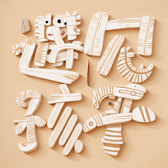



<!--  -->

<h3>遇见孩子，遇见更好的自己 🚀</h3>
<h3>欢迎来到一个新手爸爸的育儿宝库 💎</h3>

# 📇 目录

- 🚣 [儿童发展阶段](./content/child-development.md)
	- [发育评估标准](./content/child-development.md#-发育评估标准)
	- [胚胎发育阶段](./content/child-development.md#-胚胎发育阶段)
	- [新生儿发展阶段](./content/child-development.md#-新生儿发展阶段)
	- [1-2岁发展阶段](./content/child-development.md#-1-2岁发展阶段)
	- [3-5岁发展阶段](./content/child-development.md#-3-5岁发展阶段)
	- [6-11岁发展阶段](./content/child-development.md#-6-11岁发展阶段)
	- [12-14岁发展阶段](./content/child-development.md#-12-14岁发展阶段)
	- [15-17岁发展阶段](./content/child-development.md#-15-17岁发展阶段)
- 👨‍👩‍👧‍👦 [家庭教育](./content/family-education.md)
	- [教育理论](./content/family-education.md#-教育理论)
	- [养育指南](./content/family-education.md#-养育指南)
	- [亲子时间](./content/family-education.md#-亲子时间)
	- [家庭活动](./content/family-education.md#-家庭活动)
	- [写给孩子的信](./content/family-education.md#-写给孩子的信)
- 🎓 [学校教育](./content/school-education.md)
	- [教学理念](./content/school-education.md#-教学理念)
	- [教学资源](./content/school-education.md#-教学资源)
	- [教学标准](./content/school-education.md#-教学标准)
	- [教学评估](./content/school-education.md#-教学评估)
- 🏫 [社会教育](./content/social-education.md)
	- [创新教育](./content/social-education.md#-创新教育)
	- [在线教育](./content/social-education.md#-在线教育)
	- [慕课资源](./content/social-education.md#-慕课资源)
	- [公益组织](./content/social-education.md#-公益组织)
	- [儿童网站](./content/social-education.md#-儿童网站)
	- [机构报告](./content/social-education.md#-机构报告)
- 👨‍💻 [STEAM](./content/steam.md)
	- [Science](./content/steam.md#-science)
	- [Technology](./content/steam.md#-technology)
	- [Engineering](./content/steam.md#-engineering)
	- [Arts](./content/steam.md#-arts)
	- [Mathematics](./content/steam.md#-mathematics)
	- [实践](./content/steam.md#-实践)

 

## 📚 说明

为便于管理与维护，原先位于 README 的完整内容已按一级目录拆分为独立文档，
请从上方目录进入对应主题查看详细内容。

