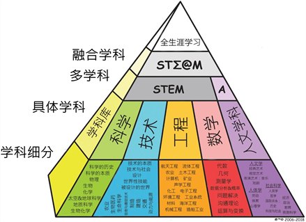
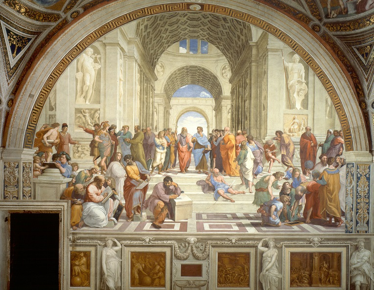

# 👨‍💻 STEAM

## 本页目录

- [Science](#-science)
- [Technology](#-technology)
- [Engineering](#-engineering)
- [Arts](#-arts)
- [Mathematics](#-mathematics)
- [实践](#-实践)

STEAM是指由科学（Science）、技术（Technology）、工程（Engineering）、艺术（Art）、数学（Mathematics）等学科共同构成的跨学科课程。它强调知识跨界、场景多元、问题生成、批判建构、创新驱动，既体现出课程综合化、实践化、活动化的诸多特征，又反映了课程回归生活、回归社会、回归自然的本质诉求。根据美国国家科学委员会《[STEAM_education](https://en.wikipedia.org/wiki/STEAM_education)》的定义。📌 [STEAM的含义](../asset/images/STEAM.png)，👉 [Awesome-STEAM](https://github.com/RahulBirCodes/awesome-steam)

## 🔬 Science

### 🏛️ 理解科学

正如在拉斐尔那里，哲学总是像永恒的仙境、思想的圣地。求真的沉思上百年甚至上千年地在此之中碰撞交织，如同成对的蜻蜓。或许，正是如此神圣的非现实化，使得这幅画直到今天依然散发着魅力！📌 [雅典学院](../asset/images/雅典学院.jpg)

<!--  -->

- 👉 [雅典学院](https://zh.wikipedia.org/zh-cn/%E9%9B%85%E5%85%B8%E5%AD%B8%E9%99%A2_%28%E7%95%AB%E4%BD%9C%29) - Wikipedia上的拉斐尔画作雅典学院的人物介绍。
- 👉 [Understanding Science 101](https://undsci.berkeley.edu/understanding-science-101/what-is-science/) - 加州大学伯克利分校的Understanding Science 101。📺️ [什么是科学](https://youtu.be/TclBJZuUAOY)
- 📚️ [《什么是科学》](https://weread.qq.com/web/reader/9dd32760813ab7b76g018738) - 在本书中，吴国盛教授先是梳理当代中国人的科学观念，然后阐述现代科学起源于古希腊的理性科学，并对比中西文化的差异。
- 📚️ [《科学的故事》](https://weread.qq.com/web/reader/b6e3217071e92091b6eef43) - 科学并不是高深莫测，也不应该烧脑。相反，科学的故事就是人类追求真理的故事，精彩纷呈，引人入胜。
- 📚️ [《科学的历程》](https://weread.qq.com/web/reader/39332d60716516c8393abcb) - 一部普及性的世界科学通史。以东方文明和科学技术对人类进步的影响为开端，以西方文明和科学的发展历程为核心，同时探讨了科学精神的本质和推动科学发展的力量。
- 📚️ [《哲学·科学·常识》](https://weread.qq.com/web/reader/d9a32fe05e3cc6d9ae19c25) - 哲学家陈嘉映的代表作，这本书既是对历史上人类求知之路的回顾，也是对人之本、知识之本的追问。
- 📚️ [《世界观：现代人必须要懂的科学哲学和科学史》](https://weread.qq.com/web/reader/61f322a071fac4b261f20c8) - 本书是一本让人大开脑洞、训练思维、自我成长的人文通识读本。它介绍了科学史和科学哲学根本的问题，如什么是真理、哲学性、概念性事实等。
- 📚️ [《万物简史》](https://weread.qq.com/web/reader/af832e60813ab6d90g01048f) - 书中回溯了科学史上那些伟大与奇妙的时刻，引用了近年来发现的最新科学史料。讲述了人类文明发展进程中所发生的繁多妙趣横生的故事。

### 🏆 科学组织

- 👉 [科学网](https://www.sciencenet.cn/) - 科学网，构建全球华人科学社区。
- 👉 [中国科学院](https://www.cas.cn/) - 中国科学院官网。
- 👉 [科普中国](https://www.kepuchina.cn/) - 科普中国（KepuChina）是一个专注于科学普及和教育的在线平台，致力于传播科学知识，提升公众的科学素养。
- 👉 [世界科学](https://worldscience.cn/) - 《世界科学》是中国大陆地区的一家科学传播媒体，致力于提供高质量的科学新闻和科普内容。
- 👉 [HowStuffWorks](https://www.howstuffworks.com/) - 博闻网（HowStuffWorks）是美国一个百科全书类的网站。
- 👉 [National Inventors Hall of Fame (NIHF) ](https://www.invent.org/) - 国家发明家名人堂（NIHF）是一个成立于1973年的美国非营利组织，旨在表彰持有对美国技术有重大贡献的美国专利的个人工程师和发明家。除了名人堂，赞助教育项目和大学竞赛。
- 👉 [美丽科学]( https://www.beautyofscience.cn/) - 专注于科学可视化前沿技术创新与产业化应用，打造融合科学与艺术之美的系列内容与软硬件产品，服务于科技文化数字展示与青少年科学素质教育。
- 👉 [科学人](https://www.scimonth.com.tw/) - 一份专注于科学、科技、环境和健康领域的高品质科普杂志。它是美国[《科学美国人》](https://www.scientificamerican.com/)杂志（Scientific American）在中文授权版本，内容涵盖最新的科研成果、科技趋势、环境议题和健康知识。
- 👉 [NOAA](https://www.noaa.gov/) - 美国国家海洋和大气管理局（National Oceanic and Atmospheric Administration，简称 NOAA），其主要任务是理解地球系统（包括大气、海洋、气候）并提供科学数据、产品和服务，以保护生命和财产，促进经济发展。
- 👉 [AAPT](https://www.aapt.org/) -  美国物理教师协会（American Association of Physics Teachers，简称 AAPT），一个致力于提升物理教育质量和普及物理科学知识的非营利专业组织。协会成员包括物理教师、教授、研究人员和其他对物理教育感兴趣的个人。👉 [K12老师指导](https://www.aapt.org/K12/index.cfm)

### 🤓 科普精选

- 👉 [Scientific American](https://www.scientificamerican.com/) - 权威科普杂志，适合深入了解科学热点。
- 👉 [Discover Magazine](https://www.discovermagazine.com/) - 科学与技术创新故事。
- 👉 [Smithsonian Magazine](https://www.smithsonianmag.com/) - 科学、历史、文化与艺术交叉内容。
- 👉 [Science News for Students](https://www.sciencenewsforstudents.org/) - 青少年版科学新闻，适合K-12学生。
- 👉 [NOVA (PBS)](https://www.pbs.org/wgbh/nova/) - 经典科学纪录片与互动资源。

[《第一推动丛书》](https://book.douban.com/series/1700)是一套凝结了30年时光的经典科普丛书，被无数读者视为科学精神的家园。

#### 💠 微观宏观

- 📚️ [《从一到无穷：科学中的事实和臆测》](https://weread.qq.com/web/reader/d8732de071913d87d8751c1) - 是当今世界最有影响的科普经典名著之一，1970年代末由科学出版社引进出版后，曾在国内引起很大反响，直接影响了众多的科普工作者。
- 👉 [Scale of the Universe](https://scaleofuniverse.com/) - 是一个在线互动网站，主要功能是帮助用户通过直观的视觉体验理解宇宙的尺度。这个网站展示了从亚原子粒子到宇宙最大结构的尺度，允许用户探索从极微观到极宏大的一切。**相当好！**🤩

#### 🐣 自然生命

- 📚️ [《自私的基因》](https://weread.qq.com/web/reader/fb732f6071691b6efb7de4b) - 是一部开创性的著作，不仅挑战了传统的生物进化观念，还激发了人们对生命本质和行为动机的深刻思考。通过对基因视角的解析，作者为理解生物多样性和人类社会提供了独特的视角，使其成为现代进化生物学和科普文学的经典之作。

#### 🌕 复杂系统

- 📚️ [《哥德尔、艾舍尔、巴赫书：集异璧之大成》](https://book.douban.com/subject/1291204/) - 通过对哥德尔的数理逻辑，艾舍尔的版画和巴赫的音乐三者的综合阐述，引人入胜地介绍了数理逻辑 学、可计算理 论、人工智能学、语言学、遗传学、音乐、绘画的理论等方面，构思精巧、含义深刻、视野广阔、富于哲学韵味。拥有极高评价的科普著作。

## 📡 Technology

### 💍 技术指导

- 👉 [Make](https://makezine.com/) - 一个DIY手动进行创意制作的网站。
- 👉 [Carolina Science](https://www.carolina.com/) - 一个关于生活中的科学作品和制作指导。Carolina covers the world of life science with everything from slides and kits to Agricultural and Vet Science.
- 👉 [507 Mechanical Movements](https://507movements.com/) - 一个可以展示机械方面运动的网站。
- 👉 [Plugs And Sockets](https://www.worldstandards.eu/electricity/plugs-and-sockets/) - 全世界共有15种"插头 + 插座"组合，这个网页把它们全列出来。
- 👉 [关于汉字编码的一些技术](https://spectrum.ieee.org/chinese-keyboard) - The Forgotten History of Chinese Keyboards.

### 🎟️ 古代技术

- 📚️ [《天工开物》](https://weread.qq.com/web/reader/a8232ec0813ab7a2dg012c49) - 全书较全面系统地记述了中国古代农业和手工业的生产技术及经验。
- 📚️ [《营造法式》](https://weread.qq.com/web/reader/2e132f00720527a12e1e573) - 《营造法式》是我国古代*为完整的建筑技术书籍。
- 📚️ [《工程学之书》](https://weread.qq.com/web/reader/55632e70725f98cb556641d) - 探讨了工程学发展历史上250个令人着迷的里程碑事件，从史前期到21世纪。
- 👉 [Pyramids of Meroë](https://artsexperiments.withgoogle.com/meroe/) - 一个动画项目，展示埃及金字塔是如何创建的。介绍那些古代工匠的运用技术智慧。

### 🔢 数字工程

- 👉 [儿童绘本数字化](https://readtogether.ai/) - 李沐开发的儿童绘本实体书转化为电子书并转化为可朗读版本。 开源的上千本英文绘本[网盘地址](https://bit.ly/kidsbooklib)，可以加入到该数字化产品中。
- 👉 [BeddyStories](https://beddystories.com/) - 一个儿童睡前故事网站收集了全球经典的儿童睡前故事。
- 👉 [识典古籍](https://www.shidianguji.com/) - 北大和字节跳动共同研发的一个专注于古籍数字化和传统文化传播的平台。
- 👉 [Vesuvius Challenge](https://scrollprize.org/) - 维苏威火山挑战赛（Vesuvius Challenge）是一个专注于利用现代技术解读古代文献的国际竞赛。
- 👉 [Blinkist](https://www.blinkist.com/) - 一个专注于提供书籍摘要的应用程序和网站，通过提供书籍的精简版摘要，为那些没有足够时间阅读完整书籍的读者提供了一种替代方案。
- 👉 [虚拟博物馆](https://mayeclair.itch.io/museum-of-all-things) - 一个跨平台的桌面软件，将维基百科变成一个虚拟博物馆。
- 👉 [ChinaTextbook](https://github.com/TapXWorld/ChinaTextbook) - 所有小初高、大学PDF教材。
- 👉 [中国盲人数字图书馆](http://www.cdlvi.cn/user/index) - 中国盲人数字图书馆的网站内容全部提供音频播放。
- 👉 [全球气温地图](https://zoom.earth/maps/temperature/) - 通过地图可以查看全球当前的天气可视化数据。**相当好！**🤩
- 👉 [Mapedia.cc](https://mapedia.cc/) - AI地图，用户搜索一个主题，它会显示相关地图和解释文章。包括名人的足迹，非常有趣！
- 👉 [Citywalki](https://www.citywalki.com/) - 让你感受在世界200多个城市步行/开车/飞无人机。选择城市和移动方式后，它会全屏播放相应的Youtube视频，完成一个数字化体验。
- 👉 [中小学语文示范诵读库](https://zedex.github.io/mandarin-reading-resource/) - 中央人民广播电台中小学语文示范诵读库的 Web 前端，课文按年级、学期分类。
- 👉 [ISBN Visualization](https://phiresky.github.io/isbn-visualization) - 世界上所有书籍的国际书号（ISBN），可视化成一个图书馆的书架。查询某本书，可以显示该书所在的书架，👉 [开源代码](https://github.com/phiresky/isbn-visualization/) 
- 👉 [ASCIIMoon](https://asciimoon.com/) - 这个网站使用ASCII码展示当天的月相（新月、弯月、满月）。
- 👉 [Open Library](https://openlibrary.org) - Open Library（开放图书馆）是一个雄心勃勃的非营利性数字图书馆项目，其目标是 “为世界上每一本书创建一个网页”。它由互联网档案馆（Internet Archive）于2007年发起，致力于构建一个开放、免费、可编辑的全球图书目录和阅读平台。
- 👉 [人类消费的动物](https://www.humanconsumption.live/) - 人类要消费多少动物？有人做了一个网站，实时显示今年至今被消费掉的动物数量。这是一个惊人的数字！为了养活人类，地球需要付出这么多。
- 👉 [海平面上升模拟器](https://www.runcell.dev/tool/true-size-map/sea-level-rise-simulator) - 用户在网页上设定海平面的上升高度，查看地球卫星地图的变化，哪些地区被淹没。
- 👉 [Diode](https://www.withdiode.com/) - 面包板在线模拟网站，在网页上用各种电子元件，可视化模拟面包板电路项目，可以查看运行效果。**相当好！**🤩
- 👉 [LEOLabs](https://platform.leolabs.space/visualization) - 澳大利亚LEOLab公司的卫星数据平台，提供近地轨道可视化、轨道分析功能。**相当好！**🤩
- 👉 [佛津](https://fojin.app/) - 全球佛教古籍数字化聚合平台。
- 👉 [Flight VIZ](https://flight-viz.com/) - 实时3D显示全球的航班。

## 🩺 Engineering

[Engineer4Free](https://www.engineer4free.com/)是一个专门提供免费工程教育资源的网站，主要的目标群体是工程学的学生和爱好者。该网站包含了广泛的教学材料，包括视频讲座、教学笔记、习题解析、实践项目等，覆盖了包括但不限于化工、机械、电气、土木、计算机等工程学的多个领域。📺️ [YouTube空间内容](https://www.youtube.com/engineer4free)

### 📑 教程

- 👉 [Awesome](https://github.com/sindresorhus/awesome) - GitHub上开源的Awesome集合。
- 👉 [Unicode联盟](https://home.unicode.org/) - Unicode联盟是一个非营利性组织，负责开发、维护和推广Unicode标准，这是一项国际编码标准，旨在为全球所有语言文字的字符提供唯一的编码，从而实现各种语言和字符在数字设备上的统一表示和处理。
- 🤗 [计算机自学课程集合](https://github.com/ForrestKnight/open-source-cs) - 这个仓库按照学习顺序，列出对应的欧美大学的计算机科学开放课程。全部学完，就等于上完计算机学位课程了。
- 🤗 [VisualSorting](https://github.com/mszula/visual-sorting) - 排序算法可视化。
- 📚️ [《编码：隐匿在计算机软硬件背后的语言》](https://weread.qq.com/web/reader/64e32bf071fd5a9164ece6b) - 作者用丰富的想象和清晰的笔墨将看似繁杂的理论阐述得通俗易懂，你丝毫不会感到枯燥和生硬。更重要的是，你会因此而获得对计算机工作原理较深刻的理解。
- 👉 [Programming for Kids](https://github.com/HollyAdele/awesome-programming-for-kids) - 整理了各年龄段学习的不同级别的编程指导和网站。
  - 👉 [Scratch](https://scratch.mit.edu/) - Scratch是由麻省理工学院媒体实验室开发的图形化编程平台，旨在让程序设计语言初学者不需先学习语言语法便能设计产品。
  - 👉 [PixelPad](https://pixelpad.io/) - 在线游戏引擎，用于学习如何用Python构建在线游戏和应用程序。
  - 👉 [Code](https://code.org/) - Code.org是一个非盈利性的全球性组织，致力于为所有年龄层的学生提供计算机科学教育。
  - 👉 [Construct 3](https://www.construct.net/) - 一个免费的在线游戏工作室，供初学者构建自己的游戏。
  - 👉 [Isaac Computer Science](https://isaaccomputerscience.org/) - 为所有年级学生探索计算机科学的在线平台。
  - 👉 [GeeksforGeeks](https://www.geeksforgeeks.org/) - 一个专注于计算机科学和编程教育的在线平台，提供丰富的学习资源和教程。
  - 👉 [CS Unplugged](http://csunplugged.org/) - 一个专注于通过非传统方式教授计算机科学概念的教育资源网站。该平台提供了一系列免费的学习活动，旨在通过游戏、谜题和动手活动激发学生的兴趣。
- 👉 [用JavaScript生成迷宫](https://jrsinclair.com/articles/2025/joy-of-immutable-data-recursion-pure-functions-javascript-mazes/) - 本文用通俗的语言，介绍一种生成迷宫的简单算法，给出JS的实现。

### 📦︎ 作品

- 👉 [In Pieces-30 endangered Species](http://www.species-in-pieces.com/#) - 一个很有创意的网站，用30个碎片拼出30种濒危动物，只使用 CSS。
- 👉 [Arecibo_message](https://en.wikipedia.org/wiki/Arecibo_message) - 想象下你要给远方的外星人发一段编码信息介绍地球人，该如何设计？
- 🤗 [Weather as Landscape](https://github.com/lds133/weather_landscape) - 一个利用显示器将天气预报信息转化变成一幅画，提供开源代码和硬件设备资料。
- 🤗 [CuteClock](https://github.com/AkenClub/CuteClock) - 一个开源硬件项目，基于ESP8266的智能时钟，可以显示时间和天气，支持小爱同学语音控制，自带 Web 和小程序客户端。
- 🤗 [Weathr](https://github.com/Veirt/weathr) - 一个终端应用，用来查看指定地点的天气，以动画形式展示。
- 🤗 [树莓派掌上电脑](https://soulscircuit.com/pilet) - 一支国外团队推出了"树莓派掌上电脑"，看上去很酷，它就是一个全功能的 Linux 系统，带有7小时续航。[开源代码](https://github.com/soulscircuit/pilet)
- 🤗 [Pi Box](https://hackaday.io/project/202168-pi-box/details) - 树莓派是最流行的单板计算机，使用时，需要自己准备一大堆外设，很不方便也不好携带。一位印度开发者，为树莓派设计了一个外壳，起名为 Pi Box，令人耳目一新。另外还有很多有趣的[数字电路作品](https://hackaday.io/projects)。
- 🤗 [五子棋游戏程序](https://github.com/mumuy/gobang) - 一个开源的五子棋对战游戏程序。
- 🤗 [MI-GPT](https://github.com/idootop/mi-gpt) - 一个开源实现小爱音箱接入大模型。
- 🤗 [Lobe Chat](https://github.com/lobehub/lobe-chat) - 一键免费拥有你自己的Chat应用。
- 🤗 [MLC AI](https://github.com/mlc-ai/mlc-llm) - 一个通用的大模型部署引擎，可以构建部署自己的机器学习和大模型。
- 🤗 [SkyThought](https://github.com/NovaSky-AI/SkyThought) - NovaSky-AI团队开发的低成本高效语言模型系列，核心目标是通过优化训练策略和测试时缩放技术，在保持低成本的同时提升模型在数学、编程、科学推理等领域的性能。
- 🤗 [辰宇落雁體](https://github.com/Chenyu-otf/chenyuluoyan_thin) - 一个自己动手制作的手写字体，项目开源可参考。
- 🤗 [vYinn（殷人）](https://github.com/shanleiguang/vYinn) - 古籍印章图案的制作工具。该作者发起了中文古籍數字復刻計劃，包括多个开源内容！
- 👉 [木制显示器](https://benholmen.com/blog/kilopixel/) - 一位程序员制作了一个木质的像素显示器，非常有创意！
- 👉 [地震预警系统](https://research.google/blog/android-earthquake-alerts-a-global-system-for-early-warning/) - 谷歌披露，安卓系统内置了一个全球地震预警系统，可以向用户发出地震警报。设计思路非常有启发！
- 👉 [Touch Mapper](https://touch-mapper.org/) - 这个网站的创意很棒，你输入一个街道地址，它输出该地址的3D地图文件，可以3D打印出来，供视障人士触摸使用。
- 👉 [粘土电路板](https://feministhackerspaces.cargo.site/Clay-PCB-Tutorial) - 一位国外网友，为了演示电路板并不是高深的产品，特别制作了一块粘土电路板。👉 [开源代码](https://github.com/FeministHardware/Making-PCBs-from-natural-clay) **相当有趣！**🤩  
- 👉 [Valetudo](https://valetudo.cloud/) - 扫地机器人的开源固件，提供完整功能，并且不跟云端服务器进行通信。👉 [开源代码](https://github.com/Hypfer/Valetudo)
- 🤗 [结印](https://github.com/huanglizhuo/Ketsuin) - 一个 Web 应用，通过火影忍者的手势输入法，摄像头识别手势进行文字输入。

### 🤖 AI

GitHub上总结的一份[Awesome ML](https://github.com/josephmisiti/awesome-machine-learning)一个精心策划的机器学习资源列表，旨在帮助初学者和专家找到与机器学习、深度学习和人工智能相关的高质量工具、软件、库、教程、论文、课程以及博客文章等。

- 📚️ [《人工智能基础（高中版）》](https://book.douban.com/subject/30209224/) - 本书较科普，讲授人工智能的发展历史、基本概念以及实际应用，使学生理解人工智能的基本原理，特别是数据、算法与应用之间的相互关系。
- 📚️ [《人工智能 (高中版)》](https://book.douban.com/subject/35479969/) - 本书较偏理论，介绍了人工智能的8个核心方向，包括搜索、机器学习、线性回归、决策树、神经网络、计算机视觉、自然语言处理、强化学习，特别归纳了其中适合中学阶段学习的关键知识点。
- 👉 [看见概率论](https://probability.visualized.fun/) - 让概率论变得可见且有趣，通过直观的交互式演示，深入理解概率论中的经典定理， 让抽象的数学概念变得生动有趣。
- 👉 [Embedding Projector](http://projector.tensorflow.org/) - 可视化单词嵌入表示。
- 👉 [Playground可视化神经网络](https://playground.tensorflow.org/) - 可视化神经网络工作工程。👉 [开源代码](https://github.com/tensorflow/playground)
- 👉 [神经网络的视觉解释](https://visualrambling.space/neural-network/) - 这个网站用动画解释"什么是神经网络"。
- 👉 [Transformer可视化](https://bbycroft.net/llm) - 一个大语言模型的可视化工具。**相当好！**🤩
- 👉 [Transformer逆向工程](https://transformer-circuits.pub/) - 一个专注于Transformer模型逆向工程研究的网站，旨在通过简化模型来探究Transformer背后的工作原理和机制。
- 👉 [LLM解释可视化](https://openai.com/index/language-models-can-explain-neurons-in-language-models/) - 大语言模型的解释可视化。👉 [开源代码](https://github.com/openai/automated-interpretability)
- 👉 [JMLR](https://www.jmlr.org/) - The Journal of Machine Learning Research (JMLR), provides an international forum for the electronic and paper publication of high-quality scholarly articles in all areas of machine learning. 
- 👉 [Towards Data Science](https://towardsdatascience.com/) - 一个专注于数据科学和机器学习的博客平台。
- 👉 [Medium](https://medium.com/) - 提供了许多关于机器学习的文章和教程。
- 👉 [DeepLearning.AI](https://www.deeplearning.ai/) - 专注于深度学习和人工智能教育的在线平台。 📺️ [B站吴恩达AI课程研究院](https://space.bilibili.com/96499511)
- 📚️ [《统计学习方法》](https://weread.qq.com/web/reader/c0032560813ab6c02g010482) - 李航老师编写的机器学习。👉 [开源代码](https://github.com/fengdu78/lihang-code)
- 📚️ [《动手学习机器学习》](https://hml.boyuai.com/) - 上海交通大学推出的机器学习教科书。👉 [开源代码](https://github.com/d2l-ai/d2l-zh)
- 📚️ [《动手学习深度学习》](https://zh.d2l.ai/) - 面向中文读者的能运行、可讨论的深度学习教科书。👉 [开源代码](https://github.com/d2l-ai/d2l-zh)， 📺️ [B站跟李沐学AI](https://space.bilibili.com/1567748478/)
- 📚️ [《动手学习强化学习》](https://hrl.boyuai.com/) - 旨在为国内学生和研究者提供一个友好的强化学习环境。👉 [开源代码](https://github.com/boyu-ai/Hands-on-RL)
- 📚️ [《Neural Networks and Deep Learning》](http://neuralnetworksanddeeplearning.com/) - 量子计算领域大牛[Michael Nielsen](https://michaelnielsen.org/)写的神经网络和深度学习入门书籍。👉 [开源代码](https://github.com/mnielsen/neural-networks-and-deep-learning)

### 🛠️ 工具

- 👉 [MapLab](https://github.com/ethz-asl/maplab) - 一个地图绘制工具包。
- 👉 [Pango](https://pango.gnome.org) - 一个高性能国际字体渲染库，方便制作各类字体。
- 👉 [Materials Project](https://next-gen.materialsproject.org/) - 材料科学研究平台。可视化工具包[Pymatgen](https://pymatgen.org/)和[开源代码](https://github.com/materialsproject/pymatgen)
- 👉 [Excalidraw](https://excalidraw.com/) - 一个开源的白板工具。
- 🤗 [Oxdraw](https://github.com/RohanAdwankar/oxdraw) - 一个Rust语言编写的Web服务，用来可视化生成图表，同时给出对应的Mermaid语法代码。
- 🤗 [Screenity](https://github.com/alyssaxuu/screenity) - 开源的录频工具。The free and privacy-friendly screen recorder with no limits.
- 🤗 [LosslessCut](https://github.com/mifi/lossless-cut) - 开源的音视频剪辑工具。The swiss army knife of lossless video/audio editing.
- 🤗 [Openscreen](https://github.com/siddharthvaddem/openscreen) - 开源的录屏桌面应用，用于制作产品演示与讲解视频。
- 🤗 [HandBrake](https://github.com/HandBrake/HandBrake) - 一个非常强大的开源的视频格式转化工具。
- 👉 [Zotero](https://www.zotero.org/) - 一款开源的科研助手。Zotero is a free, easy-to-use tool to help you collect, organize, annotate, cite, and share research. 👉 [开源代码](https://github.com/zotero/zotero)
- 👉 [Datawrapper](https://www.datawrapper.de/) - 免费的数据可视化工具。Enrich your stories with charts, maps, and tables. 类似的一个在线的数据图表生成器[UChart](https://www.uwarp.design/uchart)让没有编程背景的用户也能创建专业数据图表。
- 👉 [Bokeh](https://github.com/bokeh/bokeh) - 数据可视化工具包。Interactive Data Visualization in the browser, from Python.
- 👉 [PyGWalker](https://github.com/Kanaries/pygwalker) - 可以交互的数据可视化工具包。Turn your dataframe into an interactive UI for visual analysis.
- 🤗 [just-the-docs](https://github.com/just-the-docs/just-the-docs) - 开源的在线文档制作工具。A modern, high customizable, responsive Jekyll theme for documentation with built-in search.
- 👉 [颜色代码表](https://www.ysdaima.com/) - 一站式色彩解决方案，为设计师和开发者提供专业的色彩工具，让设计更出色。
- 👉 [CodePen](https://codepen.io/) - CodePen是一个在线代码编辑器和社交开发平台，主要面向前端开发者和设计师。
- 👉 [TinkerCAD](https://www.tinkercad.com/) - TinkerCAD是一个免费的、基于浏览器的三维设计和打印工具，由Autodesk公司开发。它旨在让初学者和有经验的设计师都能轻松创建三维模型，并将其用于3D打印或其他目的。
- 👉 [DIY.org](https://diy.org/) - 一个专注于 DIY（Do It Yourself，自己动手做）项目和创意分享的在线平台。
- 👉 [Minecraft](https://www.microsoft.com/en-us/makecode) - Microsoft提供的一套面向儿童的教育工具，包括游戏开发、Minecraft模组、硬件黑客等在线环境。
- 👉 [GitHub Resume](https://resume.github.io/) - 该工具可以基于GitHub上的内容创建自己的简历。
- 👉 [Chatbot Arena](https://lmarena.ai/) - 一个专注于展示和评测大型语言模型（LLM）性能的在线平台。这个平台的核心目标是为研究人员、开发者和一般用户提供一个直观、全面的比较工具，用以评估不同语言模型在多种任务和指标上的表现。
- 👉 [Dify.ai](https://dify.ai/) - 一个专注于构建和管理多模态AI应用的平台。它旨在帮助开发者和企业利用先进的AI技术，快速构建定制化的AI解决方案，而无需从零开始开发复杂的AI模型。👉 [开源代码](https://github.com/langgenius/dify)
- 👉 [腾讯兔小巢](https://txc.qq.com/) - 腾讯旗下的反馈互动社区工具，可以集成到软件产品中，收集用户的反馈。另外可以找到多款腾讯生态工具。
- 👉 [HQDFM](https://www.nextpcb.com/dfm) - 一个在线PCB（Printed Circuit Board，印刷电路板）设计审查和可制造性分析（Design for Manufacturing，DFM）服务的平台。
- 👉 [Voice-Pro](https://github.com/abus-aikorea/voice-pro) - AI 语音工具，具有多种功能（语音识别、翻译、语音克隆、文本转语音）。
- 👉 [InternetSpeedTest](https://www.internetspeed.my/) - 一个网速测试工具。 
- 👉 [ChangeDetection](https://changedetection.io/) - 一个开源的服务，用来检测指定网页的某个部分是否发生变化。比如，网页上面的商品价格发生变化，它就会通知你。👉 [开源代码](https://github.com/dgtlmoon/changedetection.io)
- 👉 [物言](https://mono.cards/) - 一个制作你的物品明信片的网站。
- 👉 [BrickLink Studio](https://www.bricklink.com/v3/studio/download.page) - BrickLink提供了一个名为Studio的工具，允许用户为乐高构建、渲染和创建原创作品。用户可以使用Studio来设计自己的乐高模型，并生成详细的搭建指南。[乐高日心仪](https://marian42.de/article/orrery/)就是用该工具设计，非常惊艳！
- 👉 [iCraft Editor](https://icraft.gantcloud.com/) - 一个强大的3D架构图绘制工具，适用于需要直观展示复杂系统架构和实时监控数据的场景。
- 👉 [Teleprompter.today](https://www.teleprompter.today/) - 一个在线的提词器，为演讲者、视频创作者和直播主播提供文本提示，可以定制各种属性。
- 👉 [Crawl4AI](https://github.com/unclecode/crawl4ai) - Crawl4AI: Open-source LLM Friendly Web Crawler & Scraper.
- 🤗 [EternalTerminal](https://github.com/MisterTea/EternalTerminal) - 基于SSH的远程登录工具，自动重连上一次的会话，即不会发生会话中断。
- 🤗 [NocoBase](https://github.com/nocobase/nocobase) - NocoBase是一个极易扩展的AI无代码开发平台。
- 🤗 [NetNewsWire](https://github.com/Ranchero-Software/NetNewsWire) - 一个桌面的RSS阅读器。
- 👉 [TeachBooks](https://teachbooks.io/) - 一个专为教育工作者设计的开源协作平台。它主要解决两个核心痛点：如何让非技术人员轻松创建高质量的在线书籍，以及如何利用多媒体资源提升 K-12 阶段的教学体验。
- 🤗 [Meilisearch](https://github.com/meilisearch/meilisearch) - 一个轻量级的混合模式搜索引擎工具。

### 🧮 有趣发明

- 👉 [红外线编码](https://www.unsw.edu.au) - 英国科学家发明了一种新的通信方式，通过热辐射二极管，将数字信号以热量形式传递。

## 🎨 Arts

AI时代是否每个人都会成为数字艺术家？是那些原本爱好艺术的人才能成为艺术家！

- 👉 [SmartHistory](https://smarthistory.org/) - 艺术史与艺术教育资源，深入解读经典作品。
- 👉 [Google Arts & Culture](https://artsandculture.google.com/) - 浏览全球博物馆藏品、虚拟展览与艺术故事。
- 👉 [Artcyclopedia](http://www.artcyclopedia.com/) - 艺术作品与艺术家在线索引。
- 👉 [Artsonia](https://www.artsonia.com/) - 儿童艺术作品在线展示与学校项目。
- 👉 [Drawspace](http://www.drawspace.com/) - 绘画与素描的免费教程与练习。

### 🎵 音乐

GitHub上总结的一份[Awesome Music](https://github.com/noteflakes/awesome-music)，包含很棒的音乐库、工具、框架和软件的分类集合。还有另一份[Awesome Music Production](https://github.com/ad-si/awesome-music-production)总结，用于创作音乐的软件、硬件和其他资源的精选列表。

#### 🎹 音乐教学

- 👉 [音乐教学法](https://www.xueshu.com/haowen/795.html) - 学术之家上整理的12篇音乐教学法。
- 👉 [乐理学习](https://en.wikipedia.org/wiki/Music_theory)
  - 👉 [OpenMusicTheory](http://openmusictheory.com/) - 一个不断增长的在线教科书，用于音乐理论和听觉技能。
  - 👉 [Musictheory](https://www.musictheory.net/) - 非常好的乐理在线课程和练习。**相当好！**🤩
  - 👉 [Know Your Theory](https://knowyourtheory.com/) - 一个致力于音乐理论教育的在线平台，它为音乐爱好者、学生以及专业音乐人提供了一系列的课程和资源，以帮助他们深入了解和掌握音乐理论的核心概念。
  - 👉 [Music Theory for Musicians and Normal People](https://tobyrush.com/theorypages/index.html) - Toby Rush创建的一个在线音乐理论资源网站，该网站被设计为一本在线音乐理论教科书，它全面、深入地探讨了音乐理论的各个方面，从基本概念到高级主题。通过漫画展示非常有趣！
  - 👉 [Four Score and More](https://fourscoreandmore.org/) - 基于乐谱量身定制的音乐理论练习。
- 👉 [口琴学习](https://en.wikipedia.org/wiki/Harmonica)
  - 👉 [Harmonica](https://www.harmonica.com/) -  一个提供教育资料，还构建了一个社区，让口琴爱好者能够互相交流经验，分享演奏技巧，以及找寻同好。这对于初学者来说，是一个与其他口琴爱好者建立联系、获得鼓励和支持的宝贵机会。[初学者入门指南](https://www.harmonica.com/harmonica-keys-for-beginners/)
  - 👉 [HarmonicaLessons](https://www.harmonicalessons.com/) - 提供了从基础知识到高级演奏技巧的全面教程，适合不同级别的学习者。课程包括视频教学、伴奏练习和音乐理论讲解，涵盖了布鲁斯、流行、民间等多种风格。
  - 👉 [BluesHarmonica](https://www.bluesharmonica.com/) - 专注于布鲁斯风格的口琴学习，提供免费资源，如技巧文章、曲谱和视频教学，对于想要深入探索布鲁斯口琴魅力的学习者是一个不错的选择。
  - 👉 [The Harmonica Club](https://harmonicaclub.com/) - 这个网站提供了一系列的基础到进阶课程，以及一个充满活力的社区，学习者可以在其中分享经验、交流技巧。此外，网站上还有乐器购买指南、曲谱下载等资源，是一个全面的口琴学习平台。
  - 👉 [World Harmonica Festival](https://www.world-harmonica-festival.de/) - 世界口琴节（World Harmonica Festival）是一个专注于口琴艺术和文化的国际性活动——世界口琴节的官方网站。
  - 📺️ [B站复音口琴教程](https://www.bilibili.com/video/BV1rU4y1F7MB) - 苡蒽de口琴乐园。👉 [B站空间](https://space.bilibili.com/479771256/lists)
  - 📚️ [《口琴自学教程》](https://book.douban.com/subject/3562082/) - 口琴爱好者写的口琴自学教程【复音】。另有布鲁斯口琴教程[《跟美国名师学口琴》](https://book.douban.com/subject/2150650/)和口琴大师黄文胜的[《口琴入门基础教程》](https://book.douban.com/subject/5998232/)
- 👉 [尤克里里学习](https://en.wikipedia.org/wiki/Ukulele)
  - 👉 [UkeGeeks](https://ukegeeks.com/) - UkeGeeks是一个专注于尤克里里（Ukulele）爱好者的资源网站。它提供了大量的教程、乐谱、技巧和社区支持，旨在帮助尤克里里爱好者提高演奏技巧和享受音乐的乐趣。👉 [在线歌曲编辑器](https://ukegeeks.com/songeditor)，👉 [开源代码](https://github.com/buzcarter/UkeGeeks)
  - 👉 [UkeAlong](https://ukealong.com/) - UkeAlong是一个专注于尤克里里（Ukulele）的教学与乐谱网站，非常全面的尤克里里学习网站。👉 [提供一个和弦识别工具](https://ukealong.com/tool/chord-detector/)
  - 👉 [UkuTabs](https://ukutabs.com/) - UkuTabs是一个非常受欢迎的尤克里里（Ukulele）和弦谱网站。这个网站集合了成千上万首各类风格的歌曲和弦谱，专为尤克里里爱好者打造。
  - 📚️ [《尤克里里完全入门24课》](https://book.douban.com/subject/6959725/) - 尤克里里的入门教程。
- 👉 [吉他学习](https://en.wikipedia.org/wiki/Guitar)
  - 👉 [在线吉他学习](https://hougiser.gitee.io/music-score/#/) - 一个提供吉他教学相关的网站。
  - 👉 [Fretboard](http://alexmost.github.io/fretboard/) - 一个在线的吉他指板视图工具，用于研究音阶和和弦。它为学习吉他提供了实用和直观的视觉辅助。👉 [开源代码](https://github.com/AlexMost/fretboard)
  - 👉 [Guitarix](https://guitarix.org/) - 一个虚拟吉他放大器。它提供了多种效果和放大器模拟，可以模拟真实吉他的声音。
  - 👉 [GuitarML](https://guitarml.com/) - GuitarML是一个专门为吉他爱好者和技术爱好者设计的平台。它结合了机器学习技术与音乐，为用户提供了一种创新的吉他效果处理方法。
- 👉 [钢琴学习](https://en.wikipedia.org/wiki/Piano)
  - 👉 [Frazier Piano Studio](https://www.frazierpianostudio.com/) - 一个专注于钢琴教学的专业音乐工作室。
- 👉 [NOTATIO](https://notat.io/) - 一个致力于音乐记谱实践的论坛。
- 👉 [Audio](https://audio.com/) - 免费的音频托管平台。帮助音频创意人士与世界分享他们的作品。
- 👉 [Music Fonts](https://music-fonts.com/) - 音乐字体库和视觉展示。
- 👉 [CPDL](https://www.cpdl.org/) - CPDL的主要目标是提供一个平台，使合唱指挥、歌手和音乐爱好者能够访问大量合唱作品，其中大部分作品的版权已经过期或由作曲家自愿共享。
- 👉 [Sonic Pi](https://sonic-pi.net/) - Sonic Pi可直接代码现场编码合成器，被广泛用于音乐教育领域，因为它易于上手且功能强大。许多学校和大学使用它来教授编程和音乐创作。
- 👉 [ChordPro](https://www.chordpro.org/) - ChordPro是一种用于标记歌曲和弦的标准格式，它允许你在文本文件中清晰地标记歌词和和弦。👉 [开源实现的标准格式](https://github.com/ChordPro/chordpro)

#### 🏭︎ 音乐工具

- 👉 [Audacity](https://www.audacityteam.org/) - Audacity是一款免费、开源的音频编辑软件，广泛用于录音、混音和音频处理。此外，还提供了一些高级功能，如频率分析、音量标准化和音频增强工具。这些功能使得Audacity成为音乐制作人、播客制作者和音频工程师等专业人士的理想选择。👉 [开源代码](https://github.com/audacity/audacity)
- 👉 [LMMS](https://lmms.io/) - LMMS是一款开源跨平台音乐制作软件。👉 [开源代码](https://github.com/LMMS/lmms)
- 👉 [SuperCollider](https://supercollider.github.io/) - SuperCollider的独特之处在于它的灵活性和强大的音频处理能力，使得它成为音乐家、声音设计师和研究人员的首选工具之一。可以使用控制语言处理音频。👉 [开源代码](https://github.com/supercollider/supercollider)
- 👉 [Ardoru](https://ardour.org/) - Ardoru是一个开源的音频录制和编辑软件，以及丰富的插件。这个软件以其强大的功能和灵活的操作界面而闻名，被广泛用于音乐制作、广播和声音设计等领域。
- 👉 [MuseScore](https://musescore.org/) - 免费的开源音乐记谱和作曲软件。[使用手册](http://musescore.org/en/handbook)支持中文。👉 [开源代码](https://github.com/musescore/MuseScore)
- 👉 [LilyPond](https://lilypond.org/) - LilyPond是一个免费且开源的软件，它使用一种基于文本的输入方式来创建乐谱。用户可以直接在文本编辑器中编写乐谱代码，然后通过LilyPond将其转换为美观的五线谱。
  - 👉 [Lilypond cook book](https://github.com/noteflakes/lilypond-cookbook/wiki/) - 获取LilyPond最大效益的技巧和窍门。
  - 👉 [Lilypond Snippet Repository](http://lsr.di.unimi.it/) - 一个在线的LilyPond片段数据库，包括想法、功能和技巧。
  - 👉 [OpenLilyLib](https://github.com/openlilylib/snippets/) - 存储有用的LilyPond代码片段的地方，包括片段、模板和扩展。
  - 👉 [Lilypond-Sheet-Music](https://github.com/cellist/Lilypond-Sheet-Music) - 使用Lilypond系统排版音乐。
  - 👉 [Denemo](https://www.denemo.org/) - 一个基于LilyPond的免费音乐记谱编辑器。👉 [开源代码](https://github.com/denemo/denemo)
  - 👉 [Frescobaldi](https://www.frescobaldi.org/) - 一个免费的LilyPond乐谱编辑器。👉 [开源代码](https://github.com/frescobaldi/frescobaldi)
  - 👉 [Hacklily](https://www.hacklily.org/) - 基于LilyPond的在线乐谱编辑器。
  - 👉 [Lilybin](http://lilybin.com/) - 基于Web的LilyPond编辑器。
  - 👉 [Abjad](http://abjad.mbrsi.org/) - 基于LilyPond的正式乐谱控制Python API。
- 👉 [Guido](https://guido.grame.fr/) - 一个通用的、可移植的图形化渲染乐谱的库和API。👉 [开源代码](https://github.com/grame-cncm/guidolib) 
- 👉 [Neoscore](https://neoscore.org/) - 一个以图形为先的音乐记谱Python库。
- 👉 [Vexflow](http://www.vexflow.com/) - 一个用于渲染音乐记谱和吉他指法的JavaScript库。👉 [开源代码](https://github.com/0xfe/vexflow)
- 👉 [Alda](https://alda.io/) - Alda是一种创新的、基于文本的编程语言，专门设计用于音乐创作。Alda的出现，模糊了编程与音乐创作之间的界限，促进了这两个领域的交叉与融合。👉 [开源代码](https://github.com/alda-lang/alda)
- 👉 [Faust](https://faust.grame.fr/) - Faust一种开源用于信号处理和声音合成的函数式编程语言。👉 [提供在线IDE](https://faustide.grame.fr/)，👉 [开源代码](https://github.com/grame-cncm/faust)
- 👉 [Chuck](https://chuck.stanford.edu/) - 斯坦福大学开发的一种强时间性的、并发的、即时的音乐编程语言。👉 [提供在线IDE](https://chuck.stanford.edu/ide/)，👉 [开源代码](https://github.com/ccrma/chuck)
- 👉 [Overtone](https://github.com/overtone/overtone/) - 一个开源的工具包，用于设计合成器并与音乐合作。👉 [开源代码](https://github.com/overtone/overtone/)
- 👉 [Helio](https://helio.fm/) - 一个轻量级的音乐制作工具。[开源代码](https://github.com/helio-fm/helio-sequencer)
- 👉 [Orca](https://github.com/hundredrabbits/Orca) - 一个用于音乐的现场编程环境。Orca独特设计使其成为实时音乐制作和音频处理的理想选择，特别是对于那些希望创建独特的音乐序列和实验性声音设计的音乐家和声音艺术家而言。
- 👉 [IanniX](https://www.iannix.org) - 一个基于[Iannis Xenakis（先锋艺术家）](https://www.iannis-xenakis.org/)作品的图形开源序列器，用于数字艺术。
- 👉 [Beets](https://beets.io/) - Beets的主要设计目的是帮助用户组织和管理音乐库，自动修正音乐文件的元数据，并能将音乐文件转换为不同的格式。👉 [开源代码](https://github.com/beetbox/beets)
- 👉 [Finale Reader](https://www.finalemusic.com/) - Finale Reader是Finale音乐公司的各类音乐文件的阅读器。
- 👉 [Franzelio](https://franzelio.franzai.com) - 一个有意思的网页小游戏，在网页上画线，反弹小球，发出的声音组成旋律。
- 👉 [Suno](https://suno.com/) - Suno is building a future where anyone can make great music.
- 👉 [DiffRhythm](https://github.com/ASLP-lab/DiffRhythm) - Blazingly Fast and Embarrassingly Simple End-to-End Full-Length Song Generation with Latent Diffusion.

#### 📣 音乐作品

- 👉 [班得瑞作品](https://zh.wikipedia.org/zh-sg/班得瑞) - 班得瑞的音乐风格以轻柔、宁静、自然为主要特点，他们的音乐作品常常被用作环境音乐、冥想音乐以及放松和减压的背景音乐。班得瑞的音乐中融入了大量的自然声音，如流水、鸟鸣等，这些音效都是通过实地录制得到的，旨在为听众提供一种身临其境的自然体验。📺️ [B站搬运视频](https://www.bilibili.com/video/BV1HZ4y1m7NX/)，📺️ [另一个合集](https://www.bilibili.com/video/BV18Y4y1Y7Gd)
- 👉 [神思者作品](https://zh.wikipedia.org/wiki/神思者) - 神思者是一支具有深厚音乐功底和广泛影响力的新世纪音乐团体。他们的音乐融合了现代与古典、电子与传统的元素，创造出独特的音乐风格和氛围。📺️ [B站搬运视频](https://www.bilibili.com/video/BV1sQ4y1D7SJ)
- 👉 [新世纪音乐-雅尼](https://zh.wikipedia.org/wiki/雅尼) - 雅尼（Yanni），著名的新世纪音乐作曲家和演奏家。📺️ [雅尼13场音乐会合集](https://www.bilibili.com/video/BV1sJ411A7Pa/)，📺️ [B站雅尼合集](https://www.bilibili.com/video/BV1XQ4y1y7i9)
- 👉 [久石让作品](https://zh.wikipedia.org/wiki/久石让) - 久石让是一位才华横溢的音乐家，他的作品深受全球听众的喜爱。他的音乐不仅具有独特的艺术价值，也为电影和动画作品增添了无限的魅力。📺️ [久石让电影配乐合集](https://www.bilibili.com/video/BV1LN411d7Hy)，📺️ [久石让-宫崎骏动漫音乐会](https://www.bilibili.com/video/BV1oV411y7Xo)
- 👉 [MyNoise](https://mynoise.net/) - 一个提供背景噪音和互动声景的作品集。可以自定义背景声音。比如[孕妈妈子宫中的声音](https://mynoise.net/NoiseMachines/inUteroSoundGenerator.php)

#### 🎑 音乐欣赏

- 📚️ [《音乐的故事：从巴比伦到披头士》](https://weread.qq.com/web/reader/a3d32fb071d54fb1a3d1129) - 极简欧洲主流音乐演化史，了解西方音乐的来龙去脉。📺️ [BBC同名纪录片](https://movie.douban.com/subject/21759202/)
- 📚️ [《剑桥西方音乐理论发展史》](https://book.douban.com/subject/6989173/) - 可以说是西方音乐百科全书式的发展史。
- 📚️ [《中国人的音乐》](https://weread.qq.com/web/reader/e8f32e9072ab5f2ee8f7bf8) - 这是一本讲中国传统音乐的、具有艺术普及功能的书，也是一本通过中华传统音乐来讲中国和中国人的书，是以中国传统音乐、各地民歌为脉，饱含深情讲述的中国故事。

### 🖌️ 绘画

#### ⛳ 绘画教学

- 📚️ [《铅笔画技法》](https://book.douban.com/subject/2090395/) - 这是一本绘画入门书。铅笔画是广义上的素描，美术的基础是造型，艺术造型是人按照自然方式进行的复杂劳动，是一项需要长期训练才能形成的特殊技能，本书可以指导读者掌握对各形各类物体进行绘画的能力。
- 📚️ [《美国绘画透视完全教程》](https://book.douban.com/subject/20382249/) - 教授你如何掌握绘画中的透视关系，通过深入浅出的方法，将复杂的透视理论通过简洁的语言让你轻松的掌握。
- 📚️ [《世界绘画经典教程：动物素描》](https://book.douban.com/subject/5922095/) - 经久不衰的绘画教程，学习大量动物绘画的原则和技巧。
- 📚️ [《世界绘画经典教程：风景素描》](https://book.douban.com/subject/5915006/) - 经久不衰的绘画教程，学习风景手绘基础。
- 📚️ [《最美的花绘教科书》](https://book.douban.com/subject/26576534/) - 40种花草的水彩画技法，只要一步一步跟着画，就可以画出最美的花朵！
- 📚️ [《水彩奶奶Cathy Johnson的清新手绘教程》](https://book.douban.com/subject/26315410/) - 跟随水彩奶奶的脚步，开启手绘大自然笔记之旅。
- 📚️ [《水彩花卉的极致表现》](https://book.douban.com/subject/25851341/) - 这是一本给人以灵感的花卉绘制指导书。
- 👉 [阿加特·埃弗曼手绘三部曲](https://book.douban.com/subject/26183911/)
  - 📚️ [《植物的水彩极致表现》](https://book.douban.com/subject/25880435/) 
  - 📚️ [《海洋生物的水彩极致表现》](https://book.douban.com/subject/25880437/) 
  - 📚️ [《自然生物的水彩极致表现》](https://book.douban.com/subject/25880434/)

#### 🔮 绘画欣赏

- 👉 [儿童美术启蒙教育](https://www.xueshu.com/haowen/172688.html) - 学术之家上整理的12篇儿童美术启蒙教育。👉 [儿童艺术教育的重要性](https://www.xueshu.com/haowen/172705.html)
- 📚️ [《如何读中国画》](https://book.douban.com/subject/26606513/) - 《如何读中国画》一书，力图通过对36幅美国大都会艺术博物馆典藏的绘画和书法作品的视觉解析，以揭示其成为杰作的缘由。
- 📚️ [《李霖灿读画四十年》](https://book.douban.com/subject/30187740/) - 这是一本讲述艺术、欣赏、美与日常生活的书。
- 📚️ [《构图的艺术》](https://book.douban.com/subject/6982049/) - 无论是写实还是抽象，是静物还是风景，所有伟大的画作都具有相同的特点：成功的构图。即是学习也是欣赏！
- 📚️ [《关于构图问题》](https://weread.qq.com/web/reader/9b132c20718896d19b17fb7) - 中国画构图问题，学习东方构图思维！

#### 🏮 绘画作品

- 📚️ [《生活蒙太奇》](https://weread.qq.com/web/reader/b0c32c5071ff64e7b0c7ab4) - 作者把这些单独静止的画面，通过独特想象力和洞察力的艺术加工，画成可以阅读的，充满故事感的连续绘画作品，仿佛一部生活电影的蒙太奇。读者静下心来读一读，会从画面故事里得到一种前所未见的生活平静之美和细节之美。
- 📚️ [《治愈系的手账简笔画：人人都是艺术家》](https://weread.qq.com/web/reader/3d932380723fba3d3d9b21a) - 不需要复杂的描绘，用简单的线条、可爱的形状，就能释放你满满的爱心。本书便是一本生动活泼、简单易学的治愈系手账简笔画教程。

#### 🛠️ 绘画工具

- 👉 [Midjourney](https://www.midjourney.com/) - 一款AI绘画工具，用户只需输入想到的文字，就能通过人工智能产出相对应的图片。
- 👉 [Imagine.Art](https://www.imagine.art/) - 是一个基于人工智能的在线艺术创作平台，它允许用户通过简单的输入和操作，生成具有独特风格和创意的艺术作品。
- 👉 [Say What You See](https://experiments.withgoogle.com/say-what-you-see) - 一个实验项目，通过查看Google AI生成的图像并描述您所看到的内容，学习提示艺术并提高您的图像阅读技能。类似做游戏。

### 📸 摄影

- 👉 [iGoTerra](https://igoterra.com/dashboard) - 一个提供植物、鸟类、昆虫图片和摄影者排名的网站。
- 👉 [摄影师罗伯特•卢埃林作品集](https://www.robertllewellyn.com/) - 著名摄影师罗伯特•卢埃林的个人网站展示他四十余年摄影生涯成果。
- 📚️ [《热带雨林》](https://book.douban.com/subject/1902741/) - 自然摄影师托马斯·马伦特花费16年的心血，足迹踏遍五大洲，艰苦但吸引人的冒险历程最终集结成这本热带雨林图集。
- 📚️ [《地球之光》](https://book.douban.com/subject/5924706/) - 《地球之光—BBC野生生物摄影年赛二十年精选》是近年来发表的最出色的一本自然摄影作品集。
- 📚️ [《世界最美飞鸟》](https://book.douban.com/subject/26387128/) - 200幅最美飞鸟写真，配合日本著名图集出版公司X-Knowledge的精心编著，为你还原那些飞翔在我们身边的飞鸟最真实、最精彩、最美丽的身姿。
- 📚️ [《艾略特•厄威特：快照集》](https://book.douban.com/subject/26636418/) - 这本厚达544页的《快照集》涵盖了厄威特一生的重要作品，它们来自两架相机——一架用于工作、一架用于爱好。两架相机的作品一同向世人展现了人间悲喜剧。
- 📚️ [《寂静》](https://book.douban.com/subject/26306353/) - 《寂静》中的作品由摄影师采用4*5大画幅相机自然光拍摄，无任何辅助设备，也未经后期制作。这部耗时数年的拍摄项目共分为6个主题，通过图像在指涉时间流逝上的喻意性作用，从过去，到现在，再向未来，展现了当代废墟美学的新高度。
- 📚️ [《卡什肖像经典》](https://book.douban.com/subject/5906083/) - 透过优素福·卡什的双眼，透过他的视角以及他在拍摄伟人肖像时的娴熟技巧，我们得以看到20世纪全球最著名的人物。

### 🖊️ 书法

- 👉 [书法字典](https://www.shufazidian.com/) - 书法字典是一个专门为中国书法爱好者、学习者以及研究者设计的在线资源平台。这个网站提供了一个庞大的书法作品数据库，涵盖了从古至今众多书法名家的名作，旨在帮助用户学习、欣赏和研究中国书法艺术。
- 👉 [碑帖网](http://www.beitie.com/) - 一个专注于古代碑刻和书法艺术的专业网站，它为书法爱好者、研究人员和文化历史学者提供了一个宝贵的资源库。另有[墨池书法网](https://www.52shufa.com)提供书法碑帖高清图片下载。
- 👉 [书法艺术网](http://www.shufaart.com/) - 一个知名的在线书法艺术平台，它汇集了丰富的书法资源，包括书法作品展示、名家介绍、书法教程、理论研究以及交流论坛，对于书法爱好者、学习者和专业艺术家来说，是一个极为宝贵的在线资源库。另有[书法网](http://www.shufa.com/)提供书法作品下载。
- 📚️ [《书法7个问题：一份关于书法的知识、观念和深入途径的备忘录》](https://book.douban.com/subject/6309933/) - 对书法进行新锐而深刻的解说，以深入浅出的语言把书法的魅力和当代进展介绍给读者。
- 📚️ [《中国书法：167个练习书法技法的分析与训练》](https://weread.qq.com/web/reader/20332b60726918f82037e58) - 邱振中老师关于中国书法167个练习书法技法的分析与训练。📺️ [B站邱振中老师讲解视频](https://www.bilibili.com/video/BV1P24y1s76g)
- 👉 [方建勋书法文丛三册](https://book.douban.com/series/39412)
  - 📚️ [《书法课：字美在何处》](https://book.douban.com/subject/27104108/) - 本书是面向大众读者的一部中国书法艺术欣赏与临习指导普及图书。全书从甲骨文开始，历述篆、隶、楷、行、草、硬笔书法的特征和欣赏方法，兼及篆刻艺术的相关知识。立足于审美的感悟，带领读者领略汉字书法之美。
  - 📚️ [《书法课：行书的故事》](https://book.douban.com/subject/35459651/) - 全书从行书的发展，演变到代表书法家的作品，详细讲述了行书这一重要书法的历史，从而呈现了行书在不同历史阶段的价值和意义。文笔通畅朴实，生动有趣，同时配有丰富的图例，操作性强，适合青少年阅读和学习。
  - 📚️ [《书法课：临帖九讲》](https://book.douban.com/subject/27104109/) - 本书是面向书法爱好者者的一部书法临帖指导普及图书。

### 🔍 纹样

- 📚️ [《世界花纹与图案大典》](https://book.douban.com/subject/35128137/) - 收录古今装饰纹样1500例，涵盖东西方历史上的各种装饰风格，分为植物图案、动物图案、几何图案、图画和抽象图案五大类，涉及纺织品（服饰、地毯、桌布等）、印刷品（壁纸、图书、包装纸等）、家居用品（家具、地板、瓷砖、灯饰等）和艺术品（陶器、瓷器、剪纸等）。
- 📚️ [《中国经典纹样图鉴》](https://weread.qq.com/web/reader/24d32b107226b17324d807a) - 收录了上至新石器时代马家窑彩陶、商周时代青铜器上的纹样，下至元、明、清时期及近现代瓷器、织物上的纹样，共80种、近200张中国经典纹样。这些纹样包括兽面纹、花卉纹、动物纹等具象纹样，还包括万字纹、几何纹等抽象纹样。
- 📚️ [《中国纹样》](https://book.douban.com/subject/35736074/) - 1867年印刷出版的经典著作，绘制了100幅最具代表性的中国纹样，这些纹样多出自中国皇家明清陶瓷，包括青花瓷、粉彩瓷器和景泰蓝等纹样，品质一流，精美绝伦。

### 🎼 诗词

- 👉 [古诗文网](https://www.gushiwen.cn/) - 一个专注于古诗词和古代文学的在线平台，用户可以在这个平台上搜索特定的诗歌、作者或者主题，也可以按照朝代、题材进行浏览，该网站还提供了诗词的朗诵音频，增加了学习和欣赏的趣味性。对于学习中文、研究中国传统文化和文学的人来说，古诗文网是一个非常实用和全面的工具。👉 [抓取的诗文数据](https://github.com/javayhu/poetry)
- 📚️ [《唐诗百话》](https://weread.qq.com/web/reader/1fe32b10716677131fe7c0a) - 本书收入讲解唐诗的文章100余篇、唐诗近300首，按初唐、盛唐、中唐和晚唐四个时期编排。施先生结合作者情况和相关社会背景、历史知识的介绍，分别对每首诗歌进行分析、考据和讲解。

### 🎊 曲艺

- 👉 [昆剧青春版《牡丹亭》](http://www.xinminweekly.com.cn/wenhua/2024/12/18/27053.html) - 白先勇，我们把昆曲青春的生命找回来了。📺️ [B站搬运视频](https://www.bilibili.com/video/BV1UX4y127d2)
- 👉 [苏州评弹名家名篇赏析-名人名段赏析](https://zh.wikipedia.org/zh-sg/评弹) - 苏州评弹名家名篇赏析-名人名段赏析(全五十九集) 。📺️ [YouTube视频]((https://www.youtube.com/playlist?list=PLhbYKZKr81ef6DIwSDdTBhhPxbo-FZeyd))、📺️ [B站搬运视频](https://www.bilibili.com/video/BV1px411k7UQ/)

### 📎 图标

- 👉 [Awesome-icons](https://github.com/notlmn/awesome-icons) - 各种图标网站的集合。
- 👉 [Emojiall](https://www.emojiall.com/) - 一个表情符号检索网站。
- 👉 [Emojipedia](https://emojipedia.org/) - 一个关于表情符号的百科全书式网站。
- 👉 [Awesome-gif](https://github.com/davisonio/awesome-gif) - 各种GIF动画工具集合。
- 👉 [ShadingReference](https://shadingreference.com/) - 提供各种3D材质和表面的高清参考图像，这些图像旨在帮助用户理解不同材料在各种光线条件下的外观和反应，从而在他们的数字作品中更加准确和现实地表现这些材料。

### 🏘︎ 建筑

- 📚️ [《建筑的故事》](https://book.douban.com/subject/33476150/) - 一部手绘全球建筑史，剖面图大师图解16座传世建筑。
- 📚️ [《认识建筑》](https://book.douban.com/subject/34974775/) - 全球首部以体验为核心的建筑类入门读物，精选五千年来72座建筑典范，开启环球云游建筑之旅。
- 👉 [Parametric Architecture](https://parametric-architecture.com/) - Explore the transformative impact of AI and technology in architecture and design, shaping innovative, sustainable, and efficient built environments.
- 👉 [ArchDaily](https://www.archdaily.com/) - 世界领先的建筑设计平台，展示全球优秀的建筑和设计案例，并提供建筑行业的最新动态。
- 👉 [Design Milk](https://design-milk.com/) - 网站专注于现代设计，涵盖建筑、室内设计、家具、艺术和科技领域，提供全球最前沿的设计趋势和灵感。

### 📦 工艺品

- 👉 [Midwest data artist and designer](https://www.c82.net/) - 著名设计师及艺术家Nicholas Rougeux的个人设计工作的作品展示。
- 👉 [Urban Alchemist](https://urbanalchemist.com/) - 一个专注于提供个性化和手工艺品的在线平台。这个品牌以融合现代设计和传统工艺而著称，为顾客提供一系列独特的产品。
- 👉 [Crafts For Kids](https://www.pinterest.com/fortmagicfun/crafts-for-kids/) - Pinterest网站上一个展示各种儿童工艺品的博主的内容（Inspiring Craft Ideas For Children）。
- 👉 [31 Arts and Crafts for Kids to Make at Home](https://parents.highlights.com/31-arts-and-crafts-kids-to-make-home) - Highlights网站上的一个儿童工艺品的内容。
- 👉 [60 Fun and Easy Kids' Crafts](https://www.hgtv.com/design/make-and-celebrate/handmade/20-fun-and-easy-kids-crafts-pictures) - 来自HGTV网站（是一家专注于家居装修和园艺）的儿童工艺品。
- 👉 [50 easy crafts for kids that are fun](https://www.goodto.com/family/things-to-do/easy-crafts-for-kids-533109) - 我们分享适合孩子们的简易手工艺品，从自制的彩泥到点画艺术，浏览我们精心挑选的50个最佳手工艺品。
- 👉 [乐高面板](https://interactionmagic.com/UX-LEGO-Interfaces/) - 如何设计辨识度高，使控制台简单干净。
- 👉 [Moss&Fog](https://mossandfog.com/) - 一个富有创意和灵感的网站，专注于艺术、设计、自然、科技以及可持续生活等主题。旨在探索和发现我们周围的美好世界。
- 👉 [Colossal](https://www.thisiscolossal.com/) - 一个专注于艺术、设计和视觉文化的网站，以展示各种形式的创意为核心，涵盖雕塑、摄影、插画等内容。
- 👉 [The Dieline](https://thedieline.com/) - 专注于包装设计领域，展示从食品到奢侈品的创意包装设计案例及趋势。
- 👉 [Behance](https://www.behance.net/) - 全球知名的创意作品展示平台，设计师和艺术家们可以分享自己的项目，获取灵感和专业反馈。

### 📠 3D打印

- 👉 [沙子国际象棋](https://parametric-architecture.com/3d-printed-dune-chess-set-by-rory-noble-turner/) - 一位英国设计师用沙子作为材料，3D打印了一套国际象棋。

### 🎭️ 研究中心

- 👉 [CCRMA（Center for Computer Research in Music and Acoustics）](https://ccrma.stanford.edu/) - 斯坦福大学的音乐与声学计算机研究中心（CCRMA）是一个致力于音乐创作、音乐声学、心理声学、数字音频处理和音乐技术研究的前沿机构。👉 [开源作品集](https://github.com/ccrma)，👉 [音乐和AI](https://chuck.stanford.edu/chai/)
- 👉 [Grame, Centre National de Creation Musicale](https://www.grame.fr) - Grame是一个在法国的机构名称（国家音乐创作中心），专注于音乐创作、研究与发展的国家级中心，旨在推动音乐创新，支持艺术家和创作者进行新的音乐实验和项目。👉 [开源作品集](https://github.com/grame-cncm)
- 👉 [C4DM（Centre for Digital Music）](https://c4dm.eecs.qmul.ac.uk/) - 是伦敦大学玛丽女王学院的数字音乐研究中心。全球领先的数字音乐研究机构，以研究计算机音乐创作、表演、制作和分析等领域的前沿技术而闻名。该中心与计算机科学、电子工程、艺术、媒体和心理学等领域有着紧密的跨学科合作，致力于推动音乐与科技的深度融合。
- 👉 [GridSound](https://gridsound.com/) - GridSound是一个专注于音乐创作的项目。👉 [开源作品集](https://github.com/gridsound)，(https://gridsound.com/)，👉 [在线音乐创作](https://daw.gridsound.com/)，👉 [极简音阶介绍](https://gammes.gridsound.com/)，👉 [虚拟钢琴](https://piano.gridsound.com/)
- 👉 [Mid-Iowa Sound Piano](https://theremin.music.uiowa.edu/MISpiano.html) - 一个实验性质的项目（爱荷华大学音乐学院的MIS钢琴实验室），其主要目标是开发和研究电子钢琴及其技术。
- 👉 [AI Duet](https://experiments.withgoogle.com/ai-duet) - AI Duet是谷歌实验项目的一部分，它是一个基于人工智能的音乐交互平台，让每个人都能体验与AI共同创作音乐的乐趣。这个项目由谷歌的Magenta团队开发，Magenta是一个研究如何使用机器学习，特别是深度学习，来生成音乐和艺术的研究项目。👉 [AI配合创作-钢琴演奏](https://experiments.withgoogle.com/ai/ai-duet/view/)，另一AI辅助创作的实验[Instrument Playground](https://experiments.withgoogle.com/instrument-playground)

## 📐 Mathematics

[Understanding Mathematics](https://github.com/nbro/understanding-math)有关如何学习和理解数学以及数学语言、术语和符号的资源链接。

### 🛠️ 工具

- 👉 [Desmos](https://www.desmos.com/) - 一个强大的在线数学工具平台，以其免费的图形计算器而闻名。提供了一系列功能强大的工具，适用于教育者、学生和所有对数学有兴趣的人。**相当好！**🤩
- 👉 [WolframAlpha](https://www.wolframalpha.com/) - 一个知识计算引擎，由Wolfram Research创建，它的目标是为用户提供计算和数据驱动的查询结果，而非传统的网页搜索结果。WolframAlpha背后的技术不仅理解输入的查询内容，还能计算出答案并提供详细的解决步骤，以及相关的数据、图表、可视化信息等。
- 👉 [Symbolab](https://www.symbolab.com/) - 一个高级的在线数学学习平台，主要功能是帮助用户解决数学问题，包括代数、微积分、三角学、几何学、统计学等领域的复杂问题。Symbolab的特色在于不仅提供解题结果，还以逐步解答的方式展示解题过程，这不仅有助于学生理解解题思路，也对教师的授课具有辅助作用。
- 👉 [Mathigon](https://mathigon.org/) - 一个创新的数学教育平台，它采用互动式学习方法，提供广泛的数学课程和资源，适合不同年龄和学习阶段的学生。Mathigon旨在通过游戏化、可视化和交互性学习经验使数学变得更加有趣和易于理解。👉 [在线交互](https://polypad.amplify.com/p)
- 👉 [Math StackExchange](https://math.stackexchange.com/) - A Q&A site for any level of math.
- 👉 [Math Overflow](https://mathoverflow.net/) - A Q&A site for professional mathematicians.
- 👉 [Manim](https://github.com/3b1b/manim) - 一个非常强大的数学知识动画制作工具。可使用Python语言编写逻辑。
- 👉 [Taichi](https://taichi-lang.cn/) - Taichi用Python轻松玩转并行编程，实现大规模仿真和动画。
- 👉 [Quil](http://quil.info/) - 在线通过脚本创建动画模拟现实世界。 👉 [开源代码](https://github.com/quil/quil)
- 👉 [Lean](https://lean-lang.org/learn/) - Lean is a functional programming language and theorem prover built for formalizing math and for formal verification, but is flexible enough for general coding.
- 👉 [Khan Academy Math](https://zh.khanacademy.org/math) - 可汗学院的数学专栏，适合K-12阶段分级学习。
- 👉 [Coolmath4Kids](https://www.coolmath4kids.com/) - 游戏化数学练习，适合小学低年级。
- 👉 [Mathplanet](https://www.mathplanet.com/) - 高中数学课程与例题讲解。
- 👉 [MathTV](https://www.mathtv.com/) - 专业数学视频教学与课程讲解。
- 👉 [Figure This!](https://figurethis.nctm.org/) - 生活中的数学挑战题与教师资源。
- 👉 [Illuminations (NCTM)](https://illuminations.nctm.org/) - 数学教师与学生的互动资源。
- 👉 [Inside Mathematics](https://www.insidemathematics.org/) - Common Core对齐的数学视频与课堂案例。
- 👉 [Math Dictionary for Kids](http://www.amathsdictionaryforkids.com/) - 儿童友好型数学概念词典。
- 👉 [ThatQuiz](https://www.thatquiz.org/) - 在线数学测验与即时反馈。
- 👉 [AAAMath](http://www.aaamath.com/) - 小学至初中互动数学课程。

### 📏 著作

- 📚️ [《度量：一首献给数学的情歌》](https://weread.qq.com/web/reader/7d5328c0813ab87e0g010df9) - 介绍了对形状和运动的度量。
- 📚️ [《数学之书》](https://book.douban.com/subject/35626482/) - 为我们展示了数学发展史最重要的里程碑事件背后的魔力与神奇，包括人类曾经思索过的最古怪的问题，从公元前一亿五千万年到最新的前沿突破。
- 📚️ [《什么是数学：对思想和方法的基本研究》](https://book.douban.com/subject/1320282/) - 书中搜集了许多经典的数学珍品，给出了数学世界的一组有趣的、深入浅出的图画，对整个数学领域中的基本概念与方法，做了精深而生动的阐述。
- 📚️ [《数学也可以这样学：自然、空间和时间里的数学》](https://weread.qq.com/web/reader/cff321b07193f21acff90ed) - 本书汲取原始的经验，从生活出发，通过有趣的画图练习和模型制作等，向读者展示自然、空间以及时间里的数学知识。
- 📚️ [《数学也可以这样学：大自然中的几何学》](https://weread.qq.com/web/reader/b5d3207071cfc36eb5d2a7f) - 大量彩图和手绘图引导读者观察大自然中的事物，并从中发现几何学的身影。
- 📚️ [《代数的历史：人类对未知量的不舍追踪》](https://weread.qq.com/web/reader/8eb326c0723be76c8ebd4a5) - 深受读者喜爱的数学经典。写给好奇的非数学专业人士的代数历史书。
- 👉 [盖尔范德中学生数学思维丛书](https://book.douban.com/series/54852)
  - 📚️ [《代数》](https://book.douban.com/subject/35320798/)
  - 📚️ [《函数和图像》](https://book.douban.com/subject/35320796/)
  - 📚️ [《三角函数》](https://book.douban.com/subject/35320797/)
  - 📚️ [《坐标方法》](https://book.douban.com/subject/35320795/)
  - 📚️ [《几何》](https://book.douban.com/subject/36670122/)

### 🖱️ 动画

- 👉 [GeoGebra](https://www.geogebra.org/) - GeoGebra工具和资源以更为灵活的方式进行数学的教授与学习。通过动画，让数学动起来！**相当好！**🤩
- 👉 [3Blue1Brown](https://www.3blue1brown.com/) - 专注于制作直观理解数学概念视频，其内容覆盖数学、人工智能等领域，还有[衍生的物品商店](https://store.dftba.com/collections/3blue1brown)非常有趣。📺️ [YouTube视频](https://www.youtube.com/3blue1brown)、📺️ [B站官方视频](https://space.bilibili.com/88461692)
- 👉 [可交互的几何原本](https://www.c82.net/work/?id=372) - 著名设计师及艺术家胡芝在网页发布了柏恩版《几何原本》的数码化版本，除了重新绘制所有几何插图外，他更找回跟原著相近的字型，并加入互动元素，只要点按证明中的图形，证明的插图便会凸显相关部分，以便读者理解证明。
- 👉 [傅里叶级数的动画](https://www.andreinc.net/2024/04/24/from-the-circle-to-epicycles) - 数学之美：一个傅里叶级数的动画课程。
- 👉 [阶乘的斯特林公式推导](https://www.longluo.me/blog/stirlings-formula/) - 数学之美：斯特林公式一般用来快速计算阶乘 n!，本文尝试用通俗语言推导这个公式。
- 👉 [JRMF](https://jrmf.org/) - 一个关于数学小游戏的网站，可以直接在网站上玩耍。

### 📊 数据

- 🧾 [CHILDES](https://childes.talkbank.org/) - 一个总结儿童语言的数据库。
- 🧾 [Open Weather Map](https://openweathermap.org/) - 一个开源的天气数据。
- 🧾 [Sound of the Earth](https://soundoftheearth.org/) - 一个全球性的声音地图项目，这个项目旨在通过收集并展示来自全球各地的自然声音，来强调自然环境的重要性，并提高人们对环境变化的意识。
- 🧾 [Chordata](https://github.com/starenka/chordata) - 一个虚拟的和弦库，专门为曼陀林、尤克里里和吉他设计。举例[尤克里里和弦搜索](https://chords.starenka.net/search?chord=C&instrument=uke)
- 🧾 [Everything2](https://everything2.com/) - 这个网站的核心理念是建立一个包含人类知识、观点和创意的全面数据库，用户可以在这里创建、编辑和分享各种类型的内容，包括文章、诗歌、故事、评论、观点甚至编程代码等。
- 🧾 [NameCensus](https://namecensus.com/) - NameCensus是一个专注于分析和展示美国人口普查数据中名字流行度的网站。该网站提供了一个有趣而深入的视角，允许用户探索自1880年以来美国社会中名字的兴衰。
- 👉 [统计局数据](https://data.stats.gov.cn/search.htm) - 国家统计局数据搜索入口。🧾 [统计年鉴](https://www.stats.gov.cn/sj/ndsj/)
- 👉 [McCrindle Research](https://mccrindle.com.au) - 一个位于澳大利亚的研究、趋势分析和未来学咨询公司，由Mark McCrindle创立。这家公司专注于提供数据驱动的见解，旨在帮助企业和组织理解社会趋势、人口统计变化以及未来的工作和生活模式。McCrindle Research因其深入的研究报告、未来学预测以及对澳大利亚和全球人口趋势的分析而闻名。
- 👉 [中文互联网语料资源](https://corpus.cybersac.cn/#/dataSet) - 中文互联网语料资源平台发布了共2.7TB中文资料，向社会开放，专门用来训练大模型。
- 👉 [癌症可视化资料](https://visualsonline.cancer.gov/) - 一个致力于提供高质量、科学准确的癌症视觉资料的平台。如果你对癌症科学感兴趣，或是在寻找专业的癌症视觉资料，这个网站是一个不可多得的资源库。

### 🧮 有趣问题

- 👉 [为什么 π² ≈ g](https://roitman.io/blog/91) - π² 等于9.86，很接近重力加速度 g 的9.8。本文告诉你，这不是巧合，跟米的定义（北极到赤道的距离的百万分之一）有关。
- 👉 [一道有趣的几何题](https://samjshah.com/2025/08/05/sangaku-puzzle-i-cant-solve/) - 正方形里面有一个小圆，请问小圆的半径与正方形边长的关系是多少？
- 👉 [中国何止八大菜系](https://chinesecookingdemystified.substack.com/p/63-chinese-cuisines-the-complete) - 这是一篇由知名美食博主Kaspar撰写的深度长文。文章的核心主张是打破传统认知，指出中国菜系远不止“八大菜系”，而是拥有极其丰富的地域多样性。

## 👑 实践

### 🌼 开放内容

- 👉 [OpenSciEd教学材料](https://openscied.org/curriculum/) - 根据NGSS标准，OpenSciEd提供的中学科学每一单元的手册和课堂资源。
- 👉 [Carolina-STEM](https://www.carolina.com/stem-science-technology-engineering-math-curriculum/10788.ct) - Carolina网站关于STEM的实践指导。
- 👉 [NIHF-STEM](https://www.invent.org/educators/invention-project) - NIHF网站关于STEM的实践指导。👉 [这里是老师入口](https://www.invent.org/educators/professional-development)
- 👉 [STCMS](https://smithsonianstc.com/stcms/) - Science You Can Trust. Results You Can See. 👉 [STCMS™ Learning Framework](https://www.carolina.com/stem-science-technology-engineering-math-curriculum/smithsonians-stcms-curriculum/27701.ct) 遵循了NGSS标准。
- 👉 [Cosmo Learning](https://cosmolearning.org/) - 一个提供免费、高质量在线学习资源的教育平台，尤其在科学、工程学、数学、计算机科学等STEM领域拥有丰富的课程内容。该平台的目标是通过普及高质量的教育资源，促进全球的教育公平和学习机会。
- 👉 [eSpark Learning](https://www.esparklearning.com/) - 一个基于网络的教育平台，专注于提供创新和互动式的在线学习体验，主要针对K-12的学生。设计目的是为了提升儿童的学习兴趣，以及他们在数学、阅读和科学等关键学科的能力。
- 👉 [Experiments with Google](https://experiments.withgoogle.com/) - Experiments with Google是谷歌的一个项目，其目标是展示并促进创新和技术的前沿。这个网站上汇集了谷歌内部以及全球独立开发者和艺术家的各种实验性和创新性的项目。目前已经有**1611**个实验内容。
- 📺️ [STEM Ideas & The Practices of Science](https://www.youtube.com/playlist?list=PLat8Jejmdx1sfzUPWL-lI6WbT109A7PC_) - Jared Hottenstein提供的酷炫新学习工具与活动，你可以用它们帮助学生理解工程学与科学的本质。

### 🆒 个人博客

- 👉 [Theodore Gray](https://home.theodoregray.com/) - 一位杰出的化学家和科普作家，以其对元素的狂热收藏和创新的科普方式闻名于世。**相当好！**🤩
- 👉 [Nicholas Rougeux](https://www.c82.net/) - 一位才华横溢的芝加哥设计师和数据艺术家，专注于网页和用户体验设计
- 👉 [Robert Llewellyn](https://www.robertllewellyn.com/) - 一位杰出的摄影师，展示了他令人惊艳的摄影作品。**相当好！**🤩
- 👉 [Chris Judge](http://www.chrisjudge.com/) - 一位著名的童书插画师的个人空间。他的[每日一云](http://www.chrisjudge.com/a-daily-cloud)作品非常有创意。就是在云朵上添加几笔变成一副有趣的画作。他还做了[衍生物品商店](https://www.adailycloud.com/)售卖这些画作，非常有趣！
- 👉 [Neo Martinez](https://littleneocreative.com/) - 一个由设计师兼插画师Neo Martinez运营的创意工作室网站。主要提供各种创意设计和插画服务，擅长于将独特的创意和艺术理念融入到每个项目中，使其具有个性化和原创性。
- 👉 [Gareth Loy](http://www.musimathics.com/) - 著名音乐技术和理论专家Gareth Loy创建的网站，它主要围绕着他所著的两卷《音乐数学》(Musimathics)丛书。这套书籍深入浅出地探讨了音乐与数学之间的深刻联系，为读者提供了一个独特的视角，去理解和欣赏音乐背后的结构和原理。一篇揭示了极简主义音乐如何与现代技术和算法相融合的[文章](https://teropa.info/blog/2017/01/23/terry-rileys-in-c.html)，另一篇类似[文章](https://arxiv.org/html/1202.4212v2/)
- 👉 [Toby Rush](https://tobyrush.com/) - Toby Rush是一位经验丰富的音乐理论家和教师，同时他也是一位活跃的音乐家。通过这个网站，他分享了自己的知识和对音乐理论的理解。他的内容都是通过漫画展示，非常有创意！
- 👉 [Walter Saul](https://waltersaul.com/) - 口琴演奏家和教育家Walter Saul创立的个人网站，该网站为口琴爱好者提供了丰富的学习资源，还有其他音乐相关的课程和指导。
- 👉 [Dominic Walliman](https://dominicwalliman.com/) - Dominic Walliman是一位知名的科学传播者、教育家和漫画家的线上平台。以其独特的方式解释复杂的科学概念而闻名，他最知名的作品包括一系列的简明科学漫画（Simple Science Comics），用幽默和直观的漫画形式，帮助人们理解和欣赏科学的美妙与复杂。他还做了[衍生物品商店](https://store.dftba.com/collections/domain-of-science)售卖制作的科学领域地图。
- 👉 [Heimler's History](https://heimlershistory.com/) - 一个由历史学者、教师和作家Brian Heimler创立的网站。该网站致力于提供深入的历史内容，旨在增强公众对历史的兴趣和理解。Brian Heimler通过一系列的文章、视频和在线课程，探讨历史上的重要事件、人物及关键时期，尤其专注于美国历史。
- 👉 [Simon Willison](https://simonwillison.net/) - 技术专家兼开源项目贡献者Simon Willison维护的技术博客。以其深入浅出的技术分析和敏锐的行业观察力，在技术圈享有较高的声誉。大模型的内容写的非常好，👉 [2024大模型回顾](https://simonwillison.net/2024/Dec/31/llms-in-2024/)
- 👉 [Christopher Olah](https://colah.github.io/) - 一位计算机-大模型领域的科学家。
- 👉 [Andrej Karpathy](https://karpathy.ai/) - 一位计算机-视觉领域的明星科学家。
- 👉 [栗茂腾](https://blog.sciencenet.cn/u/limaotenghust) - 华中科大的生命科学教授，博客中有大量身边植物的介绍，非常详尽！
- 👉 [Katalog](https://katalog-barbaraiweins.com/) - 非常有趣的项目！一位摄影师为她的每一件个人物品拍了一张照片，放到网站上，她想告诉大家，不要低估你拥有的物品数量。
- 👉 [HummingbirdSpot](https://hummingbirdspot.com/all-hummingbird-species/) - 这是一个美国退休女教师的网站，她立志要拍摄所有种类的蜂鸟。全世界共有366种蜂鸟，她已经拍到了277种。她还做了[衍生物品商店](https://hummingbirdspot.myspreadshop.com/)售卖基于蜂鸟品牌的服装和物品。
- 👉 [Animation Obsessive](https://animationobsessive.substack.com/) - Animation Obsessive 是由知名动画历史学家 Roberto Serrano 创立的 Substack 电子报。它不仅仅是一个新闻网站，更像是一本专注于全球动画文化的“印刷杂志”。

### 🏳️‍🌈 社区平台

- 👉 [连线](https://www.wired.com/) - 专注于新兴技术及其对社会、文化、经济和政治影响的美国月刊杂志，并拥有相应的在线网站。
- 👉 [国家地理](https://www.nationalgeographic.com/) - 这是一个全球知名的科学、探险和教育媒体平台。
- 👉 [HackerNoon](https://hackernoon.com/) - 一个广受欢迎的在线出版平台，专注于科技、编程、创业、区块链、加密货币、人工智能以及未来技术趋势等话题。它被全球数以百万计的读者、开发人员和科技爱好者所关注，被认为是科技社区中的一份权威性和开放性的报纸。
- 👉 [DFTBA Records](https://store.dftba.com/) - DFTBA Records (Don't Forget to Be Awesome Records)的在线商店是专为热爱音乐、艺术和创意内容的在线社区成员提供的一站式购物体验。如今已成为一个广受欢迎的平台，将多元化的创意作品带给全球的粉丝。
- 👉 [Lobste.rs](https://lobste.rs/) - 一个以编程、软件开发、计算机科技和开源项目为中心的社区驱动型新闻聚合网站。它被设计成一个高度专注于技术话题的讨论平台，旨在为软件工程师、程序员和科技爱好者提供一个高质量、低噪音的交流环境。
- 👉 [Mastodon](https://joinmastodon.org/) - 一个基于开源技术的分布式社交网络平台，旨在提供一个更加去中心化、个性化和隐私保护的在线交流空间。与传统的大型社交媒体平台不同，Mastodon将网络划分为多个由个人或组织独立运营的实例，这些实例通过联邦协议相互通信，形成了一个庞大的社交网络。
- 👉 [Hackaday](https://hackaday.io/) - 一个全球性的在线社区，专注于硬件创新、DIY项目、技术探索和开源文化，它是一个极客、工程师、发明家、创客和任何热衷于技术和创新的人分享、发现和合作的平台。核心理念是促进技术知识的共享，鼓励创新思维，以及推动硬件领域的社区合作和开源精神。
- 👉 [BrickLink](https://www.bricklink.com/) - BrickLink 是一个专注于乐高（LEGO）零件、套装和迷你人偶的在线市场。
- 👉 [Ko-fi](https://ko-fi.com) - 一个为内容创作者量身打造的在线赞赏和商品销售平台。它通过提供简单直接的赞赏机制、商品销售功能和社区互动空间，帮助创作者与他们的支持者建立更紧密的联系，并从中获得必要的资金支持。无论你是刚起步的创作者还是已经有一定影响力的专业人士，Ko-fi 都是一个值得考虑的平台。
- 👉 [XDA Developers](https://www.xda-developers.com/) - 是全球最著名的移动软件开发与极客社区之一。自 2003 年成立以来，它已成为 Android 玩机、刷机、破解和二次开发的“圣地”。

### 🏇 科学竞赛

- 👉 [USACO](https://usaco.guide/) - 是一个非常有用的在线资源平台，主要针对对美国计算机奥林匹克竞赛（USA Computing Olympiad, USACO）感兴趣的学生和编程爱好者。该网站提供了全面的学习材料，辅导资料，以及练习题目，帮助用户准备USACO的各等级考试。
- 👉 [APP Challenge](https://www.congressionalappchallenge.us/) - 由美国众议院议员主办的一个面向美国中学生和高中生的地区性编程挑战赛。
- 👉 [Art of Problem Solving](https://artofproblemsolving.com/) - 一个拥有大量高中数学竞赛练习题、答案和详细解释的网站。它包括 AMC 8、AMC 12 和 AIME 考试的所有先前考试题。它还包含有关特定数学相关主题（例如数论）的材料。

### 🎡 科学里程碑

- 👉 [牛顿提出万有引力定律](https://wuli.wiki/online/NEWW.html) - 1687年，艾萨克·牛顿在《自然哲学的数学原理》中提出了万有引力定律。这一理论解释了天体运动和地球上的物体运动，奠定了经典力学的基础。👉 [一个有趣的讲解](https://www.geeksforgeeks.org/universal-law-of-gravitation/)
- 👉 [达尔文提出进化论](https://www.allaboutscience.org/chinese/darwins-theory-of-evolution.htm) - 1859年，查尔斯·达尔文在《物种起源》中提出了自然选择的进化理论。这一理论解释了生物多样性的起源和演化，深刻影响了生物学和其他科学领域。
- 👉 [孟德尔揭示遗传密码](https://blog.sciencenet.cn/blog-2237-381628.html) - 孟德尔通过豌豆从1856年至1864年实验揭示了遗传规律，奠定了现代遗传学的基础。他的发现解释了遗传特性如何从一代传递到下一代，开启了遗传学研究的新纪元。📺️ [B站饶毅讲孟德尔的故事](https://www.bilibili.com/video/BV1Zv411h7nb)
- 👉 [爱因斯坦提出相对论](https://worldscience.cn/c/2005-02-25/605786.shtml) - 1905年，爱因斯坦提出了狭义相对论，1915年提出了广义相对论。相对论改变了我们对时间、空间和引力的理解，成为现代物理学的基石。
- 👉 [青霉素的发现](https://www.acs.org/education/whatischemistry/landmarks/flemingpenicillin/flemingpenicillin-mandarin.html) - 1928年，弗莱明发现了青霉素。青霉素的发现和应用开启了抗生素时代，极大地提高了人类对抗感染性疾病的能力。
- 👉 [DNA双螺旋结构的发现](https://m.thepaper.cn/baijiahao_5302155) - 1953年，詹姆斯·沃森和弗朗西斯·克里克发现了DNA的双螺旋结构。这一发现揭示了遗传信息的存储和传递机制，对分子生物学和基因工程的发展具有深远影响。👉 [论文](https://www.nature.com/articles/d41586-019-02554-z)
- 👉 [人类第一次成功的登月任务](https://blog.sciencenet.cn/blog-39026-1021834.html) - 1969年，阿波罗11号任务成功将人类送上月球，阿姆斯特朗成为第一个踏上月球的人。这是人类航天史上的重大成就，标志着人类探索太空的新高度。这是一个人的一小步，却是人类的一大步。📺️ [阿波罗11号登月完整视频](https://v.qq.com/x/page/c089731blet.html) 
- 👉 [互联网的诞生](https://baike.baidu.com/item/互联网/199186) - 20世纪60年代末，ARPANET作为互联网的前身开始发展，1990年蒂姆·伯纳斯-李发明了万维网。互联网彻底改变了信息传播和人类交流的方式，推动了全球化和信息社会的发展。
- 👉 [AlphaGO围棋战胜人类](https://deepmind.google/research/breakthroughs/alphago/) - 2016年，DeepMind开发的AlphaGO在围棋比赛中战胜了世界冠军李世石。这一事件展示了人工智能在复杂策略游戏中的强大能力，推动了AI技术的发展。📺️ [AlphaGO电影](https://www.bilibili.com/video/BV1Rg4y1o7H5)
- 👉 [ChatGPT突破自然语言处理瓶颈](https://openai.com/chatgpt/overview/) - OpenAI开发的ChatGPT展示了在自然语言理解和生成方面的卓越能力。ChatGPT的成功标志着自然语言处理技术的重大突破，广泛应用于各个领域，提升了人机交互体验。

[↑ 返回目录 ↑](../README.md#-目录)

